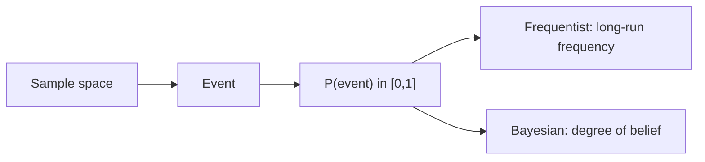

# What Is Probability?

> Probability 101 series (1/10)

<!-- a-grade-intro:begin -->

**Core question**: Is *probability* a *property of the world*, or a *measure of our uncertainty*?

> *Probability can be a *long-run frequency* or a *degree of belief*.*

<!-- a-grade-intro:end -->

## What You Will Learn

- The *definition* of probability
- The *frequentist* and *Bayesian* views
- Why probability *matters* in *data and ML*
- A 5-step intuition exercise
- Five common mistakes

## Why It Matters

Probability is the *shared language* of ML, statistics, and decision-making. *Weak probability skills* mean you *cannot interpret model output*.

> *Probability is the foundation of statistical reasoning.*

## Concept at a Glance



## Key Terms

- **Sample space Ω**: the set of *all possible outcomes*.
- **Event**: a *subset* of the sample space.
- **Probability P(A)**: a number between *0 and 1*; *all outcomes sum to 1*.
- **Frequentist**: the *limit of relative frequency* under *repeated trials*.
- **Bayesian**: a *degree of belief* given the *available information*.

## Before / After

**Before**: *“A coin lands heads 50% of the time”* — *why* is unclear.

**After**: *“Sample space {H,T}, symmetric, so P(H)=0.5 — or, Bayesian, our *prior belief* about the coin.”*

## Hands-on: 5-step Probability Intuition

### Step 1 — Sample space

```python
sample_space = {"H", "T"}
```

### Step 2 — Events and probability

```python
P = {"H": 0.5, "T": 0.5}
print("P(H):", P["H"], "sum:", sum(P.values()))
```

### Step 3 — Frequentist simulation

```python
import random
flips = [random.choice(["H","T"]) for _ in range(10_000)]
print("freq H:", flips.count("H") / len(flips))
```

### Step 4 — Bayesian update

```python
prior = 0.5
likelihood = 0.7  # likelihood of H under "biased coin" hypothesis
post = (likelihood * prior) / (likelihood * prior + (1 - likelihood) * (1 - prior))
print("posterior:", post)
```

### Step 5 — Compare the two views

```python
# Same data, two interpretations
print("frequentist: long-run ratio")
print("bayesian: updated belief")
```

## What to Notice in This Code

- Probability rests on *axioms* (Kolmogorov) — values in *[0, 1]*; *total mass = 1*.
- The frequentist and Bayesian views *complement* each other.
- *Simulation* is the fastest way to *validate intuition*.

## Five Common Mistakes

1. **Confusing *probability* with *likelihood*.**
2. **Failing to *state the sample space*.**
3. **Drawing *probability conclusions* from *tiny samples*.**
4. **Dismissing *subjective probability* as *unscientific*.**
5. **Reading *probability 0 or 1* as *deterministic*.**

## How This Shows Up in Production

Spam filters, recommender systems, fraud detection, medical diagnosis — *probability scores* drive *decisions*. *Bayesian A/B testing* and *probabilistic ML* depend on it.

## How a Senior Engineer Thinks

- Always names the *sample space*.
- Uses *both* frequentist and Bayesian thinking.
- *Simulates* to validate.
- Distinguishes *probability* from *likelihood*.
- Quantifies *uncertainty*.

## Checklist

- [ ] I can define *sample space, event, probability*.
- [ ] I know both *interpretations*.
- [ ] I can *simulate*.
- [ ] I know the *Kolmogorov axioms*.

## Practice Problems

1. Write the sample space for *the sum of two dice* and find *P(sum = 7)*.
2. Give the *frequentist and Bayesian readings* of one event in two lines.
3. State the *practical difference* between *probability 0.99* and *probability 1*.

## Wrap-up and Next Steps

Probability is the *language of uncertainty*. The next episode defines *events and the sample space* more precisely.

- **What Is Probability? (current)**
- Events and Sample Space (upcoming)
- Conditional Probability (upcoming)
- Bayes' Theorem (upcoming)
- Random Variables (upcoming)
- Expectation and Variance (upcoming)
- Discrete Distributions (upcoming)
- Continuous Distributions (upcoming)
- Law of Large Numbers and CLT (upcoming)
- Probability in Machine Learning (upcoming)
## References

- [Khan Academy — Probability](https://www.khanacademy.org/math/statistics-probability/probability-library)
- [Wikipedia — Probability axioms](https://en.wikipedia.org/wiki/Probability_axioms)
- [3Blue1Brown — Bayes' theorem](https://www.3blue1brown.com/lessons/bayes-theorem)
- [Stanford CS109 — Probability for Computer Scientists](https://web.stanford.edu/class/cs109/)

Tags: Probability, Foundations, Intuition, DataScience, Beginner

---

© 2026 YeongseonBooks. All rights reserved.
