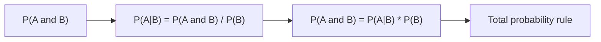

# Conditional Probability

> Probability 101 series (3/10)

<!-- a-grade-intro:begin -->

**Core question**: How does probability *change* when we *learn new information*? The single line *P(A | B)* explains *half the world*.

> *Conditional probability is the *probability of context*.*

<!-- a-grade-intro:end -->

## What You Will Learn

- The definition of *P(A | B)*
- The *multiplication rule* and *law of total probability*
- *Independence* vs *dependence*
- A 5-step conditional exercise
- Five common mistakes

## Why It Matters

The real world is *conditional*. *P(traffic | rain)*, *P(disease | symptom)* — *every act of inference* starts here.

> *Conditioning is the heart of probability.*

## Concept at a Glance



## Key Terms

- **P(A | B)**: probability of A given B = P(A∩B) / P(B).
- **Multiplication rule**: P(A∩B) = P(A | B)·P(B).
- **Law of total probability**: P(A) = Σ P(A | Bᵢ)·P(Bᵢ).
- **Independent**: P(A | B) = P(A).
- **Dependent**: P(A | B) ≠ P(A).

## Before / After

**Before**: *“If the test is positive, the chance of disease equals the positive rate.”* — *Wrong*.

**After**: *P(disease | positive) = P(positive | disease)·P(disease) / P(positive)* — the *direction of the condition* matters.

## Hands-on: 5-step Conditional Probability

### Step 1 — Build the data

```python
# 100 people; 5 sick. Sensitivity 0.9, specificity 0.95
N, sick = 100, 5
TP = round(sick * 0.9)
FN = sick - TP
TN = round((N - sick) * 0.95)
FP = (N - sick) - TN
print(TP, FN, TN, FP)
```

### Step 2 — P(positive)

```python
pos = TP + FP
print("P(pos):", pos / N)
```

### Step 3 — P(disease | positive)

```python
print("P(sick|pos):", TP / pos)
```

### Step 4 — Verify the multiplication rule

```python
P_sick = sick / N
P_pos_given_sick = TP / sick
print("P(sick and pos):", P_pos_given_sick * P_sick, "==", TP / N)
```

### Step 5 — Check independence

```python
P_pos = pos / N
print("indep?", round(TP/N - P_sick * P_pos, 6))  # nonzero implies dependence
```

## What to Notice in This Code

- Conditioning is essentially *changing the denominator*.
- *Sensitivity P(+|disease)* ≠ *positive predictive value P(disease|+)* — a *classic confusion*.
- A *low base rate* yields a *low PPV* even with a sensitive test.

## Five Common Mistakes

1. **Equating *P(A|B)* with *P(B|A)***.
2. **Ignoring the *base rate* (base-rate fallacy).**
3. **Confusing *independence* with *mutual exclusivity*.**
4. **Failing to *state the condition*.**
5. **Dropping *conditions* from the *multiplication rule*.**

## How This Shows Up in Production

Spam filters, medical screening, fraud detection, autocomplete — *conditional probability* drives *what model output really means*.

## How a Senior Engineer Thinks

- Always asks *what the denominator is*.
- States the *direction of the condition*.
- Reads numbers alongside the *base rate*.
- *Verifies* independence assumptions.
- Decomposes via *total probability*.

## Checklist

- [ ] I can define *P(A|B)*.
- [ ] I can apply the *multiplication rule*.
- [ ] I can verify *independence*.
- [ ] I recognize the *base-rate fallacy*.

## Practice Problems

1. If *P(umbrella | rain)* is near 1, is *P(rain | umbrella)* also near 1? Explain.
2. Decide whether a test with PPV 50% is *useful* in practice.
3. Give one *independent* and one *dependent* pair of events.

## Wrap-up and Next Steps

Conditional probability is the tool for *handling context*. The next episode reaches its peak: *Bayes' Theorem*.

- [What Is Probability?](./01-what-is-probability.md)
- [Events and Sample Space](./02-events-and-sample-space.md)
- **Conditional Probability (current)**
- Bayes' Theorem (upcoming)
- Random Variables (upcoming)
- Expectation and Variance (upcoming)
- Discrete Distributions (upcoming)
- Continuous Distributions (upcoming)
- Law of Large Numbers and CLT (upcoming)
- Probability in Machine Learning (upcoming)
## References

- [Khan Academy — Conditional probability](https://www.khanacademy.org/math/statistics-probability/probability-library/conditional-probability-independence)
- [Wikipedia — Conditional probability](https://en.wikipedia.org/wiki/Conditional_probability)
- [Wikipedia — Base rate fallacy](https://en.wikipedia.org/wiki/Base_rate_fallacy)
- [Stanford CS109 — Notes](https://web.stanford.edu/class/cs109/)

Tags: Probability, Conditional, Independence, Inference, Beginner

---

© 2026 YeongseonBooks. All rights reserved.
