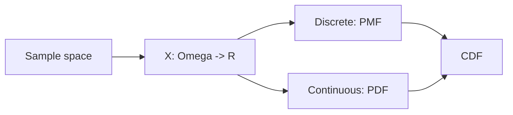

# Random Variables

> Probability 101 series (5/10)

<!-- a-grade-intro:begin -->

**Core question**: What changes when we *map outcomes to numbers*? A random variable is *the world seen as numbers*.

> *A random variable is a *function that maps outcomes to numbers*.*

<!-- a-grade-intro:end -->

## What You Will Learn

- The definition of a *random variable*
- The difference between *discrete* and *continuous*
- *PMF*, *PDF*, *CDF*
- A 5-step random-variable exercise
- Five common mistakes

## Why It Matters

Random variables enable *numeric statistics* — *expectation, variance, distributions, regression*. *Every ML model output* is a random variable.

> *Random variables put numbers on outcomes.*

## Concept at a Glance



## Key Terms

- **Random variable X**: a function Ω → ℝ.
- **Discrete RV**: countable outcomes (coin, die).
- **Continuous RV**: uncountable outcomes (height, time).
- **PMF p(x)**: P(X = x) (discrete).
- **PDF f(x)**: density. P(a ≤ X ≤ b) = ∫f.
- **CDF F(x)**: P(X ≤ x).

## Before / After

**Before**: *“A die outcome”* — just an event.

**After**: *X = the face value* → enables *numeric analysis* like *expectation 3.5* and *variance 2.92*.

## Hands-on: 5-step Random Variables

### Step 1 — Discrete RV

```python
import numpy as np
x = np.array([1, 2, 3, 4, 5, 6])
p = np.full(6, 1/6)  # PMF
print("sum p:", p.sum())
```

### Step 2 — CDF

```python
cdf = np.cumsum(p)
print("CDF:", cdf)
```

### Step 3 — Continuous RV (normal)

```python
from scipy import stats
rv = stats.norm(loc=0, scale=1)
print("PDF at 0:", rv.pdf(0), "CDF at 0:", rv.cdf(0))
```

### Step 4 — Sampling

```python
import numpy as np
samples = np.random.default_rng(0).normal(0, 1, 10_000)
print("mean:", samples.mean(), "std:", samples.std())
```

### Step 5 — Compute probability

```python
from scipy import stats
rv = stats.norm()
print("P(-1 <= X <= 1):", rv.cdf(1) - rv.cdf(-1))
```

## What to Notice in This Code

- A *PMF* value *is* a probability; a *PDF* value is a *density*, not a probability.
- For continuous RVs, *P(X = x) = 0*.
- The *CDF* is *always* defined.

## Five Common Mistakes

1. **Reading *PDF values as probabilities*.**
2. **Mixing up *discrete* and *continuous*.**
3. **Using a PMF whose *sum ≠ 1*.**
4. **Confusing *CDF* with *PDF*.**
5. **Treating *sample statistics* as *parameters*.**

## How This Shows Up in Production

Softmax probabilities from ML models, Gaussian noise assumptions, survival-time analysis — *random variables* are the foundation of *all modeling*.

## How a Senior Engineer Thinks

- Distinguishes *PMF / PDF / CDF*.
- Knows *P(X = x) = 0* in continuous cases.
- *Visualizes* every distribution.
- Computes probabilities by *integration / summation*.
- Separates *sample* from *parameter*.

## Checklist

- [ ] I separate *discrete* and *continuous* RVs.
- [ ] I know *PMF / PDF / CDF*.
- [ ] I use *scipy.stats* for distributions.
- [ ] I can simulate by *sampling*.

## Practice Problems

1. Build the PMF and CDF for the *sum of two dice*.
2. Compute *P(|X| < 2)* for *N(0,1)*.
3. Answer: *can a PDF value be greater than 1*?

## Wrap-up and Next Steps

Random variables are the bridge from *probability to numeric analysis*. The next episode covers *expectation and variance*.

- [What Is Probability?](./01-what-is-probability.md)
- [Events and Sample Space](./02-events-and-sample-space.md)
- [Conditional Probability](./03-conditional-probability.md)
- [Bayes' Theorem](./04-bayes-theorem.md)
- **Random Variables (current)**
- Expectation and Variance (upcoming)
- Discrete Distributions (upcoming)
- Continuous Distributions (upcoming)
- Law of Large Numbers and CLT (upcoming)
- Probability in Machine Learning (upcoming)
## References

- [Khan Academy — Random variables](https://www.khanacademy.org/math/statistics-probability/random-variables-stats-library)
- [Wikipedia — Random variable](https://en.wikipedia.org/wiki/Random_variable)
- [scipy.stats](https://docs.scipy.org/doc/scipy/reference/stats.html)
- [Stanford CS109 — Notes](https://web.stanford.edu/class/cs109/)

Tags: Probability, RandomVariable, Distribution, PMF, Beginner

---

© 2026 YeongseonBooks. All rights reserved.
