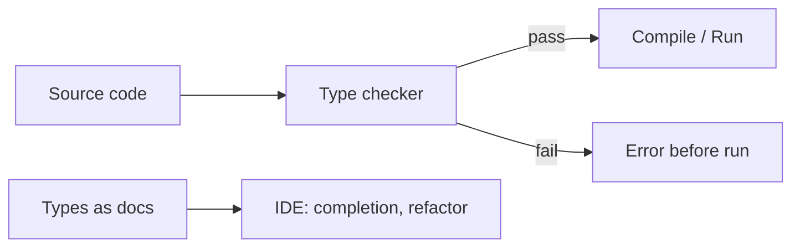

# Type Systems

> Programming Languages 101 series (3/10)

<!-- a-grade-intro:begin -->

**Core question**: Dynamic languages run fine without type annotations, so why do we keep going back and adding them?

> A type system is not just data tagging. It is a tool that **proves, before the program runs, that it does not do nonsensical things**. Static typing buys safety and tooling at the cost of a small amount of expressive freedom; dynamic typing trades the other way. This episode looks at the deal both sides accept.

<!-- a-grade-intro:end -->

## What You Will Learn

- The roles a type plays — checking, documentation, tool support
- The tradeoffs between static and dynamic typing
- How strong/weak differs from static/dynamic
- What type inference actually buys you
- The intuition behind generics and union/intersection types

## Why It Matters

Most modern languages have some kind of type system, and even Python, JavaScript, and Ruby grew gradual type systems (type hints, TypeScript). To use autocompletion, refactoring tools, and build-stage error messages well, you need to understand types. The later episodes — scope and closures — also operate on top of types.

> A type narrows down, in advance, which inputs are even legal.

## Concept at a Glance



The type checker rules out impossible calls before runtime. Simultaneously, it gives the IDE the basis for autocompletion and safe refactoring.

## Key Terms

- **Static typing**: Types checked at compile / pre-run time.
- **Dynamic typing**: Types checked while the program runs.
- **Strong typing**: Implicit conversions are rare.
- **Weak typing**: Implicit conversions are common (think JavaScript's `+`).
- **Type inference**: The compiler figures out the type without an annotation.
- **Generics**: Parameterizing code so it works for many types safely.

## Before/After

**Before — a function with no types**

```python
def discount(price, rate):
    return price - price * rate

# Someone calls it like this
discount("1000", 0.1)  # TypeError at runtime
```

The signature alone does not tell callers what to pass, and bugs only show at runtime.

**After — annotated**

```python
def discount(price: int, rate: float) -> float:
    return price - price * rate

discount("1000", 0.1)  # mypy rejects this at the call site
```

A static checker like `mypy` catches it before runtime, and the signature itself becomes a small piece of documentation.

## Hands-on: Introduce Types Step by Step

### Step 1 — Add type hints

```python
# 1_hints.py
def to_kebab(s: str) -> str:
    return s.strip().lower().replace(" ", "-")

print(to_kebab("Hello World"))
```

The behavior is the same with or without `-> str`, but callers now have a contract.

### Step 2 — Run mypy

```bash
pip install mypy
mypy 1_hints.py    # Success: no issues
```

A new habit: check at build time.

### Step 3 — Generic function

```python
# 3_generic.py
from typing import TypeVar, Iterable

T = TypeVar("T")

def first(xs: Iterable[T]) -> T:
    for x in xs:
        return x
    raise ValueError("empty")

reveal_type(first([1, 2, 3]))   # Revealed type is "int"
reveal_type(first(["a", "b"]))  # Revealed type is "str"
```

The same function preserves an exact return type for many input types. Tooling gets stronger.

### Step 4 — Union types and narrowing

```python
# 4_union.py
def length(x: str | list) -> int:
    if isinstance(x, str):
        return len(x)
    return sum(len(item) for item in x)
```

After the `isinstance` check, the type checker narrows the type inside each branch.

### Step 5 — A real bug found by adding types

```python
# 5_real_bug.py
def total_price(items: list[dict]) -> int:
    return sum(item["price"] for item in items)  # mypy points out the dict value type is unclear
```

Trying to write the type accurately tends to expose ambiguity in the data model itself. That ambiguity is usually where the real bug lives.

## What to Notice in This Code

- A type is checking, documentation, and tool input all at once.
- A static check does not catch every bug, but it catches the cheapest, most common ones cheapest.
- Generics are the safe form of "write once, use for many types."
- Union types plus `isinstance` narrowing carry your dynamic-language intuition straight into the static checker.

## Five Common Mistakes

1. **Sprinkling `Any` everywhere.** The checker stays quiet, but you lost the safety.
2. **Adding types everywhere at once.** Start at boundaries — public functions, module interfaces — and grow inward.
3. **Confusing types with runtime validation.** `mypy` does not check the shape of external inputs at runtime. Validate those separately.
4. **Chasing overly precise types.** A simple type that catches 90% of cases tends to be more valuable than a baroque one that catches 100%.
5. **Treating dynamic vs static as a status battle.** It is a tradeoff that depends on team size and domain.

## How This Shows Up in Production

Large Python codebases run mypy or pyright in CI and require types on public functions. The JavaScript world has settled on TypeScript as the de facto default. Types at library boundaries are the first documentation users see and the basis of autocompletion.

Types are a refactoring safety net. When changing the order of a function's arguments lights up every call site at compile time, you can do that change confidently.

## How a Senior Engineer Thinks

- Adds types to module boundaries and public APIs first; helpers later.
- When they spot an `Any`, they look for one step of narrowing.
- Always validates external input separately (types ≠ runtime validation).
- Treats static vs dynamic as a tradeoff driven by team size and change frequency, not faith.
- Sees IDE support (autocomplete, refactoring) as the type system's main payoff, not a side benefit.

## Checklist

- [ ] Can you tell static vs dynamic and strong vs weak typing apart in one line?
- [ ] Do you know where to add types first when adopting them gradually?
- [ ] Do you have a strategy for narrowing an `Any`?
- [ ] Do you know the difference between types and runtime validation?
- [ ] Can you explain why generics are stronger than ad-hoc parameterization?

## Practice Problems

1. Take the `total_price` example and introduce a `TypedDict` describing the exact shape of `item`.
2. Pick a function in your favorite dynamic language and write down its input and output types in prose. If anything is ambiguous, describe what that ambiguity actually means.
3. Recall a real bug that was only caught after types were added. Explain why the dynamic check found it late.

## Wrap-up and Next Steps

A type system gives you safety, documentation, and tooling at the same time. Not every language needs every level of typing, but for large systems with many boundaries it is almost always a win. Next we look at another universal pillar — scope and binding.

- [What Is a Programming Language?](./01-what-is-a-programming-language.md)
- [Syntax and Semantics](./02-syntax-and-semantics.md)
- **Type Systems (current)**
- Scope and Binding (upcoming)
- Functions and Closures (upcoming)
- Objects and Prototypes (upcoming)
- Memory Management (upcoming)
- Interpreters and Compilers (upcoming)
- Static vs Dynamic Languages (upcoming)
- What Makes a Good Language Design? (upcoming)
## References

- [Types and Programming Languages (Pierce)](https://www.cis.upenn.edu/~bcpierce/tapl/)
- [mypy documentation](https://mypy.readthedocs.io/)
- [TypeScript Handbook](https://www.typescriptlang.org/docs/handbook/)
- [PEP 484 — Type Hints](https://peps.python.org/pep-0484/)

Tags: Computer Science, Programming Languages, TypeSystem, Static, Dynamic, Inference

---

© 2026 YeongseonBooks. All rights reserved.
