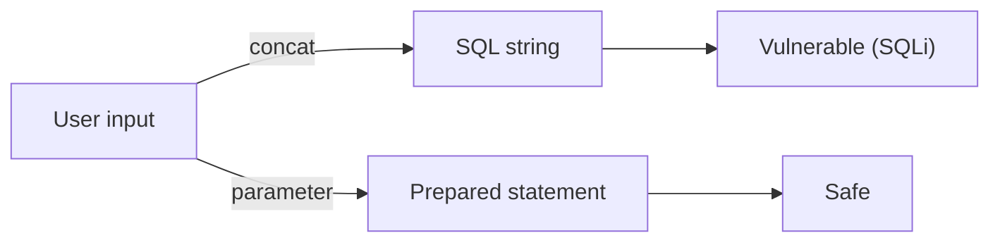

# SQL Injection and Safe ORM Usage

> Secure Coding 101 series (7/10)

<!-- a-grade-intro:begin -->

**Core question**: Twenty-five years on, why is *SQL injection still the top issue*?

> *The cause is always the same — *building SQL by string concatenation*. So is the fix — *use parameters*.*

<!-- a-grade-intro:end -->

## What You Will Learn

- How *SQL injection* works
- Why *parameterized queries* matter
- When ORMs *still leak*
- How to use *raw SQL* safely
- A five-step routine and five common mistakes

## Why It Matters

A single SQLi exposes the *entire database*. Auth bypass, data exfiltration, and tampering — all at once.

> *If SQL is built from string concatenation, it *will leak* one day.*

## Concept at a Glance



## Key Terms

- **SQL Injection**: input that *changes the meaning* of the SQL.
- **Parameterized query**: SQL and data are *syntactically separated*.
- **Prepared statement**: SQL the DB *pre-compiles*.
- **ORM**: a library that builds SQL from an *object model*.
- **Stored procedure**: a function *stored inside the DB*.

## Before/After

**Before**: `f"SELECT * FROM users WHERE name='{name}'"` — *plain SQLi*.

**After**: `cursor.execute("SELECT * FROM users WHERE name=%s", (name,))` — *parameter*.

## Hands-on: Defend SQLi in Five Steps

### Step 1 — Use parameters

```python
cursor.execute(
    "SELECT id FROM users WHERE name=%s AND status=%s",
    (name, "active"),
)
```

### Step 2 — Use the ORM properly

```python
from sqlalchemy import select
stmt = select(User).where(User.name == name)
result = session.scalars(stmt).all()
```

### Step 3 — Allowlist any dynamic column

```python
ALLOWED = {"name", "created_at", "id"}
def order_by(field):
    if field not in ALLOWED:
        raise ValueError("invalid order field")
    return field  # safe to splice into SQL
```

### Step 4 — Even raw SQL must use *parameters*

```python
session.execute(text("SELECT * FROM logs WHERE user_id=:uid"), {"uid": uid})
```

### Step 5 — Split DB privileges

```sql
-- The app account does DML only; DDL belongs to a separate account.
GRANT SELECT, INSERT, UPDATE ON db.* TO 'app'@'%';
```

## What to Notice in This Code

- *String concatenation* into SQL is a *red flag* every time.
- An ORM is no shield if you misuse `text()` or raw escapes.
- *Dynamic identifiers* require an *allowlist* — there is no other safe option.

## Five Common Mistakes

1. **f-strings inside SQL.** The most common SQLi.
2. **String composition inside an ORM `.filter()`.** False sense of safety.
3. **Order-by columns taken *directly from input*.** Dynamic-column SQLi.
4. **Granting *DROP* to the app account.** Catastrophic blast radius.
5. **Echoing the *raw SQL* in error messages.** Fuel for *blind SQLi*.

## How This Shows Up in Production

Most teams default to the ORM and treat *raw SQL* as the exception. Every raw SQL line is reviewed for *parameter use*. The application's DB account is on *least privilege*.

## How a Senior Engineer Thinks

- *Treat string-built SQL as *not allowed*.*
- *Dynamic identifiers go through an *allowlist*.*
- *DB accounts also follow *least privilege*.*
- *Never let *SQL leak into error messages*.*
- *ORMs are a *safe habit*, not a magic shield.*

## Checklist

- [ ] All SQL uses *parameters*.
- [ ] Dynamic columns/tables go through an *allowlist*.
- [ ] DB accounts are *role-separated*.
- [ ] Error messages stay *safe*.

## Practice Problems

1. Explain *blind SQLi* in one paragraph.
2. Show two safe patterns for using *raw text* in an ORM.
3. Write the *order-by allowlist* helper.

## Wrap-up and Next Steps

A safe DB removes the attacker's *biggest prize*. Next we cover the two browser-side attacks — *XSS and CSRF*.

- [What Is Secure Coding?](./01-what-is-secure-coding.md)
- [Input Validation](./02-input-validation.md)
- [Authentication and Session](./03-authentication-and-session.md)
- [Authorization and Permissions](./04-authorization-and-permissions.md)
- [Safe Data Storage](./05-safe-data-storage.md)
- [Secret and Key Management](./06-secret-and-key-management.md)
- **SQL Injection and Safe ORM Usage (current)**
- XSS and CSRF Defense (upcoming)
- Managing Dependency Vulnerabilities (upcoming)
- Safe Logging and Audit (upcoming)
## References

- [OWASP SQL Injection Prevention Cheat Sheet](https://cheatsheetseries.owasp.org/cheatsheets/SQL_Injection_Prevention_Cheat_Sheet.html)
- [PortSwigger — SQL injection](https://portswigger.net/web-security/sql-injection)
- [SQLAlchemy security](https://docs.sqlalchemy.org/)
- [psycopg parameter binding](https://www.psycopg.org/psycopg3/docs/basic/params.html)

Tags: SQLInjection, ORM, Database, SecureCoding, OWASP

---

© 2026 YeongseonBooks. All rights reserved.
