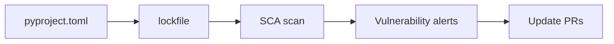

# Managing Dependency Vulnerabilities

> Secure Coding 101 series (9/10)

<!-- a-grade-intro:begin -->

**Core question**: Most of our code was *written by someone else*. Who is responsible for *its security*?

> *Dependencies are *part of our code*. Their flaws *become our flaws*.*

<!-- a-grade-intro:end -->

## What You Will Learn

- What *SCA* (Software Composition Analysis) means
- The role of an *SBOM*
- Why a *lockfile* is non-negotiable
- *Dependabot / Renovate* automation
- A five-step routine and five common mistakes

## Why It Matters

Log4j, event-stream, ua-parser-js — *supply-chain attacks* succeed with *zero lines* of our code. A library you *don't know you depend on* becomes the *door*.

> *Dependencies are *assets that will leak someday*. Tracking them is the start of defense.*

## Concept at a Glance



## Key Terms

- **SCA**: scanning dependencies for *known vulnerabilities*.
- **SBOM**: a list of *every component* you ship.
- **Lockfile**: pins *exact versions and hashes*.
- **Pinning**: explicitly *fixing direct dependency* versions.
- **Transitive dependency**: a dependency *of a dependency*.

## Before/After

**Before**: `requirements.txt` lists only `requests`. Each build picks a *different version*. You don't know *what came in*.

**After**: `uv.lock` / `poetry.lock` *pin hashes*. *Weekly dependency PRs* arrive automatically; CI gates with *SCA*.

## Hands-on: Safer Dependencies in Five Steps

### Step 1 — Generate a lockfile

```bash
uv lock          # or poetry lock, pip-compile
```

### Step 2 — Generate an SBOM

```bash
syft packages dir:. -o cyclonedx-json > sbom.json
```

### Step 3 — Run SCA

```bash
pip-audit                # Python
osv-scanner --lockfile=uv.lock   # generic
```

### Step 4 — Automate updates

```yaml
# .github/dependabot.yml
version: 2
updates:
  - package-ecosystem: pip
    directory: "/"
    schedule:
      interval: weekly
```

### Step 5 — Pin and verify

```bash
pip install --require-hashes -r requirements.txt
```

## What to Notice in This Code

- *Lockfile + hashes* is the heart of *reproducible* builds.
- An SBOM lets you check *blast radius in seconds* during an incident.
- *Regular* updates beat *occasional* heroic ones.

## Five Common Mistakes

1. **Using *latest* with no lockfile.** A target for *supply-chain attacks*.
2. **Ignoring *SCA results*.** Real findings get buried in noise.
3. **Ignoring *transitive dependencies*.** Most CVEs are *transitive*.
4. **Sticking with abandoned libraries.** Patches *never come*.
5. **Letting auto-update PRs *pile up*.** Hundreds in a month.

## How This Shows Up in Production

Most teams use *Renovate* or *Dependabot* for *weekly* PRs and put an *SCA gate* in CI. Larger orgs publish *SBOMs* alongside their builds.

## How a Senior Engineer Thinks

- *Dependencies are *our code* — and our responsibility.*
- *No lockfile means no reproducibility.*
- *Small updates prevent *big incidents*.*
- *An SBOM is an *incident-response tool*.*
- *Depending less is itself security.*

## Checklist

- [ ] *Lockfile* committed.
- [ ] *SCA* running in CI.
- [ ] *Auto-update PRs* arriving weekly.
- [ ] *SBOM* published.

## Practice Problems

1. Read one line of *pip-audit* output and explain it.
2. Name a real CVE that came through a *transitive dependency*.
3. List three risks of building *without a lockfile*.

## Wrap-up and Next Steps

Other people's code is *our code*. The last post covers *safe logging and audit*, the evidence that survives an incident.

- [What Is Secure Coding?](./01-what-is-secure-coding.md)
- [Input Validation](./02-input-validation.md)
- [Authentication and Session](./03-authentication-and-session.md)
- [Authorization and Permissions](./04-authorization-and-permissions.md)
- [Safe Data Storage](./05-safe-data-storage.md)
- [Secret and Key Management](./06-secret-and-key-management.md)
- [SQL Injection and Safe ORM Usage](./07-sql-injection-and-orm.md)
- [XSS and CSRF Defense](./08-xss-and-csrf.md)
- **Managing Dependency Vulnerabilities (current)**
- Safe Logging and Audit (upcoming)
## References

- [OWASP — Vulnerable and Outdated Components](https://owasp.org/Top10/A06_2021-Vulnerable_and_Outdated_Components/)
- [pip-audit](https://github.com/pypa/pip-audit)
- [OSV.dev](https://osv.dev/)
- [CycloneDX SBOM](https://cyclonedx.org/)

Tags: Dependencies, SCA, SBOM, SupplyChain, SecureCoding

---

© 2026 YeongseonBooks. All rights reserved.
