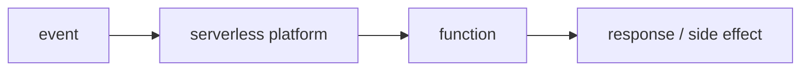

# What is Serverless?

> Serverless 101 series (1/10)

<!-- a-grade-intro:begin -->

**Core question**: does *serverless* really mean running *without servers*?

> *Serverless* does not mean *no servers*; it means the *platform* takes on the *server-operation* responsibility for you.

<!-- a-grade-intro:end -->

## What You Will Learn

- the definition of *serverless*
- its relationship with *FaaS*
- *usage-based billing*
- how *responsibility shifts*
- which *workloads* fit and which do not

## Why It Matters

Less time on *infrastructure* means more time on *product*. *Serverless* is *leverage* for *small teams*.

## Concept at a Glance



## Key Terms

- **Serverless**: a model that *delegates server operation* to the *platform*.
- **FaaS**: a *function-level* execution environment.
- **Event source**: the *signal* that *wakes* a *function*.
- **Lifetime**: the *short window* a *function* is *alive*.
- **Usage-based billing**: pay only for *invocations*.

## Before/After

**Before**: a *24/7* *server*, *cost* even at *zero traffic*.

**After**: pay only for what is *invoked*; no *provisioning*.

## Hands-on: the Smallest Function

### Step 1 — Write a Python function

```python
def handler(event, context):
    name = event.get("name", "world")
    return {"message": f"hello, {name}"}
```

### Step 2 — Simulate invocation locally

```python
def invoke_local(handler, event):
    return handler(event, context=None)

print(invoke_local(handler, {"name": "Alice"}))
```

### Step 3 — Get used to event shapes

```python
http_event = {"path": "/hello", "method": "GET", "name": "Bob"}
queue_event = {"records": [{"body": "msg-1"}, {"body": "msg-2"}]}
```

### Step 4 — Be aware of timeouts

```python
import time

def slow_handler(event, context):
    time.sleep(0.1)
    return {"ok": True}
```

### Step 5 — Standardize the response

```python
def http_response(status, body):
    return {"statusCode": status, "body": body}
```

## What to Notice in This Code

- The *event* + *context* pair is the *common* signature.
- Functions should be *short and deterministic*.
- *State* belongs *outside* the function.

## Five Common Mistakes

1. **Building *long-running* tasks as *functions*.**
2. **Storing state in *local files*.**
3. **Ignoring *cold starts*.**
4. **Estimating *cost* from *call count* alone.**
5. **Operating without *observability*.**

## How This Shows Up in Production

It fits *event handling, ETL, API backends, scheduled jobs* — work that is *short and self-contained*.

## How a Senior Engineer Thinks

- *Serverless* is an *option*, not a *default*.
- *Cost* equals *calls + duration + resources*.
- Put *state* in *external storage*.
- *Cold start* is a *design variable*.
- *Observability* is *half of debugging*.

## Checklist

- [ ] Function is *short* and *deterministic*.
- [ ] *State* externalized.
- [ ] *Cost model* reviewed.
- [ ] *Observability* in place.

## Practice Problems

1. In one line, why *serverless* does not mean *no servers*.
2. In one line, the *unit* of *FaaS*.
3. In one line, a workload that is a *poor fit*.

## Wrap-up and Next Steps

The next post explores the *structure* and *usage patterns* of *FaaS*.

- **What is Serverless? (current)**
- Function as a Service (upcoming)
- Trigger and Event (upcoming)
- Cold Start (upcoming)
- Scaling (upcoming)
- State Management (upcoming)
- Queue and Event-driven Architecture (upcoming)
- Observability (upcoming)
- Cost (upcoming)
- Designing a Serverless App (upcoming)
## References

- [AWS Lambda overview](https://docs.aws.amazon.com/lambda/latest/dg/welcome.html)
- [Google Cloud Functions](https://cloud.google.com/functions/docs)
- [Azure Functions](https://learn.microsoft.com/azure/azure-functions/)
- [Serverless (Martin Fowler)](https://martinfowler.com/articles/serverless.html)

Tags: Serverless, Cloud, FaaS, Architecture, DevOps

---

© 2026 YeongseonBooks. All rights reserved.
