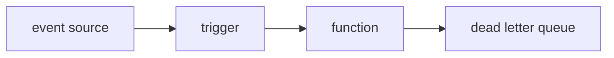

# Trigger and Event

> Serverless 101 series (3/10)

<!-- a-grade-intro:begin -->

**Core question**: *when* and *who* wakes a *function*?

> A *trigger* delivers an *event* to a *function*. The *behavior* and *retry semantics* depend on the *type*.

<!-- a-grade-intro:end -->

## What You Will Learn

- categories of *triggers*
- shapes of *event* payloads
- *sync* vs *async* differences
- *retries* and *DLQ*
- the importance of *idempotency*

## Why It Matters

Without understanding *trigger semantics*, you ship *duplicate processing, lost messages,* and *retry storms* into production.

## Concept at a Glance



## Key Terms

- **trigger**: connects an *event* to a *function*.
- **event source**: *queues, storage, HTTP, schedules,* etc.
- **invocation type**: *sync / async / stream*.
- **DLQ**: a *dead-letter queue* for *failed messages*.
- **idempotency**: *same input* → *same outcome*.

## Before/After

**Before**: *cron* + *script* + *manual retry*.

**After**: *scheduled trigger* + *DLQ* + *automatic retry*.

## Hands-on: HTTP / Queue / Schedule

### Step 1 — HTTP event

```python
def http_handler(event, context):
    body = event.get("body", "")
    return {"statusCode": 200, "body": f"echo:{body}"}
```

### Step 2 — Queue event

```python
def queue_handler(event, context):
    for rec in event["records"]:
        process(rec["body"])

def process(msg):
    print("got", msg)
```

### Step 3 — Schedule event

```python
import datetime as dt

def cron_handler(event, context):
    now = dt.datetime.utcnow().isoformat()
    return {"ran_at": now}
```

### Step 4 — Apply an idempotency key

```python
seen = set()

def idempotent(handler):
    def wrap(event, ctx):
        key = event.get("id")
        if key in seen:
            return {"skipped": True}
        seen.add(key)
        return handler(event, ctx)
    return wrap
```

### Step 5 — Decide what goes to DLQ

```python
def safe(handler, dlq):
    def wrap(event, ctx):
        try:
            return handler(event, ctx)
        except Exception as e:
            dlq.append({"event": event, "error": str(e)})
            raise
    return wrap
```

## What to Notice in This Code

- *records* may be a *batch*.
- *Idempotency keys* are a *retry safety net*.
- *DLQs* are the *starting point* for *debugging*.

## Five Common Mistakes

1. **Assuming *retries* will not happen.**
2. **Assuming *order* is *guaranteed*.**
3. **Doing *payment-like* work without *idempotency*.**
4. **Skipping *DLQ* configuration.**
5. **Setting *schedule ticks* too *short*.**

## How This Shows Up in Production

Common flows include *upload → thumbnail, payment event → email, queue → batch ingest* — *async pipelines*.

## How a Senior Engineer Thinks

- Assume *every trigger* is *at-least-once*.
- *Idempotency* protects *cost*.
- Without a *DLQ*, you do not see *problems*.
- Use a *FIFO queue* if *order* matters.
- *Schedules* must prevent *overlap*.

## Checklist

- [ ] *Idempotency* ensured.
- [ ] *DLQ* configured.
- [ ] *Retry count* explicit.
- [ ] *Ordering* requirement explicit.

## Practice Problems

1. In one line, the meaning of *at-least-once*.
2. In one line, the *purpose* of a *DLQ*.
3. In one line, the *risk* of missing *idempotency keys*.

## Wrap-up and Next Steps

Next, we look at the causes and mitigations of *Cold Start*.

- [What is Serverless?](./01-what-is-serverless.md)
- [Function as a Service](./02-function-as-a-service.md)
- **Trigger and Event (current)**
- Cold Start (upcoming)
- Scaling (upcoming)
- State Management (upcoming)
- Queue and Event-driven Architecture (upcoming)
- Observability (upcoming)
- Cost (upcoming)
- Designing a Serverless App (upcoming)
## References

- [Lambda event sources](https://docs.aws.amazon.com/lambda/latest/dg/invocation-eventsourcemapping.html)
- [SQS DLQ](https://docs.aws.amazon.com/AWSSimpleQueueService/latest/SQSDeveloperGuide/sqs-dead-letter-queues.html)
- [EventBridge schedules](https://docs.aws.amazon.com/eventbridge/latest/userguide/eb-scheduled-rule-pattern.html)
- [Idempotency pattern](https://docs.aws.amazon.com/prescriptive-guidance/latest/cloud-design-patterns/idempotency.html)

Tags: Serverless, Trigger, Event, EventDriven, Cloud

---

© 2026 YeongseonBooks. All rights reserved.
