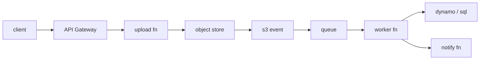

# Designing a Serverless App

> Serverless 101 series (10/10)

<!-- a-grade-intro:begin -->

**Core question**: How do you weave the *pieces* you have learned into *one* working *app*?

> A *serverless app* is a *distributed system* of *small functions* connected by *triggers* and *queues*.

<!-- a-grade-intro:end -->

## What You Will Learn

- The core *design principles*
- A worked *image-processing pipeline*
- *Boundaries* and separation of *responsibility*
- *Failure* and *retry* design
- *Cost* and *operational* tradeoffs

## Why It Matters

A single *function* is easy. *Dozens* of them tangled together drag in every *distributed-systems* trap.

## Concept at a Glance



## Key Terms

- **edge function**: a thin function at the *request boundary*.
- **worker function**: a background processing function.
- **idempotency key**: a key that *prevents duplicate* processing.
- **dead-letter queue**: a queue that *isolates* failed messages.
- **bounded context**: a unit of *responsibility*.

## Before/After

**Before**: a single *monolithic function* handles *upload*, *transform*, and *notify*.

**After**: *upload*, *transform*, and *notify* are split across *queues*, each with its own *retry policy*.

## Hands-on: Image-processing Pipeline

### Step 1 — Upload function

```python
def upload(event):
    user = event["user_id"]
    key = f"raw/{user}/{event['filename']}"
    s3.put_object(Bucket="uploads", Key=key, Body=event["body"])
    return {"key": key}
```

### Step 2 — S3 event into a queue

```python
def on_object_created(event):
    for r in event["Records"]:
        sqs.send_message(
            QueueUrl=Q,
            MessageBody=json.dumps({"key": r["s3"]["object"]["key"]}),
        )
```

### Step 3 — Idempotent worker

```python
def worker(event):
    for r in event["Records"]:
        msg = json.loads(r["body"])
        key = msg["key"]
        if already_done(key):
            continue
        thumb = make_thumbnail(key)
        save(key, thumb)
        mark_done(key)
```

### Step 4 — Notify function

```python
def notify(event):
    for r in event["Records"]:
        msg = json.loads(r["body"])
        push(msg["user_id"], "Your thumbnail is ready")
```

### Step 5 — Failure isolation

```python
# Queue policy (pseudo-config)
queue_policy = {
    "VisibilityTimeout": 60,
    "MaxReceiveCount": 5,
    "DeadLetterQueue": "arn:.../thumb-dlq",
}
```

## What to Notice in This Code

- *Boundaries* are made *explicit* by the queues.
- *Idempotency* is a *prerequisite* for safe retries.
- A *DLQ* surfaces the *silent* failures.

## Five Common Mistakes

1. **Doing the *transform* inside the *upload* function.**
2. **Skipping the *idempotency key* and *processing twice*.**
3. **No *DLQ*, so *messages disappear*.**
4. **Aggressive *retries* overwhelming the *database*.**
5. **Watching only *logs* and ignoring *metrics*.**

## How This Shows Up in Production

*Profile photo upload* in a mobile app, *receipt OCR*, *video transcoding* — all use the *same pattern*.

## How a Senior Engineer Thinks

- *Boundaries* are the *real* design of the system.
- A *queue* buffers *time*.
- *Idempotency* is the *baseline*, not an upgrade.
- A *DLQ* is your *operational eye*.
- *Cost* and *complexity* are read together.

## Checklist

- [ ] *Function boundaries* defined.
- [ ] *Idempotency key* applied.
- [ ] *DLQ* configured.
- [ ] *Cost model* written down.

## Practice Problems

1. Define *idempotency key* in one line.
2. State the role of a *DLQ* in one line.
3. Explain how a *queue* *buffers* time in one line.

## Wrap-up and Next Steps

Congratulations on finishing the series. Take the next step: design a *small distributed system* of your own, woven from *functions*, *queues*, and *triggers*.

- [What is Serverless?](./01-what-is-serverless.md)
- [Function as a Service](./02-function-as-a-service.md)
- [Triggers and Events](./03-trigger-and-event.md)
- [Cold Start](./04-cold-start.md)
- [Scaling](./05-scaling.md)
- [State Management](./06-state-management.md)
- [Queues and Event-driven Architecture](./07-queue-and-event-driven.md)
- [Observability](./08-observability.md)
- [Cost](./09-cost.md)
- **Designing a Serverless App (current)**
## References

- [AWS Serverless Application Lens](https://docs.aws.amazon.com/wellarchitected/latest/serverless-applications-lens/welcome.html)
- [Serverless Patterns Collection](https://serverlessland.com/patterns)
- [Enterprise Integration Patterns](https://www.enterpriseintegrationpatterns.com/)
- [Idempotency in Serverless](https://docs.powertools.aws.dev/lambda/python/latest/utilities/idempotency/)

Tags: Serverless, Architecture, DesignPattern, Cloud, FinOps

---

© 2026 YeongseonBooks. All rights reserved.
