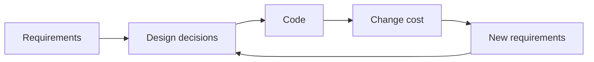

# What Is Software Design?

> Software Design 101 series (1/10)

<!-- a-grade-intro:begin -->

**Core question**: How is good design different from good coding?

> Good code makes one line easier to read; good design makes the whole code base easier to change.

<!-- a-grade-intro:end -->

## What You Will Learn

- A working definition of software design
- Signals that distinguish good design
- The relationship between design and code quality
- Symptoms of design failure
- The time horizon of design

## Why It Matters

Design is invisible. But it shows itself every time the next change is more expensive than expected.

> Design debt always charges interest.

## Concept at a Glance



Design determines change cost.

## Key Terms

- **Software design**: A set of decisions about modules, responsibilities, and dependencies.
- **Architecture**: Design decisions at the largest unit.
- **Coupling**: Degree of interdependence between modules.
- **Cohesion**: Degree of relatedness within a module.
- **Change cost**: Time and risk required for the next change.

## Before/After

**Before**

```text
"It just needs to work."
→ Quick first release; painful changes six months later.
```

**After**

```text
"It must remain changeable in six months."
→ Slightly slower first release; smaller cumulative cost.
```

Design is a cumulative cost game.

## Hands-on: Five Signals of Good Design

### Step 1 — Change simulation

```python
# 1_change_sim.py
# "Add a payment method" — how many files would you touch?
files_touched = ["payment.py"]  # one file is a strong signal
```

Smaller change footprint, better design.

### Step 2 — Dependency graph

```python
# 2_deps.py
# A -> B -> C (one direction) is fine.
# A <-> B (cycle) is a design smell.
```

Dependency cycles are nearly always a red flag.

### Step 3 — Module responsibility

```python
# 3_responsibility.py
# If you cannot describe a module in one sentence, its responsibility is fuzzy.
PAYMENT = "Payment domain — calls external gateway and applies domain rules"
```

The name and the one-sentence description must match.

### Step 4 — Testability

```python
# 4_testable.py
# Can the domain module be tested alone, without IO?
def can_test_alone(module):
    return module.no_io and module.no_globals
```

The most honest measure of design quality.

### Step 5 — Onboarding curve

```text
# 5_onboard.txt
Can a new teammate understand a module in 30 minutes?
```

Design is, in the end, a human task.

## What to Notice in This Code

- Change footprint, dependencies, responsibility, and testability viewed together.
- The onboarding curve is the strongest signal.

## Five Common Mistakes

1. **One huge upfront design.** Decisions made without information are usually wrong.
2. **Not measuring change cost.** Design debt becomes invisible.
3. **Tolerating cycles.** They harden over time.
4. **Module responsibility takes more than one sentence.** Cohesion is low.
5. **No record of design decisions.** Same debate repeats forever.

## How This Shows Up in Production

Strong teams keep ADRs (Architecture Decision Records). Decisions and their reasoning are preserved together so new teammates do not relitigate.

## How a Senior Engineer Thinks

- Design is a cumulative cost game.
- Start small and evolve often.
- Validate design with change simulations.
- Record decisions in writing.
- Treat the onboarding curve as a design signal.

## Checklist

- [ ] Can each module be described in one sentence?
- [ ] Are there no dependency cycles?
- [ ] Are change footprints small?
- [ ] Can domain modules be tested in isolation?
- [ ] Are decisions captured as ADRs?

## Practice Problems

1. Draw the module dependency graph of your project.
2. Pick the most frequent change and count the files it touches.
3. Write your last big decision as a one-page ADR.

## Wrap-up and Next Steps

Design decides the cost of the next change. Next we start with the most fundamental tool: separation of concerns.

- **What Is Software Design? (current)**
- Separation of Concerns (upcoming)
- Modules and Boundaries (upcoming)
- Dependency Direction (upcoming)
- Interfaces and Abstraction (upcoming)
- Layered Architecture (upcoming)
- Data Flow Design (upcoming)
- Reducing Change Impact (upcoming)
- Design Principles (upcoming)
- Practicing Design with a Small Project (upcoming)
## References

- [A Philosophy of Software Design (J. Ousterhout)](https://web.stanford.edu/~ouster/cgi-bin/aposd.php)
- [Software Architecture Guide (Martin Fowler)](https://martinfowler.com/architecture/)
- [Architecture Decision Records (ADR)](https://adr.github.io/)
- [Designing Data-Intensive Applications](https://dataintensive.net/)

Tags: Computer Science, SoftwareDesign, Architecture, Modularity, DesignPrinciples, Maintainability

---

© 2026 YeongseonBooks. All rights reserved.
