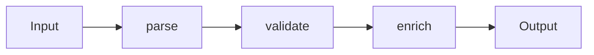

# Data Flow Design

> Software Design 101 series (7/10)

<!-- a-grade-intro:begin -->

**Core question**: What does it mean to design the flow of data?

> Decide where data comes from, how it gets transformed, and where it ends — and make all of that move in one direction.

<!-- a-grade-intro:end -->

## What You Will Learn

- The single-direction principle for data flow
- Building transformation pipelines
- The value of immutable data
- Push versus pull models
- Signals of code with a clear flow

## Why It Matters

Most bugs appear when data changes in unexpected places. A single direction makes the change easy to trace and limits the blast radius.

> Good code keeps a short distance between input and output.

## Concept at a Glance



Each step is small and just hands off to the next.

## Key Terms

- **Pipeline**: A chain of small transformation functions.
- **Pure function**: Same input gives same output, with no side effects.
- **Immutability**: Once a value is created, it does not change.
- **Push model**: Producers push to consumers.
- **Pull model**: Consumers pull what they need.

## Before / After

**Before**

```python
def process(req):
    if not req.get("email"): raise ValueError
    req["email"] = req["email"].lower()
    db.save(req)
    send_welcome(req["email"])
    return req
```

**After**

```python
def parse(payload): ...
def validate(user): ...
def normalize(user): ...
def persist(user): ...
def notify(user): ...

def signup(payload):
    return notify(persist(normalize(validate(parse(payload)))))
```

Each step has a clear responsibility.

## Hands-on: Five Steps to Clean Up the Flow

### Step 1 — Write down input and output shapes

```python
# 1_io.py
# In: dict from HTTP
# Out: User row id
# Sketch what happens between, one line per step.
```

Lock down types and shapes before code.

### Step 2 — Split into step functions

```python
# 2_steps.py
def parse(payload) -> SignupCommand: ...
def validate(cmd: SignupCommand) -> SignupCommand: ...
def to_user(cmd: SignupCommand) -> User: ...
```

Every step states what it takes and what it returns.

### Step 3 — Push side effects to the end

```python
# 3_side_effects.py
def signup(payload):
    user = to_user(validate(parse(payload)))   # pure
    repo.save(user)                            # effect
    mailer.send(user.email)                    # effect
```

Validation and transformation stay pure; IO is last.

### Step 4 — Use immutable data

```python
# 4_immutable.py
from dataclasses import dataclass
@dataclass(frozen=True)
class User:
    id: str
    email: str
```

Return new values instead of mutating state.

### Step 5 — One direction only

```python
# 5_one_way.py
# UI -> command -> domain -> event
# events flow back to UI.
# No silent mid-flow data updates.
```

Breaking cycles makes debugging easier.

## What to Notice in This Code

- Each step has a narrow responsibility.
- Side effects are concentrated on one side.
- Data does not flow backwards.

## Five Common Mistakes

1. **Mixing side effects into transformation functions.** Tests get hard.
2. **Multiple steps mutate a shared mutable object.** You cannot tell who changed it.
3. **IO calls in the middle of the flow.** The flow turns to mud.
4. **Untyped dicts as the only data shape.** Shape varies on every call.
5. **Two-way binding everywhere.** Cause and effect blur.

## How This Shows Up in Production

ETL jobs, request processing pipelines, unidirectional UI flows like React — data flow design is everywhere once you start looking.

## How a Senior Engineer Thinks

- They check whether the flow is one-directional first.
- They push side effects to the edge.
- They make immutable data the default.
- They cut steps small and compose them.
- When debugging, they pinpoint which step changed the data.

## Checklist

- [ ] Does the data flow in a single direction?
- [ ] Are side effects at the edges?
- [ ] Are steps small with clear responsibilities?
- [ ] Is the data immutable?
- [ ] Are shapes guaranteed by types?

## Practice Problems

1. Pick one function in your code and split side effects from pure transformation.
2. Convert a dict-based input into a dataclass.
3. Find a place where the flow goes backwards and write down what you would do about it.

## Wrap-up and Next Steps

Once the flow is visible, change is no longer scary. Next up we look at the design that limits how far that change can spread — reducing change impact.

- [What Is Software Design?](./01-what-is-software-design.md)
- [Separation of Concerns](./02-separation-of-concerns.md)
- [Modules and Boundaries](./03-modules-and-boundaries.md)
- [Dependency Direction](./04-dependency-direction.md)
- [Interfaces and Abstraction](./05-interfaces-and-abstraction.md)
- [Layered Architecture](./06-layered-architecture.md)
- **Data Flow Design (current)**
- Reducing Change Impact (upcoming)
- Design Principles (upcoming)
- Small Design Practice (upcoming)
## References

- [Functional Core, Imperative Shell (Gary Bernhardt)](https://www.destroyallsoftware.com/screencasts/catalog/functional-core-imperative-shell)
- [Out of the Tar Pit (Moseley & Marks)](https://curtclifton.net/papers/MoseleyMarks06a.pdf)
- [Flux Architecture — Unidirectional Data Flow](https://facebookarchive.github.io/flux/)
- [Designing Data-Intensive Applications — Batch and Stream](https://dataintensive.net/)

Tags: Computer Science, SoftwareDesign, DataFlow, Pipelines, Immutability, FunctionalDesign

---

© 2026 YeongseonBooks. All rights reserved.
