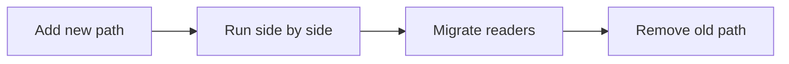

# Reducing Change Impact

> Software Design 101 series (8/10)

<!-- a-grade-intro:begin -->

**Core question**: What does it take to change one line without rattling the whole system?

> Design that limits the blast radius of change — open/closed, expand-contract, and feature flags are the practical tools.

<!-- a-grade-intro:end -->

## What You Will Learn

- The blast radius of a change
- The Open / Closed Principle (OCP)
- The expand-contract migration pattern
- Decoupling change with feature flags
- Signals that you have a real safety net

## Why It Matters

Most systems are not built well from the start. They are built to change well. The smaller the impact of each change, the more often and more safely they can evolve.

> Code is good when it is good at being changed.

## Concept at a Glance



Expand → switch → contract.

## Key Terms

- **Blast radius**: How far a single change can spread.
- **OCP**: Open for extension, closed for modification.
- **Expand-contract**: Run old and new paths together, migrate gradually.
- **Feature flag**: A switch that separates code deploy from feature activation.
- **Strangler fig**: Pattern of wrapping legacy code and replacing it gradually.

## Before / After

**Before**

```python
def price(item, kind):
    if kind == "book": return item.cost * 0.9
    elif kind == "food": return item.cost * 0.95
    elif kind == "lux": return item.cost * 1.1
    # adding a new category = editing this function
```

**After**

```python
class PricingRule:
    def apply(self, item) -> float: ...

PRICING: dict[str, PricingRule] = {}

def price(item, kind):
    return PRICING[kind].apply(item)
```

A new category just registers itself in PRICING.

## Hands-on: Five Steps to Shrink Change Impact

### Step 1 — Measure the blast radius

```bash
# 1_blast.sh
git grep -n "kind ==" | wc -l
# Has one variable's comparison spread across the system?
```

See the current radius first.

### Step 2 — Expand

```python
# 2_expand.py
# Add the new path only; leave the old one intact.
def price_v2(item, kind): ...
```

Old callers see no impact.

### Step 3 — Migrate gradually

```python
# 3_migrate.py
def price(item, kind):
    if FF.use_v2: return price_v2(item, kind)
    return price_v1(item, kind)
```

A feature flag flips users in stages.

### Step 4 — Compare in parallel

```python
# 4_compare.py
def price(item, kind):
    a, b = price_v1(item, kind), price_v2(item, kind)
    if a != b: log.warn("price drift", a, b)
    return a if not FF.use_v2 else b
```

Side-by-side comparison catches regressions.

### Step 5 — Contract

```python
# 5_contract.py
# Once everyone is on v2, remove v1 and the flag.
```

Cleanup is part of the change.

## What to Notice in This Code

- Adding a new path does not touch the old one.
- The change is expressed as data (config, flags), not branching.
- Regression checks come naturally with the pattern.

## Five Common Mistakes

1. **Editing the existing path in place.** Branching multiplies forever.
2. **Expanding but never contracting.** Dead code and flags pile up.
3. **Keeping a flag forever.** It becomes operational debt.
4. **Switching with no comparison.** Latent regressions ship.
5. **Forcing expand-contract on every change.** Overkill for a one-liner.

## How This Shows Up in Production

Schema migrations, API v1→v2 swaps, rewriting pricing or discount logic, replacing a third-party SaaS — these are the practical tools for evolving live systems safely.

## How a Senior Engineer Thinks

- They estimate blast radius first.
- They prefer data-driven dispatch over more branches.
- They run old and new in parallel to verify.
- They give feature flags an expiration date.
- The last step of any change is always cleanup.

## Checklist

- [ ] Did you estimate the blast radius?
- [ ] Can the new path live next to the old?
- [ ] Is there a way to verify regressions?
- [ ] Do flags have an expiration date?
- [ ] Is post-migration cleanup planned?

## Practice Problems

1. Find the function with the most branches in your code and turn it into a data-driven dispatch.
2. Pick one API and write a plan to expand-contract it to v2.
3. List your live feature flags that have no expiration date and assign them one.

## Wrap-up and Next Steps

Good design makes change unscary. Next up we look at the principles that compress this thinking — a tour of design principles.

- [What Is Software Design?](./01-what-is-software-design.md)
- [Separation of Concerns](./02-separation-of-concerns.md)
- [Modules and Boundaries](./03-modules-and-boundaries.md)
- [Dependency Direction](./04-dependency-direction.md)
- [Interfaces and Abstraction](./05-interfaces-and-abstraction.md)
- [Layered Architecture](./06-layered-architecture.md)
- [Data Flow Design](./07-data-flow-design.md)
- **Reducing Change Impact (current)**
- Design Principles (upcoming)
- Small Design Practice (upcoming)
## References

- [Open/Closed Principle (Robert C. Martin)](https://web.archive.org/web/20060822033314/http://www.objectmentor.com/resources/articles/ocp.pdf)
- [ParallelChange (Expand-Contract) — Danilo Sato](https://martinfowler.com/bliki/ParallelChange.html)
- [Feature Toggles — Pete Hodgson](https://martinfowler.com/articles/feature-toggles.html)
- [Strangler Fig Application — Martin Fowler](https://martinfowler.com/bliki/StranglerFigApplication.html)

Tags: Computer Science, SoftwareDesign, ChangeImpact, OpenClosed, FeatureFlags, Refactoring

---

© 2026 YeongseonBooks. All rights reserved.
