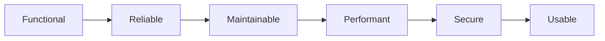

# What Makes Good Software

> Software Engineering 101 series (10/10)

<!-- a-grade-intro:begin -->

**Core question**: Are "good code" and "good software" the same thing?

> Code is a means. Software is a system people live with for years.

<!-- a-grade-intro:end -->

## What You Will Learn

- Quality attributes (a short take on ISO/IEC 25010)
- The one-line meaning of each SOLID principle
- The link between simplicity and sustainability
- Four external signals of a healthy system
- The single thing senior engineers look at last

## Why It Matters

A working feature is the start, not the end. Good software endures over time and grows the people who work on it.

> What is simple lasts.

## Concept at a Glance



Quality is not one axis but a balance across many.

## Key Terms

- **Functional suitability**: Meets the requirement correctly.
- **Reliability**: Predictable failure rate.
- **Maintainability**: Cost of change.
- **Performance efficiency**: Throughput per resource.
- **SOLID**: Five principles of OO design.

## Before/After

**Before — feature-only**

```text
"It works" is the only metric -> change cost explodes in 6 months
```

**After — measure quality attributes**

```text
lead time, incident rate, MTTR, maintainability score -> decisions become possible
```

You only improve what you measure.

## Hands-on: A Small Quality Kit

### Step 1 — SRP check (the S in SOLID)

```python
# 1_srp.py
class Invoice:           # responsibility 1: data
    ...
class InvoicePrinter:    # responsibility 2: rendering
    ...
```

One class, one reason to change.

### Step 2 — DIP check (the D in SOLID)

```python
# 2_dip.py
class OrderService:
    def __init__(self, repo: "Repo"):  # depends on the interface
        self.repo = repo
```

Depend on abstractions, not on concretions.

### Step 3 — Measure simplicity

```bash
# 3_complexity.sh
radon cc app/ -a -nb
```

If complexity passes a threshold, decompose.

### Step 4 — Measure lead time

```bash
# 4_lead_time.sh
git log --pretty='%H %as' -- app/ | head
```

Track time from code to deploy.

### Step 5 — Four external signals

```text
# 5_signals.md
- Time to a new hire's first PR
- MTTR on incidents
- Average lead time for new features
- User satisfaction (NPS, CSAT)
```

External signals tell more truth than internal code metrics.

## What to Notice in This Code

- One class, one reason to change.
- Depending on abstractions decides change cost.
- Complexity is measurable.
- External signals carry the truth about quality.

## Five Common Mistakes

1. **Measuring features only.** Change cost explodes soon.
2. **Treating SOLID as dogma.** Principles are tools, not faith.
3. **Too much abstraction.** Simplicity dies.
4. **Ignoring external signals.** User trust is the real metric.
5. **Quality at the end.** Measure from day one.

## How This Shows Up in Production

Strong teams track DORA's four metrics (deploy frequency, lead time, change failure rate, MTTR) and review them quarterly. New features call out their quality-attribute impact (reliability/security) explicitly.

## How a Senior Engineer Thinks

- What is simple lasts.
- SOLID is a tool, not a religion.
- External signals are closer to truth.
- Quality is measured from day one.
- Good software grows the people who work on it.

## Checklist

- [ ] Do you know the six quality attributes?
- [ ] Do you measure DORA's four metrics?
- [ ] Are complexity and lead time on a dashboard?
- [ ] Do you treat SOLID as a tool, not a creed?
- [ ] Do you review external signals each quarter?

## Practice Problems

1. Estimate the current values of DORA's four metrics for your project.
2. Find one SOLID violation and rewrite it through an SRP or DIP lens.
3. Define four external signals for your own system.

## Wrap-up and Next Steps

Good software is simple, measurable, and grows the people who maintain it. This series ends here, but the principles from these ten essays deepen further in the next series — Clean Code, Design Patterns, API Design, and beyond.

- [What is Software Engineering?](./01-what-is-software-engineering.md)
- [Understanding Requirements](./02-understanding-requirements.md)
- [Design vs Implementation](./03-design-vs-implementation.md)
- [Code Review](./04-code-review.md)
- [Testing Strategy](./05-testing-strategy.md)
- [Version Control and Release](./06-version-control-and-release.md)
- [Documentation](./07-documentation.md)
- [Collaboration Process](./08-collaboration-process.md)
- [Maintenance and Tech Debt](./09-maintenance-and-tech-debt.md)
- **What Makes Good Software (current)**
## References

- [ISO/IEC 25010 — Product Quality Model](https://iso25000.com/index.php/en/iso-25000-standards/iso-25010)
- [Robert C. Martin — SOLID Principles](https://en.wikipedia.org/wiki/SOLID)
- [DORA — State of DevOps](https://dora.dev/)
- [A Philosophy of Software Design — John Ousterhout](https://web.stanford.edu/~ouster/cgi-bin/aposd.php)

Tags: Computer Science, SoftwareEngineering, Quality, SOLID, Simplicity, Engineering

---

© 2026 YeongseonBooks. All rights reserved.
