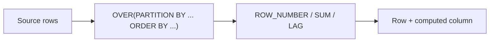

# Window Function

> SQL 101 series (7/10)

<!-- a-grade-intro:begin -->

**Core question**: GROUP BY *shrinks rows* to make answers. Is there a way to *add per-group computations* while *keeping the rows*?

> *A window function *attaches an aggregate result to every row*.*

<!-- a-grade-intro:end -->

## What You Will Learn

- The meaning of `OVER (PARTITION BY ...)`
- *ROW_NUMBER, RANK, DENSE_RANK*
- *LAG / LEAD* and *time comparisons*
- *Running totals*
- Five common mistakes

## Why It Matters

Rankings, differences, cumulative sums — essential for *row-level analysis*. GROUP BY alone *discards detail*. Windows give you *detail + aggregate together*. They are core tools for *cohort, funnel, retention*.

> *Windows are what made SQL *an analytics language*.*

## Concept at a Glance



## Key Terms

- **Partition**: rows *grouped together*.
- **Frame**: how far inside the window we *look*.
- **Ranking function**: `ROW_NUMBER, RANK, DENSE_RANK`.
- **Offset function**: `LAG, LEAD` — previous and next row.
- **Running total**: cumulative sum.

## Before/After

**Before**: Compute *revenue per country* with GROUP BY, then *join back* to the original.

**After**: One line — `SUM(total) OVER (PARTITION BY country)` — adds the total *next to each row*.

## Hands-on: Five Patterns

### Step 1 — Row number

```sql
SELECT id, country,
    ROW_NUMBER() OVER (PARTITION BY country ORDER BY signup_at) AS seq
FROM users;
```

### Step 2 — Rank

```sql
SELECT product_id, total,
    RANK() OVER (PARTITION BY product_id ORDER BY total DESC) AS rk
FROM orders;
```

### Step 3 — Previous value

```sql
SELECT user_id, signup_at,
    LAG(signup_at) OVER (PARTITION BY user_id ORDER BY signup_at) AS prev_signup
FROM users;
```

### Step 4 — Running total

```sql
SELECT day, revenue,
    SUM(revenue) OVER (ORDER BY day) AS running_total
FROM daily_revenue;
```

### Step 5 — 7-day moving average

```sql
SELECT day, revenue,
    AVG(revenue) OVER (
        ORDER BY day
        ROWS BETWEEN 6 PRECEDING AND CURRENT ROW
    ) AS ma_7
FROM daily_revenue;
```

## What to Notice in This Code

- An empty `OVER ()` makes everything one partition.
- Order-dependent functions only mean something with `ORDER BY`.
- If you don't *specify the frame*, the per-DB default differs.

## Five Common Mistakes

1. **Confusing `RANK` and `ROW_NUMBER`.** They handle ties differently.
2. **Forgetting PARTITION.** The *whole table* becomes one group.
3. **Implicit frame.** The default `RANGE UNBOUNDED PRECEDING` is *not what you want*.
4. **Ignoring NULL in `LAG`.** The first row's previous value is NULL.
5. **Mixing GROUP BY and windows.** The order of evaluation surprises you.

## How This Shows Up in Production

*7-day moving average revenue*, *Nth order per user*, *month-over-month growth* — each is one window expression. Windows are core to *time-series analysis*.

## How a Senior Engineer Thinks

- *Windows aggregate *without losing detail*.*
- *Always declare the frame.*
- *Pick RANK by the *tie-breaking policy* you want.*
- *LAG/LEAD is the basic *time comparison* tool.*
- *Pull complex windows into a *CTE*.*

## Checklist

- [ ] I know what PARTITION BY does.
- [ ] I know ROW_NUMBER vs RANK.
- [ ] I can use LAG/LEAD.
- [ ] I know the danger of default frames.

## Practice Problems

1. Pick each user's *first order* using `ROW_NUMBER = 1`.
2. Find the *top-3 revenue rows per product* with RANK.
3. Compute a *7-day moving average* of daily revenue.

## Wrap-up and Next Steps

Windows are *aggregates that keep the rows*. Next: *INSERT/UPDATE/DELETE*.

- [What Is SQL?](./01-what-is-sql.md)
- [SELECT Basics](./02-select-basics.md)
- [WHERE and Conditions](./03-where-and-conditions.md)
- [JOIN](./04-join.md)
- [GROUP BY and Aggregates](./05-group-by-and-aggregate.md)
- [Subquery](./06-subquery.md)
- **Window Function (current)**
- INSERT, UPDATE, DELETE (upcoming)
- Index and Query Plan (upcoming)
- Practical Analysis SQL (upcoming)
## References

- [PostgreSQL — Window Functions](https://www.postgresql.org/docs/current/tutorial-window.html)
- [PostgreSQL — Window Function Reference](https://www.postgresql.org/docs/current/functions-window.html)
- [Mode — Window Functions](https://mode.com/sql-tutorial/sql-window-functions/)
- [Use The Index, Luke — Top-N](https://use-the-index-luke.com/sql/partial-results/top-n-queries)

Tags: SQL, WindowFunction, Analytics, Database, Query

---

© 2026 YeongseonBooks. All rights reserved.
