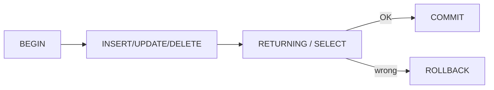

# INSERT, UPDATE, DELETE

> SQL 101 series (8/10)

<!-- a-grade-intro:begin -->

**Core question**: If SELECT is *reading*, why is *writing* an order of magnitude scarier, and how do we build *a safety net to undo it*?

> *Statements that *change data* deserve *ten times more care* than statements that read.*

<!-- a-grade-intro:end -->

## What You Will Learn

- The basics of *INSERT*, *UPDATE*, *DELETE*
- *Transactions* and `BEGIN / COMMIT / ROLLBACK`
- *UPSERT* with `ON CONFLICT`
- *RETURNING* to verify affected rows
- Five common mistakes

## Why It Matters

Forgetting *one WHERE* in production wipes the whole table. Transactions, an explicit WHERE, and RETURNING are the *team's safety net*. The habit prevents incidents.

> *DML turns *irreversible* work into *reversible* work — when you do it right.*

## Concept at a Glance



## Key Terms

- **DML**: Data Manipulation Language — INSERT, UPDATE, DELETE.
- **Transaction**: a group of operations that succeed or fail *atomically*.
- **UPSERT**: update if present, insert if absent.
- **RETURNING**: get the changed rows back.
- **Constraint**: NOT NULL, UNIQUE, FK — DB-level rules.

## Before/After

**Before**: `DELETE FROM users;` runs by accident — *unrecoverable*.

**After**: `BEGIN; DELETE FROM users WHERE id = 42 RETURNING *;` then `COMMIT` only after checking the output.

## Hands-on: Five Safe DML Patterns

### Step 1 — INSERT

```sql
INSERT INTO users (id, name, signup_at)
VALUES (4, 'Margaret', '2026-04-10');
```

### Step 2 — UPDATE (WHERE required)

```sql
UPDATE users SET name = 'Margaret Hamilton' WHERE id = 4;
```

### Step 3 — DELETE (inside a transaction)

```sql
BEGIN;
DELETE FROM users WHERE id = 4 RETURNING *;
-- review the output, then
COMMIT;
```

### Step 4 — UPSERT

```sql
INSERT INTO users (id, name, signup_at)
VALUES (4, 'Margaret', '2026-04-10')
ON CONFLICT (id)
DO UPDATE SET name = EXCLUDED.name;
```

### Step 5 — Bulk INSERT

```sql
INSERT INTO users (id, name, signup_at) VALUES
    (5, 'Edsger', '2026-04-11'),
    (6, 'Donald', '2026-04-12'),
    (7, 'Barbara', '2026-04-13');
```

## What to Notice in This Code

- *Every UPDATE/DELETE has a WHERE.* No exceptions.
- Wrap changes in transactions and verify with RETURNING.
- In UPSERT, `EXCLUDED` refers to the *new values* the INSERT was attempting.

## Five Common Mistakes

1. **UPDATE/DELETE without WHERE.** Whole table affected.
2. **Multi-step changes *without* a transaction.** A failure mid-way leaves *half-state*.
3. **Changing rows from *guesswork*.** Always verify with RETURNING.
4. **UPSERT without a unique constraint.** ON CONFLICT *won't fire*.
5. **Bulk INSERT done as N single rows.** Slow and costly.

## How This Shows Up in Production

Production changes go through *PR review* and *migration tools*. Ad-hoc changes always run *inside a transaction* and use RETURNING to *verify*. *Backups and PITR* are the *last line of defense*.

## How a Senior Engineer Thinks

- *Treat DML without WHERE as a *syntax error*.*
- *Changes mean *transaction + RETURNING*.*
- *UPSERT only works *with a constraint*.*
- *Do bulk inserts *in one shot*.*
- *Production DML lives in *migrations*.*

## Checklist

- [ ] I always check for WHERE in DML.
- [ ] I can use BEGIN/COMMIT/ROLLBACK.
- [ ] I can write UPSERT.
- [ ] I know what RETURNING does.

## Practice Problems

1. Change the name of *id = 5* inside a transaction and verify with RETURNING.
2. Before deleting *users with no orders*, SELECT them to confirm.
3. Write one UPSERT that *creates a new user or updates an existing one*.

## Wrap-up and Next Steps

DML is the craft of making the *irreversible* feel safe. Next: *Index and query plan*.

- [What Is SQL?](./01-what-is-sql.md)
- [SELECT Basics](./02-select-basics.md)
- [WHERE and Conditions](./03-where-and-conditions.md)
- [JOIN](./04-join.md)
- [GROUP BY and Aggregates](./05-group-by-and-aggregate.md)
- [Subquery](./06-subquery.md)
- [Window Function](./07-window-function.md)
- **INSERT, UPDATE, DELETE (current)**
- Index and Query Plan (upcoming)
- Practical Analysis SQL (upcoming)
## References

- [PostgreSQL — INSERT](https://www.postgresql.org/docs/current/sql-insert.html)
- [PostgreSQL — UPDATE](https://www.postgresql.org/docs/current/sql-update.html)
- [PostgreSQL — DELETE](https://www.postgresql.org/docs/current/sql-delete.html)
- [PostgreSQL — Transactions](https://www.postgresql.org/docs/current/tutorial-transactions.html)

Tags: SQL, DML, Transaction, Database, Postgres

---

© 2026 YeongseonBooks. All rights reserved.
