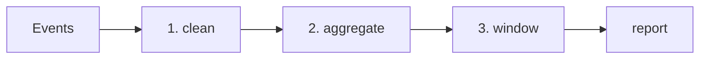

# Practical Analysis SQL

> SQL 101 series (10/10)

<!-- a-grade-intro:begin -->

**Core question**: How do you *assemble* SELECT, JOIN, GROUP BY, and windows into *real reports* like *cohort, funnel, retention*?

> *Analysis is *not magic*. It is the same tools *stacked in layers*.*

<!-- a-grade-intro:end -->

## What You Will Learn

- The SQL pattern for *DAU / WAU / MAU*
- The basic shape of *cohort retention*
- A *funnel* analysis
- *Top-N per group*
- Five common mistakes

## Why It Matters

Most dashboard numbers are variations on a few patterns. Learn them, and you can write a *first draft in minutes* for any new request. Over time, these queries become *team assets*.

> *Analytics SQL is the *final exam* of the series — and *the starting point* of real work.*

## Concept at a Glance



## Key Terms

- **DAU/WAU/MAU**: daily / weekly / monthly *active users*.
- **Cohort**: users who *signed up at the same time*.
- **Retention**: percent of cohort active *N days later*.
- **Funnel**: conversion rate per *step*.
- **Top-N per group**: the *top N* rows *within each group*.

## Before/After

**Before**: Every new request becomes a *new query from scratch*.

**After**: You assemble templates for *cohort, funnel, retention*.

## Hands-on: Five Patterns

### Step 1 — DAU

```sql
SELECT event_at::date AS day, COUNT(DISTINCT user_id) AS dau
FROM events
GROUP BY day
ORDER BY day;
```

### Step 2 — Cohort retention

```sql
WITH cohort AS (
    SELECT user_id, MIN(event_at)::date AS cohort_day FROM events GROUP BY user_id
),
activity AS (
    SELECT e.user_id, c.cohort_day,
        (e.event_at::date - c.cohort_day) AS day_n
    FROM events e JOIN cohort c USING (user_id)
)
SELECT cohort_day, day_n, COUNT(DISTINCT user_id) AS users
FROM activity
GROUP BY cohort_day, day_n
ORDER BY cohort_day, day_n;
```

### Step 3 — Funnel

```sql
SELECT
    COUNT(DISTINCT user_id) FILTER (WHERE step = 'view')   AS s1_view,
    COUNT(DISTINCT user_id) FILTER (WHERE step = 'cart')   AS s2_cart,
    COUNT(DISTINCT user_id) FILTER (WHERE step = 'pay')    AS s3_pay
FROM events;
```

### Step 4 — Top-N per group

```sql
WITH ranked AS (
    SELECT product_id, total,
        ROW_NUMBER() OVER (PARTITION BY product_id ORDER BY total DESC) AS rk
    FROM orders
)
SELECT * FROM ranked WHERE rk <= 3;
```

### Step 5 — Month-over-month growth

```sql
WITH monthly AS (
    SELECT DATE_TRUNC('month', day) AS month, SUM(revenue) AS rev
    FROM daily_revenue GROUP BY month
)
SELECT month, rev,
    rev - LAG(rev) OVER (ORDER BY month) AS diff,
    (rev - LAG(rev) OVER (ORDER BY month)) * 100.0
        / NULLIF(LAG(rev) OVER (ORDER BY month), 0) AS mom_pct
FROM monthly;
```

## What to Notice in This Code

- `DISTINCT user_id` is the standard expression for *active users*.
- `FILTER (WHERE ...)` puts a funnel *on a single line*.
- `NULLIF` prevents *divide-by-zero*.

## Five Common Mistakes

1. **Active definition varies between teams.** Without docs, the *numbers diverge*.
2. **Skipping timezone handling.** Mixing UTC and local time *shifts dates*.
3. **Vague cohort definition.** *Signup* vs *first payment* must be *explicit*.
4. **Funnel ignores time order.** Steps must be *checked chronologically*.
5. **Forgetting NULLIF.** Division by *prior zero* errors out.

## How This Shows Up in Production

Analytics teams maintain a *pattern library* of these queries. With PR review and tools like *dbt*, they become *reusable models*. Behind every dashboard line is *dozens of lines of validated SQL*.

## How a Senior Engineer Thinks

- *Analytics SQL is a *team asset* — document it.*
- *Agree on definitions (active, cohort) *first*.*
- *Always be explicit about timezones.*
- *Build layers with windows and CTEs.*
- *MoM/YoY uses NULLIF by default.*

## Checklist

- [ ] I can write DAU in one line.
- [ ] I can write cohort retention in two steps.
- [ ] I can write a funnel using FILTER.
- [ ] I can write top-N per group with ROW_NUMBER.

## Practice Problems

1. Write *Weekly Active Users (WAU)*.
2. Add *step-to-step conversion rates* to a funnel.
3. Produce a MoM growth table you can chart.

## Wrap-up and Next Steps

Closing the series: *SQL is the shared language of reads, writes, and analytics*. Next stops: *deeper query plans*, *running PostgreSQL*, and *data warehouses*.

- [What Is SQL?](./01-what-is-sql.md)
- [SELECT Basics](./02-select-basics.md)
- [WHERE and Conditions](./03-where-and-conditions.md)
- [JOIN](./04-join.md)
- [GROUP BY and Aggregates](./05-group-by-and-aggregate.md)
- [Subquery](./06-subquery.md)
- [Window Function](./07-window-function.md)
- [INSERT, UPDATE, DELETE](./08-insert-update-delete.md)
- [Index and Query Plan](./09-index-and-query-plan.md)
- **Practical Analysis SQL (current)**
## References

- [Mode — Advanced SQL](https://mode.com/sql-tutorial/)
- [PostgreSQL — Window Functions](https://www.postgresql.org/docs/current/tutorial-window.html)
- [dbt — Analytics Engineering](https://docs.getdbt.com/)
- [Looker — Block Library](https://cloud.google.com/looker/docs)

Tags: SQL, Analytics, Cohort, Funnel, Retention

---

© 2026 YeongseonBooks. All rights reserved.
