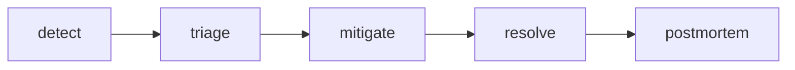

# Incident Response

> SRE 101 series (6/10)

<!-- a-grade-intro:begin -->

**Core question**: When an *outage hits*, how should the *team* *move*?

> *Incident response* is a *team activity* with fixed *roles* and a fixed *order*.

<!-- a-grade-intro:end -->

## What You Will Learn

- The *definition* of an *incident*
- *Severity* classification
- *Roles* and *responsibilities*
- *Communication* channels
- *Closure* and *handover*

## Why It Matters

*Chaos* magnifies *impact*.

## Concept at a Glance



## Key Terms

- **incident**: an *abnormal* condition with *impact*.
- **severity**: the level of *impact*.
- **IC**: the *Incident Commander*.
- **ops lead**: the operational lead.
- **comms lead**: the communications lead.

## Before/After

**Before**: at *start*, everyone *responds at once*.

**After**: *roles* and *channels* are *fixed* up front.

## Hands-on: Defining the Process

### Step 1 — Severity mapping

```python
def severity(impact_users, duration_min):
    if impact_users > 10000 or duration_min > 60:
        return "SEV1"
    if impact_users > 1000:
        return "SEV2"
    return "SEV3"
```

### Step 2 — Assign IC

```python
def assign_ic(on_call):
    return on_call[0]
```

### Step 3 — Create the channel

```python
def channel(name):
    return f"#inc-{name}"
```

### Step 4 — Status updates

```python
def update(channel, msg, every_min=15):
    return {"channel": channel, "msg": msg, "every": every_min}
```

### Step 5 — Closure check

```python
def can_close(mitigated, customer_impact_zero):
    return mitigated and customer_impact_zero
```

## What to Notice in This Code

- *Severity* is defined by *impact*, not feel.
- The *IC* is the *single* decision-maker.
- A separate *channel* preserves the *record*.

## Five Common Mistakes

1. **Delaying decisions by *consensus* instead of using an *IC*.**
2. **Estimating *impact* *subjectively*.**
3. **Skipping *customer communication*.**
4. **Vague *closure* criteria.**
5. **Returning to work without a *record*.**

## How This Shows Up in Production

*PagerDuty*, *Statuspage*, and *Slack* integrations *automate* roles and customer comms.

## How a Senior Engineer Thinks

- *Response* gets *faster* with *training*.
- The *IC* decides; *experts* do the work.
- *Communication* is the *axis of trust*.
- *Closure* is done *carefully*.
- *Training* happens *before* the call.

## Checklist

- [ ] *Severity* defined.
- [ ] *IC* rotation.
- [ ] *Communication* templates.
- [ ] *Closure* criteria.

## Practice Problems

1. Define the *IC* role in one line.
2. Define *severity* in one line.
3. Define the role of a *Statuspage* in one line.

## Wrap-up and Next Steps

Next, we cover *postmortems*.

- [What is SRE?](./01-what-is-sre.md)
- [Reliability](./02-reliability.md)
- [SLI, SLO, SLA](./03-sli-slo-sla.md)
- [Error Budget](./04-error-budget.md)
- [Monitoring](./05-monitoring.md)
- **Incident Response (current)**
- Postmortem (upcoming)
- Reducing Toil (upcoming)
- Capacity Planning (upcoming)
- Building Operable Systems (upcoming)
## References

- [Managing Incidents - Google SRE Book](https://sre.google/sre-book/managing-incidents/)
- [Incident Response - PagerDuty](https://response.pagerduty.com/)
- [Incident Command System](https://en.wikipedia.org/wiki/Incident_Command_System)
- [Atlassian Incident Handbook](https://www.atlassian.com/incident-management/handbook)

Tags: SRE, Incident, Response, OnCall, Operations

---

© 2026 YeongseonBooks. All rights reserved.
