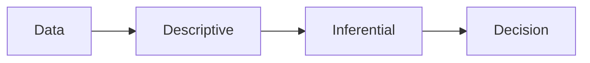

# What Is Statistics?

> Statistics 101 series (1/10)

<!-- a-grade-intro:begin -->

**Core question**: What does statistics actually study, and why do we need it? How do we turn a collection of formulas into a *language for decisions*?

> *Statistics is the shared language of uncertainty.*

<!-- a-grade-intro:end -->

## What You Will Learn

- The *two pillars* of statistics — descriptive and inferential
- The *data → decision* thinking flow
- The *four questions* statistics answers
- A 5-step statistical thinking exercise
- Five common mistakes

## Why It Matters

As data piles up, the question *“is this really true?”* shows up more and more often. Statistics is the tool that *links hypothesis to evidence in numbers* — making *uncertain decisions less uncertain*.

> *Good statistical thinking produces decisions, not numbers.*

## Concept at a Glance



## Key Terms

- **Descriptive Statistics**: statistics that *summarize* data (mean, variance, etc.).
- **Inferential Statistics**: statistics that *infer the population* from a *sample*.
- **Population vs Sample**: *all* vs *part*.
- **Estimate**: the *guess* about the *true value* in the population.
- **Uncertainty**: the error that *always* accompanies an estimate.

## Before / After

**Before**: *“Revenue went up this month!”* — By how much? Is it statistically meaningful?

**After**: *“Monthly revenue is up by 6.2% on average (95% CI ±1.5%, n=30 days) — statistically significant vs last month.”*

## Hands-on: 5-step Statistical Thinking

### Step 1 — Define the question

```text
Q: "Did this month's marketing campaign improve click-through rate?"
```

### Step 2 — Collect data

```python
import pandas as pd
df = pd.read_csv("clicks.csv")
print(df.shape, df.columns.tolist())
```

### Step 3 — Summarize (descriptive)

```python
print(df.groupby("group")["ctr"].agg(["mean", "std", "count"]))
```

### Step 4 — Infer

```python
from scipy.stats import ttest_ind
a, b = df.loc[df.group == "control", "ctr"], df.loc[df.group == "test", "ctr"]
print(ttest_ind(a, b, equal_var=False))
```

### Step 5 — Decide

```text
Decision: p < 0.01 & lift +0.4pp → roll out the campaign to all users
```

## What to Notice in This Code

- The *3-tier structure* — *describe → infer → decide*.
- *Group comparison* starts with a *t-test*.
- A *decision sentence* is what *closes* the analysis.

## Five Common Mistakes

1. **Looking only at the *mean*.** You also need *variance* and the *distribution*.
2. **Treating the *sample* like the *population*.** Forgetting *uncertainty*.
3. **Confusing *p-value* with *effect size*.**
4. **Reading statistics *without visualization*.** Distorted distributions slip by.
5. **Ending the report *without a decision*.** The point of the analysis is lost.

## How This Shows Up in Production

A/B testing, revenue forecasting, anomaly detection, quality control — *every data-driven decision* sits on a base of statistics. Even *one cell on a dashboard* is an *estimate*; reporting it *with its uncertainty* is what builds *trust*.

## How a Senior Engineer Thinks

- Read the *distribution* before the *mean*.
- *Always* attach *uncertainty* to an estimate.
- Shorten the *question → data → decision* loop.
- Use *visualization* and *statistics* together.
- Remember statistics is the *language of decisions*.

## Checklist

- [ ] I can write the *question* in one line.
- [ ] I can *summarize* data with descriptive statistics.
- [ ] I can read *uncertainty* through inference.
- [ ] I close with a *decision sentence*.

## Practice Problems

1. Compute the mean and variance of *some everyday data* (e.g., daily study time).
2. Explain the difference between *population* and *sample* in *one sentence*.
3. Recall *one statistical report* that ended with a clear decision and write its structure down.

## Wrap-up and Next Steps

Statistics is the tool that moves *uncertainty* into *decisions*. The next episode dives into the most basic summary tools — *mean, median, and variance*.

- **What Is Statistics? (current)**
- Mean, Median, and Variance (upcoming)
- Distributions (upcoming)
- Sample and Population (upcoming)
- Estimation (upcoming)
- Confidence Interval (upcoming)
- Hypothesis Testing (upcoming)
- Correlation and Regression (upcoming)
- Understanding p-value (upcoming)
- Statistical Thinking (upcoming)
## References

- [Khan Academy — Statistics and Probability](https://www.khanacademy.org/math/statistics-probability)
- [OpenIntro Statistics](https://www.openintro.org/book/os/)
- [scipy.stats — Statistical Functions](https://docs.scipy.org/doc/scipy/reference/stats.html)
- [Seeing Theory — Visual Introduction](https://seeing-theory.brown.edu/)

Tags: Statistics, Fundamentals, DataAnalysis, Beginner, Concept

---

© 2026 YeongseonBooks. All rights reserved.
