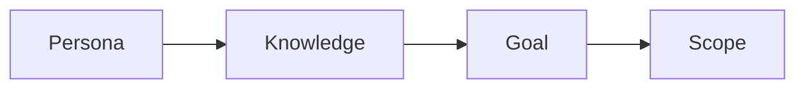

# Defining the Reader

> Technical Writing 101 series (2/10)

<!-- a-grade-intro:begin -->

**Core question**: Why does a post for *everyone* end up *helping no one*?

> A *clear reader* makes *clear sentences*.

<!-- a-grade-intro:end -->

## What You Will Learn

- Building a *persona*
- Mapping *prior knowledge*
- Aligning the *goal*
- Tightening the *scope*
- Matching example *difficulty*

## Why It Matters

A blurry *reader* leads to blurry *sentences*.

## Concept at a Glance



## Key Terms

- **persona**: A *model of the reader*.
- **prerequisite**: *Prior knowledge*.
- **goal**: *What the reader does next*.
- **scope**: What the post *covers*.
- **non-goal**: What the post *does not cover*.

## Before/After

**Before**: "A post for *developers*."

**After**: "A post for a *first-year Python* engineer learning *FastAPI*."

## Hands-on: A Persona Card

### Step 1 — Name and role

```python
persona = {"name": "Jimin", "role": "First-year Python backend"}
```

### Step 2 — Prior knowledge

```python
knows = ["variables", "functions", "git basics"]
```

### Step 3 — Gaps

```python
unknown = ["async", "type hints"]
```

### Step 4 — Goal

```python
goal = "Ship the first FastAPI endpoint"
```

### Step 5 — Non-goal

```python
non_goal = ["deployment", "DB migrations"]
```

## What to Notice in This Code

- The persona has a *name*.
- The persona has *gaps*.
- The persona has *non-goals*.

## Five Common Mistakes

1. **Targeting *everyone*.**
2. **Skipping *prerequisites*.**
3. **Vague *goals*.**
4. **Missing *non-goals*.**
5. **Examples that are *too hard*.**

## How This Shows Up in Production

API references, user guides, and tutorials all split by *persona*.

## How a Senior Engineer Thinks

- The reader feels like *one person*.
- *Non-goals* shrink the post.
- Examples sit *inside* the prior knowledge.
- Goals are written as *verbs*.
- The *future you* in two weeks is also a reader.

## Checklist

- [ ] One *persona*.
- [ ] Three *prerequisites*.
- [ ] One *goal* line.
- [ ] At least one *non-goal*.

## Practice Problems

1. Write the definition of *persona* in one line.
2. Write the meaning of *non-goal* in one line.
3. Write an example of a *prerequisite* in one line.

## Wrap-up and Next Steps

The next post is *Title and Structure*.

- [What Is Technical Writing](./01-what-is-technical-writing.md)
- **Defining the Reader (current)**
- Title and Structure (upcoming)
- Explaining Concepts (upcoming)
- Explaining Example Code (upcoming)
- Using Figures and Tables (upcoming)
- Writing the README (upcoming)
- Writing Tutorials (upcoming)
- Blog vs Documentation (upcoming)
- Pre-publish Checklist (upcoming)
## References

- [The Persona Lifecycle - Pruitt & Adlin](https://www.elsevier.com/books/the-persona-lifecycle/pruitt/978-0-12-566251-2)
- [About Face - Cooper et al.](https://www.wiley.com/en-us/About+Face%3A+The+Essentials+of+Interaction+Design%2C+4th+Edition-p-9781118766576)
- [Nielsen Norman Group on Personas](https://www.nngroup.com/articles/persona/)
- [Writing for Developers - Karl Hughes](https://www.writingfordevelopers.com/)

Tags: TechnicalWriting, Audience, Persona, Writing, Beginner

---

© 2026 YeongseonBooks. All rights reserved.
