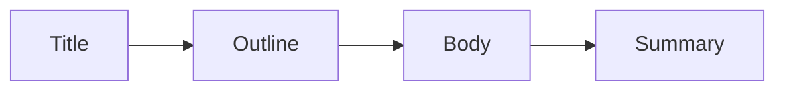

# Title and Structure

> Technical Writing 101 series (3/10)

<!-- a-grade-intro:begin -->

**Core question**: Why must a *good title* and a *good structure* travel *together*?

> The *title* is a *promise*, and the *structure* is the *delivery*.

<!-- a-grade-intro:end -->

## What You Will Learn

- *SEO* titles
- *H heading* hierarchy
- *Intro, body, summary* shape
- Building an *outline*
- Handling *paragraphs*

## Why It Matters

The *title* earns the *click*, and the *structure* earns the *time*.

## Concept at a Glance



## Key Terms

- **SEO title**: A *search-friendly title*.
- **outline**: A *draft table of contents*.
- **heading**: A *heading level*.
- **lede**: The *first paragraph*.
- **TL;DR**: *Too long, did not read* summary.

## Before/After

**Before**: "*FastAPI* notes".

**After**: "*Ship your first FastAPI endpoint in five minutes*".

## Hands-on: A Skeleton for One Post

### Step 1 — Title

```python
title = "Ship your first FastAPI endpoint in five minutes"
```

### Step 2 — Outline

```python
outline = ["Install", "Code", "Run", "Verify", "Next step"]
```

### Step 3 — First paragraph

```python
lede = "Hello World in five minutes"
```

### Step 4 — Body headings

```markdown
## Install
## Code
## Run
```

### Step 5 — Summary

```python
summary = "Now you can ship your own endpoint"
```

## What to Notice in This Code

- The title has a *verb*.
- The outline has *five items or fewer*.
- The summary ends with an *action*.

## Five Common Mistakes

1. **A title with *only nouns*.**
2. **An outline that is *too deep*.**
3. **A *long* first paragraph.**
4. **No *summary*.**
5. **Multiple *H1* headings.**

## How This Shows Up in Production

News articles use the *inverted pyramid*, and technical blogs ask for *conclusion first* writing.

## How a Senior Engineer Thinks

- The title is a *promise*.
- The outline is a *map*.
- The summary points to an *action*.
- Paragraphs stay *short*.
- There is *one* H1.

## Checklist

- [ ] A *verb* in the title.
- [ ] *Five or fewer* outline items.
- [ ] *Three lines or fewer* in the first paragraph.
- [ ] A *one line* summary.

## Practice Problems

1. Write the definition of an *SEO title* in one line.
2. Write the meaning of *outline* in one line.
3. Write the meaning of *TL;DR* in one line.

## Wrap-up and Next Steps

The next post is *Explaining Concepts*.

- [What Is Technical Writing](./01-what-is-technical-writing.md)
- [Defining the Reader](./02-defining-the-reader.md)
- **Title and Structure (current)**
- Explaining Concepts (upcoming)
- Explaining Example Code (upcoming)
- Using Figures and Tables (upcoming)
- Writing the README (upcoming)
- Writing Tutorials (upcoming)
- Blog vs Documentation (upcoming)
- Pre-publish Checklist (upcoming)
## References

- [On Writing Well - Zinsser](https://www.harpercollins.com/products/on-writing-well-william-zinsser)
- [The Elements of Style - Strunk & White](https://www.bartleby.com/141/)
- [Inverted Pyramid - Nielsen Norman Group](https://www.nngroup.com/articles/inverted-pyramid/)
- [Google Search Central Title Best Practices](https://developers.google.com/search/docs/appearance/title-link)

Tags: TechnicalWriting, Title, Structure, Outline, Beginner

---

© 2026 YeongseonBooks. All rights reserved.
