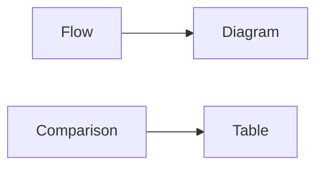
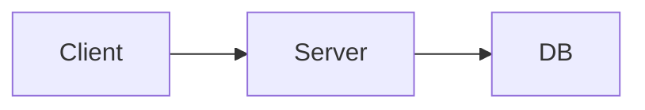
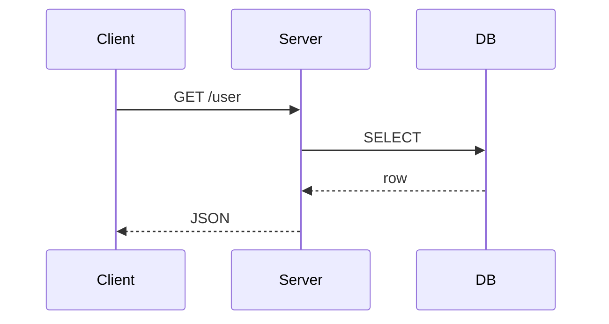

# Using Figures and Tables

> Technical Writing 101 series (6/10)

<!-- a-grade-intro:begin -->

**Core question**: When does a *figure* beat *prose*, and when does a *table* win?

> *Flow* wants a *figure*; *comparison* wants a *table*.

<!-- a-grade-intro:end -->

## What You Will Learn

- *Flowcharts* and *sequence diagrams*
- *Comparison* and *decision* tables
- Writing *captions*
- Writing *alt text*
- *Resolution* and *accessibility*

## Why It Matters

One *figure* often replaces *five* paragraphs.

## Concept at a Glance



## Key Terms

- **flowchart**: A *flow diagram*.
- **sequence diagram**: A *sequence diagram*.
- **caption**: A *caption*.
- **alt text**: *Alternative text* for an image.
- **a11y**: *Accessibility*.

## Before/After

**Before**: "The *request* goes from *client* to *server* to *DB*..." (five lines)

**After**: One *flowchart*.

## Hands-on: A Figure and a Table

### Step 1 — Flowchart



### Step 2 — Sequence



### Step 3 — Comparison table

```markdown
| Option | Speed | Cost |
| --- | --- | --- |
| A | Fast | High |
| B | Medium | Low |
```

### Step 4 — Caption

```markdown
*Figure 1*. Request flow from client to database.
```

### Step 5 — Alt text

```markdown

```

## What to Notice in This Code

- The *figure* shows *flow*.
- The *table* shows *comparison*.
- The *caption* is a *full sentence*.

## Five Common Mistakes

1. **No *figure* at all.**
2. **A *table* that is *too large*.**
3. **No *caption*.**
4. **No *alt text*.**
5. **Low *resolution*.**

## How This Shows Up in Production

Specs, architecture docs, and incident retros all combine *figures and tables*.

## How a Senior Engineer Thinks

- *Figures* for *flow*.
- *Tables* for *comparison*.
- *Captions* are *complete sentences*.
- *Alt text* is *required*.
- *Resolution* is *two times the display size*.

## Checklist

- [ ] At least *one figure*.
- [ ] *Seven rows or fewer* per table.
- [ ] *Caption* on every figure.
- [ ] *Alt text* on every figure.

## Practice Problems

1. Write the difference between *flowchart* and *sequence diagram* in one line.
2. Write the definition of *caption* in one line.
3. Write the meaning of *alt text* in one line.

## Wrap-up and Next Steps

The next post is *Writing the README*.

- [What Is Technical Writing](./01-what-is-technical-writing.md)
- [Defining the Reader](./02-defining-the-reader.md)
- [Title and Structure](./03-title-and-structure.md)
- [Explaining Concepts](./04-explaining-concepts.md)
- [Explaining Example Code](./05-explaining-example-code.md)
- **Using Figures and Tables (current)**
- Writing the README (upcoming)
- Writing Tutorials (upcoming)
- Blog vs Documentation (upcoming)
- Pre-publish Checklist (upcoming)
## References

- [The Visual Display of Quantitative Information - Tufte](https://www.edwardtufte.com/tufte/books_vdqi)
- [Mermaid Diagram Syntax](https://mermaid.js.org/intro/)
- [Web Content Accessibility Guidelines](https://www.w3.org/WAI/standards-guidelines/wcag/)
- [Storytelling with Data - Knaflic](https://www.storytellingwithdata.com/)

Tags: TechnicalWriting, Diagrams, Tables, Visual, Beginner

---

© 2026 YeongseonBooks. All rights reserved.
