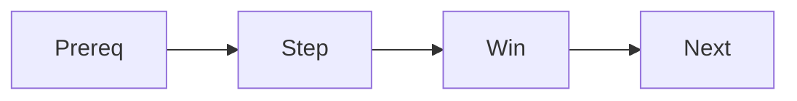

# Writing Tutorials

> Technical Writing 101 series (8/10)

<!-- a-grade-intro:begin -->

**Core question**: How do you make a *tutorial* that simply *works* when the reader *follows* it?

> Every *step* must be *verified*.

<!-- a-grade-intro:end -->

## What You Will Learn

- Where a tutorial sits in *Diátaxis*
- Stating *prerequisites*
- Designing a *small win*
- *Error recovery* notes
- The *wrap-up* and *next step*

## Why It Matters

A *first success* creates the will to keep *learning*.

## Concept at a Glance



## Key Terms

- **tutorial**: A *learning* oriented post.
- **prerequisite**: A *pre-condition*.
- **small win**: A *small success*.
- **recovery**: An *error recovery* path.
- **next step**: The *next thing to learn*.

## Before/After

**Before**: "Let us learn about *FastAPI*." (lecture)

**After**: "*Run Hello World in five minutes*." (tutorial)

## Hands-on: A Five Minute Tutorial

### Step 1 — Prerequisites

```bash
python3 --version  # 3.11 or newer
```

### Step 2 — Install

```bash
pip install "fastapi[standard]"
```

### Step 3 — Code

```python
from fastapi import FastAPI
app = FastAPI()

@app.get("/")
def root():
    return {"hello": "world"}
```

### Step 4 — Run

```bash
fastapi dev main.py
```

### Step 5 — Verify

```text
{"hello":"world"}
```

## What to Notice in This Code

- *Prerequisites* go *first*.
- *Commands* are *ordered*.
- The *result* is *stated*.

## Five Common Mistakes

1. **No *prerequisites*.**
2. ***Commands* in the wrong *order*.**
3. **No *small win*.**
4. **No *error recovery* notes.**
5. **No *next step*.**

## How This Shows Up in Production

Great libraries finish their *official tutorial* in *under five minutes*.

## How a Senior Engineer Thinks

- *Prerequisites* are *stated*.
- *Small win* arrives in *three minutes*.
- Every error has a *recovery* line.
- The *next step* is a *small jump*.
- A *tutorial* is *learning*, not *reference*.

## Checklist

- [ ] *Prerequisites* stated.
- [ ] *Five steps or fewer*.
- [ ] One *small win*.
- [ ] *Next step* shown.

## Practice Problems

1. Write the definition of *tutorial* in one line.
2. Write the meaning of *small win* in one line.
3. Write an example of *recovery* in one line.

## Wrap-up and Next Steps

The next post is *Blog vs Documentation*.

- [What Is Technical Writing](./01-what-is-technical-writing.md)
- [Defining the Reader](./02-defining-the-reader.md)
- [Title and Structure](./03-title-and-structure.md)
- [Explaining Concepts](./04-explaining-concepts.md)
- [Explaining Example Code](./05-explaining-example-code.md)
- [Using Figures and Tables](./06-using-figures-and-tables.md)
- [Writing the README](./07-writing-the-readme.md)
- **Writing Tutorials (current)**
- Blog vs Documentation (upcoming)
- Pre-publish Checklist (upcoming)
## References

- [Diátaxis Framework](https://diataxis.fr/)
- [Django Tutorial Style](https://docs.djangoproject.com/en/stable/intro/tutorial01/)
- [FastAPI Tutorial](https://fastapi.tiangolo.com/tutorial/)
- [Teach Tech with Tutorials - Write the Docs](https://www.writethedocs.org/guide/writing/beginners-guide-to-docs/)

Tags: TechnicalWriting, Tutorial, Learning, HandsOn, Beginner

---

© 2026 YeongseonBooks. All rights reserved.
