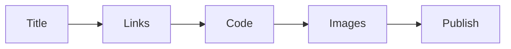

# Pre-publish Checklist

> Technical Writing 101 series (10/10)

<!-- a-grade-intro:begin -->

**Core question**: What is the *last* thing to *review* before you hit *publish*?

> Re-reading with the *eyes of a first-time visitor*.

<!-- a-grade-intro:end -->

## What You Will Learn

- *Title* review
- *Link* validation
- *Code* execution
- *Image* checks
- *Post-publish* review

## Why It Matters

A *fix after publish* is far more expensive than a *check before publish*.

## Concept at a Glance



## Key Terms

- **link rot**: A *broken link* over time.
- **smoke test**: A *basic functional check*.
- **canary read**: A *peer pre-review*.
- **post-mortem**: A *post-publish retrospective*.
- **errata**: *Typo corrections*.

## Before/After

**Before**: A *broken link* found right after publish.

**After**: The *checklist* passes before publish.

## Hands-on: A Five Step Review

### Step 1 — Title review

```python
title_ok = ["has a verb", "fits 55 chars", "uses reader words"]
```

### Step 2 — Link validation

```bash
python3 scripts/check_links.py
```

### Step 3 — Code execution

```bash
python3 -c "from m import add; assert add(2,3) == 5"
```

### Step 4 — Image check

```python
images = {"caption": True, "alt_text": True, "resolution": "2x"}
```

### Step 5 — Post-publish review

```python
post = ["fix typos within 24h", "reply to reader comments"]
```

## What to Notice in This Code

- The *title* fits *55 characters*.
- *Links* are *validated automatically*.
- The *code* really *runs*.

## Five Common Mistakes

1. **Letting *link rot* sit.**
2. ***Code* that does not run.**
3. **An *image* with no *alt text*.**
4. **A *typo* left in place.**
5. **No *post-mortem*.**

## How This Shows Up in Production

Engineering blog teams run *peer review*, *automated checks*, and *post-mortems* together.

## How a Senior Engineer Thinks

- The *checklist* is a *routine*.
- *Links* are validated *automatically*.
- *Code* runs *on copy paste*.
- Typos are fixed *within 24 hours*.
- The *post-mortem* feeds the *next post*.

## Checklist

- [ ] *Title* OK.
- [ ] *Link* validation passes.
- [ ] *Code* execution passes.
- [ ] *Image* check passes.

## Practice Problems

1. Write the meaning of *link rot* in one line.
2. Write the definition of *canary read* in one line.
3. Write an example of *errata* in one line.

## Wrap-up and Next Steps

This is the *final* post in *Technical Writing 101*. The next series covers *Open Source Contribution*.

- [What Is Technical Writing](./01-what-is-technical-writing.md)
- [Defining the Reader](./02-defining-the-reader.md)
- [Title and Structure](./03-title-and-structure.md)
- [Explaining Concepts](./04-explaining-concepts.md)
- [Explaining Example Code](./05-explaining-example-code.md)
- [Using Figures and Tables](./06-using-figures-and-tables.md)
- [Writing the README](./07-writing-the-readme.md)
- [Writing Tutorials](./08-writing-tutorials.md)
- [Blog vs Documentation](./09-blog-vs-docs.md)
- **Pre-publish Checklist (current)**
## References

- [Editorial Calendars - Trello Guide](https://blog.trello.com/editorial-calendar)
- [Hemingway Editor](https://hemingwayapp.com/)
- [Vale - Prose Linter](https://vale.sh/)
- [Plain Language Guidelines](https://www.plainlanguage.gov/guidelines/)

Tags: TechnicalWriting, Checklist, Publishing, Quality, Beginner

---

© 2026 YeongseonBooks. All rights reserved.
