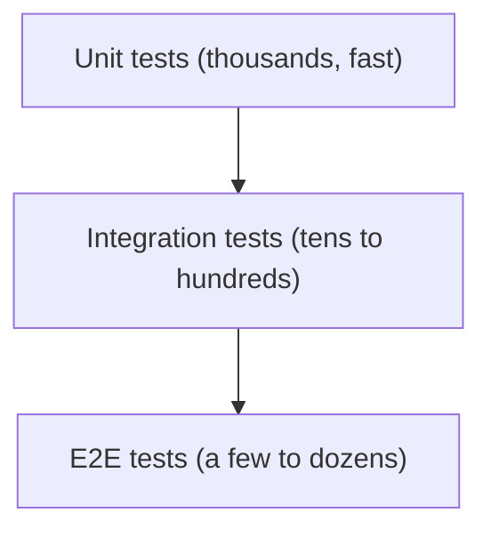

# Unit Test

> Testing 101 series (2/10)

<!-- a-grade-intro:begin -->

**Core question**: How small is the *smallest unit* of a test? One function? One class?

> A unit test verifies *one small piece of behavior* with *no external dependencies*. They are fast, plentiful, and run often.

<!-- a-grade-intro:end -->

## What You Will Learn

- The definition and *scope* of a unit test
- The *AAA pattern* (Arrange/Act/Assert)
- pytest basics, fixtures, and parametrize
- *Edge cases* and *exception cases*
- The *five conditions* of a good unit test

## Why It Matters

Unit tests are *the base of the pyramid*. Because they are fast, *thousands* of them run in *seconds*. Strong unit tests *let upper layers (integration/E2E) stay small*.

> Many fast unit tests are the *foundation of the whole strategy*.

## Concept at a Glance



## Key Terms

- **Unit**: a *minimal piece* such as a single function, method, or class.
- **AAA pattern**: *Arrange* → *Act* → *Assert*.
- **Fixture**: *prepared data/objects* shared between tests.
- **Parametrize**: collapsing tests *that differ only by input* into *one function*.
- **Edge case**: *boundary values* (0, negative, empty string, None, ...).

## Before/After

**Before (one big test)**

```python
def test_user_flow():
    u = create_user("a")
    u.activate()
    u.upgrade()
    assert u.plan == "pro"
```

**After (split into small units)**

```python
def test_create_user_starts_inactive(): ...
def test_activate_sets_active(): ...
def test_upgrade_sets_pro(): ...
```

## Hands-on: pytest in Five Steps

### Step 1 — The function under test

```python
# src/discount.py
def apply_discount(price: int, percent: int) -> int:
    if not 0 <= percent <= 100:
        raise ValueError("percent must be 0..100")
    return price - price * percent // 100
```

### Step 2 — Basic test (AAA)

```python
# tests/test_discount.py
from src.discount import apply_discount

def test_apply_10_percent_discount():
    # Arrange
    price, percent = 1000, 10
    # Act
    result = apply_discount(price, percent)
    # Assert
    assert result == 900
```

### Step 3 — Group with parametrize

```python
import pytest

@pytest.mark.parametrize("price,percent,expected", [
    (1000, 0, 1000),
    (1000, 50, 500),
    (1000, 100, 0),
])
def test_apply_discount_table(price, percent, expected):
    assert apply_discount(price, percent) == expected
```

### Step 4 — Exception cases

```python
def test_apply_discount_invalid_percent_raises():
    with pytest.raises(ValueError):
        apply_discount(1000, 150)
```

### Step 5 — Fixture

```python
@pytest.fixture
def base_price() -> int:
    return 10_000

def test_with_fixture(base_price: int):
    assert apply_discount(base_price, 10) == 9_000
```

## What to Notice in This Code

- Each test asserts *one thing*.
- Same-shaped tests are *parametrized* to *cut duplication*.
- Exception cases live in *their own test*.

## Five Common Mistakes

1. **Calling the *real* database.** That is an *integration test*.
2. **Tests depending on *each other's state*.** Reordering *breaks* them.
3. **Waiting via `time.sleep`.** Unit tests *do not wait*.
4. **Meaningless `assert True`.** It only adds noise.
5. **Test names like *test_1, test_2*.** The name is *the documentation*.

## How This Shows Up in Production

Core domain logic (pricing, authorization, state machines) is *always* covered by thick unit tests. The more incident-prone the code, the *higher the ROI of unit tests*.

## How a Senior Engineer Thinks

- Grows *small, fast unit tests* first.
- Names tests with *one line of behavior*.
- *Always* covers boundary values for the same function.
- Uses *parametrize* to express *repetition*.
- Keeps *all* unit tests under *five seconds*.

## Checklist

- [ ] You wrote *three or more* tests for one function.
- [ ] You covered *boundary* and *exception* cases.
- [ ] You followed AAA structure.
- [ ] You used parametrize *once*.

## Practice Problems

1. Build `is_palindrome(s)` and write a parametrized test with *five* inputs.
2. Cover *boundary cases* like empty string, single char, and whitespace.
3. Introduce a bug intentionally and note *which test catches it*.

## Wrap-up and Next Steps

Unit tests are *small, fast, and free of external dependencies*. The next post climbs one step up to *integration tests*, which verify several modules together.

- [What Is Testing?](./01-what-is-testing.md)
- **Unit Test (current)**
- Integration Test (upcoming)
- E2E Test (upcoming)
- Test Double (upcoming)
- Mock and Stub (upcoming)
- Test Coverage (upcoming)
- Regression Test (upcoming)
- Running Tests in CI (upcoming)
- Building a Test Strategy (upcoming)
## References

- [pytest — parametrize](https://docs.pytest.org/en/stable/how-to/parametrize.html)
- [pytest — fixtures](https://docs.pytest.org/en/stable/explanation/fixtures.html)
- [Martin Fowler — Unit Test](https://martinfowler.com/bliki/UnitTest.html)
- [Google Testing Blog](https://testing.googleblog.com/)

Tags: Testing, Unit Test, pytest, Python, Quality

---

© 2026 YeongseonBooks. All rights reserved.
