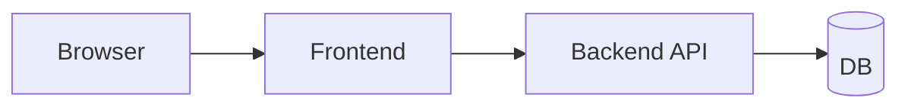

# E2E Test

> Testing 101 series (4/10)

<!-- a-grade-intro:begin -->

**Core question**: How do we automatically confirm that signup works *on the screen the user actually sees*?

> An E2E test *spins up a browser* and *clicks and types* like a user. It is the most expensive verification, and the *closest to reality*.

<!-- a-grade-intro:end -->

## What You Will Learn

- The definition of *E2E* and how it relates to other tests
- Writing *your first scenario* with Playwright
- Causes of *flaky* tests and how to fight them
- The *right number* of E2E tests
- Five common pitfalls

## Why It Matters

A passing E2E test means *frontend, backend, and DB work together*. It is the *most realistic* signal — and the *most expensive*. So you keep them *few and focused on the core*.

> E2E is the *user's point of view*.

## Concept at a Glance



## Key Terms

- **E2E (end-to-end)**: the full flow from *user start to result*.
- **Headless browser**: a browser that runs without a visible window (used in CI).
- **Selector**: an expression that *targets an element* (text, role, data-testid, ...).
- **Flaky test**: a test that breaks *intermittently*.
- **Page object**: an object that *encapsulates actions* per screen.

## Before/After

**Before (manual regression)**

```text
- Five people click for an hour before each release
- A *checkout bug* still ships and surfaces in production
```

**After (five E2E tests)**

```text
- Signup, login, payment, search, logout scenarios are automated
- Results in under five minutes from CI
```

## Hands-on: Playwright in Five Steps

### Step 1 — Install

```bash
pip install pytest-playwright
playwright install
```

### Step 2 — First scenario

```python
# tests/e2e/test_login.py
def test_login_flow(page):
    page.goto("https://example.com/login")
    page.get_by_label("Email").fill("a@b.com")
    page.get_by_label("Password").fill("secret")
    page.get_by_role("button", name="Sign in").click()
    page.wait_for_url("**/dashboard")
    assert page.get_by_text("Welcome").is_visible()
```

### Step 3 — Stable selectors

```python
# Recommended: role + name
page.get_by_role("button", name="Sign in")
# Or data-testid
page.get_by_test_id("submit-login")
# Discouraged: volatile CSS classes
page.locator(".btn-primary-3xl")
```

### Step 4 — Waiting (no sleep)

```python
# Bad
import time; time.sleep(3)
# Good
page.wait_for_url("**/dashboard")
page.wait_for_selector("text=Welcome")
```

### Step 5 — Page object

```python
class LoginPage:
    def __init__(self, page):
        self.page = page
    def open(self):
        self.page.goto("https://example.com/login")
    def login(self, email, pw):
        self.page.get_by_label("Email").fill(email)
        self.page.get_by_label("Password").fill(pw)
        self.page.get_by_role("button", name="Sign in").click()

def test_login_with_page_object(page):
    LoginPage(page).open(); LoginPage(page).login("a@b.com", "secret")
    assert page.get_by_text("Welcome").is_visible()
```

## What to Notice in This Code

- *Role/text* selectors *survive design changes*.
- Conditional waits like `wait_for_url` *replace sleeps*.
- Page objects let you *reuse scenarios*.

## Five Common Mistakes

1. **Trying to cover *every screen* with E2E.** A 5-minute suite turns into *an hour*.
2. **Waiting with `time.sleep`.** Cause #1 of *flakiness*.
3. **Calling *real payments* in production.** Always use *staging/sandbox*.
4. **Using *CSS class* selectors.** They *break with every UI change*.
5. **Scenarios *depending on each other*.** Isolation is what enables *re-runs*.

## How This Shows Up in Production

Most teams keep only *5\~20 critical scenarios* as E2E. *Playwright/Cypress* are standard, and some add *visual regression* tests.

## How a Senior Engineer Thinks

- Keeps E2E *few, expensive, and stable*.
- Defaults to *role-based selectors*.
- *Quarantines flaky tests immediately*.
- Ships small PRs at the *scenario level*.
- Sees the value of E2E as preventing *"users can't use it"* incidents.

## Checklist

- [ ] You wrote *one Playwright scenario*.
- [ ] You used *role/text/test-id* selectors.
- [ ] You replaced `sleep` with *conditional waits*.
- [ ] Scenarios run *independently*.

## Practice Problems

1. Add a *failure scenario* (wrong password) for the login above.
2. Compare *three or more* selector types and note which is most stable.
3. Intentionally use `sleep` and observe *why it breaks*.

## Wrap-up and Next Steps

E2E is the *most realistic* signal. From the next post we cover *test doubles* for handling external dependencies.

- [What Is Testing?](./01-what-is-testing.md)
- [Unit Test](./02-unit-test.md)
- [Integration Test](./03-integration-test.md)
- **E2E Test (current)**
- Test Double (upcoming)
- Mock and Stub (upcoming)
- Test Coverage (upcoming)
- Regression Test (upcoming)
- Running Tests in CI (upcoming)
- Building a Test Strategy (upcoming)
## References

- [Playwright docs](https://playwright.dev/python/)
- [Cypress docs](https://docs.cypress.io/)
- [Martin Fowler — Test Pyramid](https://martinfowler.com/bliki/TestPyramid.html)
- [Google Testing Blog — Flaky Tests](https://testing.googleblog.com/2016/05/flaky-tests-at-google-and-how-we.html)

Tags: Testing, E2E, Playwright, Browser, Automation

---

© 2026 YeongseonBooks. All rights reserved.
