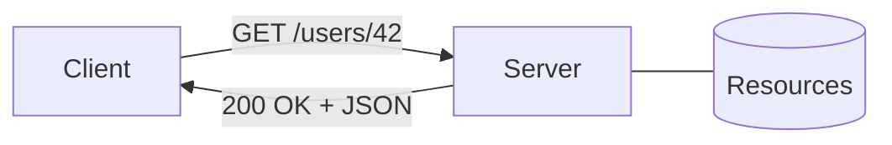

# REST 기본

> API Design 101 시리즈 (2/10)

<!-- a-grade-intro:begin -->

**핵심 질문**: REST는 단순한 *URL 규칙* 이 아닙니다 — 그 본질은 무엇인가요?

> Roy Fielding이 정리한 *6가지 제약* 입니다. 그 중심에 *자원(resource)* 이 있습니다.

<!-- a-grade-intro:end -->

## 이 글에서 배울 것

- REST의 정의와 역사
- 6가지 아키텍처 제약
- 자원 중심 사고
- HTTP method 매핑의 직관
- REST 같지만 REST 아닌 것 (RPC over HTTP)

## 왜 중요한가

REST는 가장 흔한 API 스타일입니다. 잘 따르면 *예측 가능* 하고, 잘못 따르면 *어디 한 번 본 적 있는데?* 가 됩니다. 핵심을 잡아두면 모든 후속 글이 쉬워집니다.

> 규칙을 외우기보다 *왜 그 규칙인지* 를 이해하세요.

## 개념 한눈에 보기



자원은 URL로 식별되고, 동작은 HTTP method로 표현됩니다.

## 핵심 용어 정리

- **Resource**: API가 다루는 *명사* (users, orders, posts).
- **Representation**: 자원의 표현 형태 (JSON, XML).
- **Stateless**: 서버가 클라이언트 상태를 저장하지 않는다.
- **Uniform Interface**: 일관된 호출 규칙.
- **HATEOAS**: 응답 안에 *다음 행동* 링크를 포함.

## Before/After

**Before (RPC 스타일)**

```
POST /getUser?id=42
POST /createUser
POST /deleteUser?id=42
```

동사가 URL에 들어가 있습니다.

**After (REST 스타일)**

```
GET    /users/42
POST   /users
DELETE /users/42
```

자원은 URL, 동작은 method.

## 실습: REST 6제약 따라가기

### 1단계 — Client-Server 분리

```python
# 1_client_server.py
# 클라이언트는 UI, 서버는 데이터 — 서로 *교체 가능* 해야 한다
import requests
print(requests.get("https://api.github.com").status_code)
```

서버 구현이 바뀌어도 클라이언트는 살아남습니다.

### 2단계 — Stateless 호출

```python
# 2_stateless.py
import requests
# 매 호출이 *자기 완결적* — 토큰을 매번 보낸다
headers = {"Authorization": "token TEST"}
requests.get("https://api.example.com/me", headers=headers)
```

서버는 세션을 *기억* 하지 않습니다 — 호출이 모든 정보를 가져야 합니다.

### 3단계 — Cacheable 응답

```python
# 3_cache.py
from flask import Flask, jsonify
app = Flask(__name__)

@app.get("/articles/1")
def article():
    resp = jsonify(id=1, title="REST 기본")
    resp.headers["Cache-Control"] = "public, max-age=60"
    return resp
```

응답이 캐시 가능한지 *명시* 합니다.

### 4단계 — Uniform Interface

```python
# 4_uniform.py
# 같은 자원에 대해 method만 바꾼다
# GET    /users/42  -> 조회
# PUT    /users/42  -> 교체
# DELETE /users/42  -> 삭제
```

호출 규칙이 *일관* 되어야 학습 비용이 줄어듭니다.

### 5단계 — Layered + Code on Demand

```python
# 5_layered.py
# Client -> CDN -> LB -> App -> DB
# 클라이언트는 *옆 계층* 만 압니다
```

중간에 캐시·게이트웨이가 들어가도 클라이언트 코드는 안 바뀝니다.

## 이 코드에서 주목할 점

- 동사는 *method* 가, 명사는 *URL* 이 표현합니다.
- 토큰은 매 호출에 — 세션을 *서버* 에 두지 않습니다.
- `Cache-Control` 같은 *부가 약속* 도 API의 일부입니다.

## 자주 하는 실수 5가지

1. **URL에 동사 사용.** `/getUser` — RPC 신호.
2. **POST로 모든 것.** method의 의미를 버림.
3. **세션 의존.** 서버를 *수평 확장* 못 함.
4. **에러를 200으로.** 클라이언트가 분기 못 함.
5. **REST를 *URL 규칙* 으로만 이해.** 6제약을 잊음.

## 실무에서는 이렇게 쓰입니다

GitHub, Stripe, GitLab — 대부분의 공개 API는 *대체로 REST* 입니다. 완벽한 HATEOAS는 드물지만 *자원 중심 + uniform interface* 는 표준이 되었습니다. 사내에서도 REST를 기본으로 두고, 필요할 때만 GraphQL이나 gRPC로 *추가* 합니다.

## 시니어 엔지니어는 이렇게 생각합니다

- 자원의 *경계* 를 먼저 정한다.
- method가 자원의 *상태 변화* 를 표현하게 한다.
- 캐시·인증·에러도 *공식 약속* 으로 다룬다.
- REST를 종교로 만들지 않는다 — 필요하면 RPC도 섞는다.
- 클라이언트 입장에서 *예측 가능* 한지 본다.

## 체크리스트

- [ ] URL에 동사가 없는가?
- [ ] 같은 method 의미를 모든 자원에서 지키는가?
- [ ] 응답에 적절한 cache 헤더가 있는가?
- [ ] 인증이 매 호출에 자기 완결적인가?
- [ ] 에러 상태 코드가 명확한가?

## 연습 문제

1. 손에 익은 라이브러리의 REST API 5개 endpoint를 골라 method/URL/의미 표를 만드세요.
2. 위 4단계 Flask 예제에 `PUT /articles/1`을 추가해 보세요.
3. *RPC over HTTP* 스타일과 REST 스타일을 같은 기능으로 두 가지 버전 작성해 비교하세요.

## 정리 및 다음 단계

REST는 *6제약* 의 합입니다. 다음 글에서는 그 중심인 — 자원(resource) 설계 — 를 자세히 봅니다.

- [API란 무엇인가?](./01-what-is-an-api.md)
- **REST 기본 (현재 글)**
- 리소스 설계 (예정)
- HTTP method와 status code (예정)
- Request와 response schema (예정)
- Pagination과 filtering (예정)
- Error response 설계 (예정)
- OpenAPI와 Swagger (예정)
- Versioning (예정)
- 좋은 API 문서 만들기 (예정)
## 참고 자료

- [Roy Fielding — Architectural Styles (Ch. 5)](https://www.ics.uci.edu/~fielding/pubs/dissertation/rest_arch_style.htm)
- [REST API Tutorial (restfulapi.net)](https://restfulapi.net/)
- [HTTP overview (MDN)](https://developer.mozilla.org/en-US/docs/Web/HTTP/Overview)
- [Richardson Maturity Model (Martin Fowler)](https://martinfowler.com/articles/richardsonMaturityModel.html)

Tags: Computer Science, APIDesign, REST, HTTP, Backend, WebDevelopment

---

© 2026 영선북스. 이 글의 저작권은 저자에게 있습니다.
