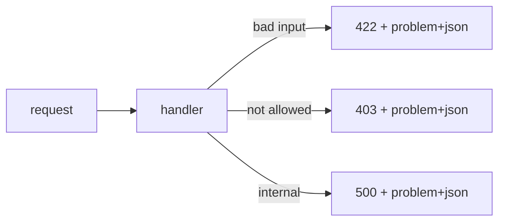

# Error response 설계

> API Design 101 시리즈 (7/10)

<!-- a-grade-intro:begin -->

**핵심 질문**: 에러 응답에 *무엇을* 담아야 클라이언트가 정확히 분기하고, 사람이 읽고도 이해할까요?

> *상태 코드 + 안정적인 본문 형식 + 안정적인 error code* 입니다.

<!-- a-grade-intro:end -->

## 이 글에서 배울 것

- 에러 응답의 4요소
- RFC 7807 `application/problem+json`
- 검증 에러의 표현 방법
- 사람용 메시지와 기계용 코드의 분리
- 보안과 디버깅의 균형

## 왜 중요한가

성공 응답은 한 가지지만 *에러는 수백 가지* 입니다. 형식이 들쭉날쭉하면 클라이언트는 *모든 케이스* 를 따로 다뤄야 하고, 사용자에겐 *알 수 없는 오류* 만 보입니다.

> 좋은 에러 응답은 *디버깅 시간* 을 줄여 줍니다.

## 개념 한눈에 보기



## 핵심 용어 정리

- **Status code**: 큰 분류 — `4xx` 사용자, `5xx` 서버.
- **Error code**: 안정적인 *문자열 식별자* — `user.not_found`.
- **Title**: 사람용 짧은 설명.
- **Detail**: 사람용 긴 설명.
- **Errors[]**: 검증 실패의 *필드별* 목록.

## Before/After

**Before (자유 형식)**

```json
{"error": "something went wrong"}
```

**After (RFC 7807 + 코드)**

```json
{
  "type": "https://example.com/errors/user-not-found",
  "title": "User not found",
  "status": 404,
  "code": "user.not_found",
  "detail": "User 42 does not exist."
}
```

## 실습: 에러 응답 5단계

### 1단계 — 표준 envelope

```python
# 1_envelope.py
from flask import Flask, jsonify
app = Flask(__name__)

def problem(status, code, title, detail):
    body = {"type": f"about:blank", "title": title,
            "status": status, "code": code, "detail": detail}
    return jsonify(body), status, {"Content-Type": "application/problem+json"}

@app.get("/users/<int:uid>")
def user(uid):
    return problem(404, "user.not_found", "User not found", f"User {uid} does not exist.")
```

### 2단계 — 검증 에러

```python
# 2_validation.py
from flask import Flask, request, jsonify
app = Flask(__name__)

@app.post("/users")
def create():
    body = request.get_json() or {}
    errs = []
    if "name" not in body: errs.append({"field": "name", "code": "required"})
    if "email" not in body: errs.append({"field": "email", "code": "required"})
    if errs:
        return jsonify(title="Validation failed", status=422,
                       code="validation_error", errors=errs), 422
    return jsonify(ok=True), 201
```

`errors[]` 로 *필드별* 실패를 묶습니다.

### 3단계 — 에러 코드 안정성

```
user.not_found          # 200, 의미 명확
order.payment_required
order.already_paid
```

코드는 *문자열* — *상태 코드보다 안정적* 입니다.

### 4단계 — 보안 정보 누출 방지

```python
# 4_safe.py
# Bad : detail="No password match for user 'yeongseon'"
# Good: detail="Invalid credentials."
```

존재 여부 자체를 노출하지 않습니다.

### 5단계 — trace id

```python
# 5_trace.py
import uuid
from flask import Flask, jsonify, g, request
app = Flask(__name__)

@app.before_request
def set_trace():
    g.trace_id = request.headers.get("X-Trace-Id") or uuid.uuid4().hex

@app.errorhandler(500)
def server_error(e):
    return jsonify(title="Internal", status=500, trace_id=g.trace_id), 500
```

trace_id 가 *지원 요청을 5분으로* 줄여 줍니다.

## 이 코드에서 주목할 점

- 본문이 *항상 같은 모양* 입니다.
- 사람용(`title`/`detail`) 과 기계용(`code`) 이 분리됩니다.
- trace_id 가 응답에 포함됩니다.

## 자주 하는 실수 5가지

1. **에러 본문이 *문자열*.** 클라이언트가 파싱 못 함.
2. **error code 없이 title만.** 다국어 번역 후 분기 깨짐.
3. **검증 실패에 단일 메시지.** 어느 필드인지 불명.
4. **스택 트레이스 노출.** 보안 사고로 직결.
5. **trace_id 없음.** 사용자 문의가 *수사극* 이 됨.

## 실무에서는 이렇게 쓰입니다

Stripe의 에러 객체 (`type`, `code`, `param`, `message`) 가 사실상 표준이 되었습니다. 큰 사내 API 들은 거의 *RFC 7807* 또는 그 변형을 씁니다 — 핵심은 *형식의 안정성* 입니다.

## 시니어 엔지니어는 이렇게 생각합니다

- 에러 envelope 를 *공용 모듈* 로 만든다.
- 새 에러는 *코드 추가* — 형식은 안 바꿈.
- 4xx 에서도 trace_id 를 돌려 준다.
- 사용자에게 보이는 메시지를 *반드시 검토* — 보안·UX 모두.
- 자주 발생하는 에러를 *문서의 위쪽* 에 둔다.

## 체크리스트

- [ ] 모든 에러가 *동일한 envelope* 인가?
- [ ] error code가 안정적인 문자열인가?
- [ ] 검증 실패가 필드별로 나뉘는가?
- [ ] 보안 정보가 detail에 새지 않는가?
- [ ] trace_id 가 모든 응답에 있는가?

## 연습 문제

1. 자신의 API에서 가장 흔한 4xx 5개의 *코드 이름* 을 정의해 보세요.
2. 위 2단계에 *최소 길이* 검증을 추가하세요.
3. 자유 형식 에러 응답을 RFC 7807 envelope 으로 마이그레이션하는 단계를 적어 보세요.

## 정리 및 다음 단계

에러 응답은 API의 *두 번째 얼굴* 입니다. 다음 글에서는 이 모든 약속을 한 곳에 모은 — OpenAPI와 Swagger — 를 봅니다.

- [API란 무엇인가?](./01-what-is-an-api.md)
- [REST 기본](./02-rest-basics.md)
- [리소스 설계](./03-resource-design.md)
- [HTTP method와 status code](./04-http-methods-and-status.md)
- [Request와 response schema](./05-request-and-response-schema.md)
- [Pagination과 filtering](./06-pagination-and-filtering.md)
- **Error response 설계 (현재 글)**
- OpenAPI와 Swagger (예정)
- Versioning (예정)
- 좋은 API 문서 만들기 (예정)
## 참고 자료

- [RFC 7807 — Problem Details for HTTP APIs](https://www.rfc-editor.org/rfc/rfc7807)
- [Stripe API: Errors](https://stripe.com/docs/api/errors)
- [GitHub REST API: Errors](https://docs.github.com/en/rest/overview/troubleshooting)
- [Microsoft REST API Guidelines: Errors](https://github.com/microsoft/api-guidelines/blob/vNext/Guidelines.md)

Tags: Computer Science, APIDesign, Errors, RFC7807, Validation, Backend

---

© 2026 영선북스. 이 글의 저작권은 저자에게 있습니다.
