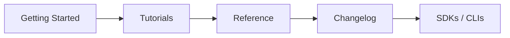

# 좋은 API 문서 만들기

> API Design 101 시리즈 (10/10)

<!-- a-grade-intro:begin -->

**핵심 질문**: 같은 API라도 *문서가 좋으면* 채택률이 다릅니다 — 좋은 문서의 *공식* 은 무엇일까요?

> Getting Started 5분 + Examples + Reference + Changelog + SDK — 이 다섯 축입니다.

<!-- a-grade-intro:end -->

## 이 글에서 배울 것

- 문서의 다섯 축
- *5분 안에* 첫 호출 만들기
- examples 의 무게
- changelog 와 SDK 의 역할
- 문서가 자라는 법

## 왜 중요한가

API 자체보다 *문서가 채택* 을 결정합니다. 같은 endpoint 라도 *5분에* 첫 호출이 되느냐, *반나절을* 헤매느냐는 문서의 차이입니다.

> 문서는 *제품의 일부* 입니다.

## 개념 한눈에 보기



## 핵심 용어 정리

- **Getting Started**: 5분 안에 *첫 호출* 까지.
- **Tutorial**: 한 가지 시나리오를 *처음부터 끝까지*.
- **Reference**: endpoint·필드의 *사전*.
- **Changelog**: 모든 버전 변경의 기록.
- **SDK**: 언어별 클라이언트 라이브러리.

## Before/After

**Before (reference 만 있음)**

```
- /users (GET, POST, ...)
- /orders (GET, POST, ...)
```

이름만 보고 무엇을 하는지 모름.

**After (다섯 축 모두)**

```
1. Getting Started — 5분 안에 첫 호출
2. Tutorials — 결제 흐름, 회원 가입 흐름
3. Reference — 모든 endpoint
4. Changelog — 버전별 변경
5. SDKs — Python, JS, Ruby
```

## 실습: 문서 5단계

### 1단계 — Getting Started

```markdown
# Getting Started

1. Sign up at https://example.com → API key 발급
2. 첫 호출 (curl):
   ```bash
   curl https://api.example.com/v1/health \
     -H "Authorization: Bearer <YOUR_KEY>"
   ```
3. `{"status": "ok"}` 가 보이면 성공.
```

*5분 룰* — 사용자가 5분 안에 *동작* 하는 것.

### 2단계 — Tutorial (시나리오 중심)

```markdown
# 첫 결제 받기

1. customer 만들기 (POST /v1/customers)
2. payment intent 만들기 (POST /v1/payment_intents)
3. confirm 호출
4. webhook 받기
```

기능 나열이 아닌 *목표 달성* 의 흐름.

### 3단계 — Reference + examples

```markdown
## POST /v1/customers
입력: {name, email}
응답 (201):
```json
{"id": "cus_abc", "name": "Y", "email": "y@example.com"}
```

에러:
| code | status | 의미 |
|------|--------|------|
| validation_error | 422 | name 또는 email 누락 |
| email.duplicate | 409 | 이미 등록된 email |
```

reference에는 *반드시* 예제 + 에러표.

### 4단계 — Changelog

```markdown
# Changelog

## 2026-05-01
- BREAKING: /v1/users 에서 `name` 제거. `full_name` 사용.
- ADD: /v2/users 에 `created_at` 추가.

## 2026-04-15
- DEPRECATE: /v1 — sunset 2027-01-31.
```

*각 변경에 날짜와 종류*.

### 5단계 — SDK 와 try-it 환경

```python
# 5_sdk.py
from example_api import Client
c = Client(api_key="...")
print(c.users.get(42))
```

*복붙* 가능한 코드와 *클릭 가능한* try-it (Swagger UI).

## 이 코드에서 주목할 점

- 첫 화면이 *getting started* 입니다.
- reference 의 모든 endpoint 에 *예제* 가 있습니다.
- changelog 가 *역시간순* 입니다.

## 자주 하는 실수 5가지

1. **reference 만 있음.** 처음 사용자는 *어디서 시작* 할지 모름.
2. **examples 없음 또는 부정확.** 복붙해도 *안 돌아감*.
3. **changelog 없음.** 사용자는 *변경을 추적할 수 없음*.
4. **에러를 문서화 안 함.** 4xx 본문이 *비밀*.
5. **문서가 *별도 저장소*.** 코드와 동기화 *불가능*.

## 실무에서는 이렇게 쓰입니다

Stripe·Twilio 의 문서가 *황금 기준* 입니다 — Getting Started·Tutorial·Reference·Changelog·SDK 다섯 축이 일관됩니다. 사내 API 도 *공개 API 처럼* 다루면 채택률·문의 비율 모두 좋아집니다 — *이게 곧 DX*.

## 시니어 엔지니어는 이렇게 생각합니다

- 문서를 *코드와 같은 저장소* 에 둔다.
- examples 를 *테스트* 한다 (실제로 돌려서).
- changelog 를 *자동 생성* (PR 라벨 → release notes).
- 5분 룰을 *측정* 한다 (실사용자 관찰).
- 가장 많이 본 페이지를 *우선 개선*.

## 체크리스트

- [ ] Getting Started 가 5분 안에 첫 호출까지 가는가?
- [ ] 모든 endpoint 에 examples 가 있는가?
- [ ] Changelog 가 항상 최신인가?
- [ ] 에러가 reference 에 *표* 로 정리되어 있는가?
- [ ] SDK 또는 try-it 환경이 있는가?

## 연습 문제

1. 자신의 API 의 Getting Started 를 5분 룰에 맞게 다시 써 보세요.
2. 가장 많이 쓰이는 endpoint 1개에 *3가지 시나리오* 의 examples 를 추가하세요.
3. CI 에서 examples 코드를 *실행* 하는 단계를 추가하는 방법을 적어 보세요.

## 정리 및 시리즈 마무리

API 는 *약속·동작·문서* 의 합입니다. 1편의 *약속* 에서 시작해 — REST·자원·method·schema·페이지·에러·OpenAPI·versioning — 을 거쳐 — *문서* 로 끝났습니다. 다음 시리즈로 가기 전에 작은 API 하나를 *처음부터 끝까지* 직접 만들어 보세요. 그것이 가장 큰 학습입니다.

- [API란 무엇인가?](./01-what-is-an-api.md)
- [REST 기본](./02-rest-basics.md)
- [리소스 설계](./03-resource-design.md)
- [HTTP method와 status code](./04-http-methods-and-status.md)
- [Request와 response schema](./05-request-and-response-schema.md)
- [Pagination과 filtering](./06-pagination-and-filtering.md)
- [Error response 설계](./07-error-response-design.md)
- [OpenAPI와 Swagger](./08-openapi-and-swagger.md)
- [API versioning](./09-api-versioning.md)
- **좋은 API 문서 만들기 (현재 글)**
## 참고 자료

- [Stripe Documentation](https://stripe.com/docs)
- [Twilio Documentation](https://www.twilio.com/docs)
- [Write the Docs — API documentation](https://www.writethedocs.org/topic-guides/api-documentation/)
- [Diataxis Framework (tutorials/how-to/reference/explanation)](https://diataxis.fr/)

Tags: Computer Science, APIDesign, Documentation, DeveloperExperience, Examples, Backend

---

© 2026 영선북스. 이 글의 저작권은 저자에게 있습니다.
