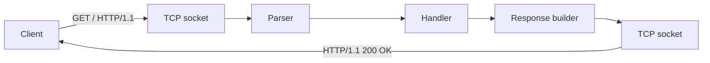

# HTTP 서버 만들기

> Backend Development 101 시리즈 (2/10)

<!-- a-grade-intro:begin -->

**핵심 질문**: HTTP 서버는 사실 *무슨 일* 을 하는 프로그램인가요?

> TCP 소켓에서 텍스트를 읽어 요청을 해석하고, 같은 소켓으로 응답 텍스트를 돌려보내는 *읽고 쓰는 프로그램* 입니다.

<!-- a-grade-intro:end -->

## 이 글에서 배울 것

- HTTP 요청과 응답의 실제 모양
- TCP 위에서 HTTP가 동작하는 원리
- status code와 header의 의미
- FastAPI로 *진짜* 서버를 만드는 흐름
- 직접 raw socket 서버를 띄워 보기

## 왜 중요한가

프레임워크가 가려주는 부분을 한 번이라도 *눈으로 보면* 이후 모든 디버깅이 빨라집니다. status code가 왜 그렇게 나왔는지, header가 왜 안 붙었는지 — 본질을 모르면 항상 추측만 합니다.

> 프레임워크는 편하지만, *프레임워크 너머* 를 알아야 시니어가 됩니다.

## 개념 한눈에 보기



요청도 응답도 결국 *텍스트 한 덩어리* 입니다.

## 핵심 용어 정리

- **Request line**: `GET /path HTTP/1.1` — 메서드, 경로, 버전.
- **Status line**: `HTTP/1.1 200 OK` — 응답의 첫 줄.
- **Header**: `Key: Value` 형식의 메타정보.
- **Body**: 실제 데이터(JSON, HTML, 파일 등).
- **Method**: GET, POST, PUT, DELETE 등 행동의 종류.

## Before/After

**Before (라이브러리 안에 다 숨어 있다)**

```python
import requests
print(requests.get("https://example.com").status_code)
```

**After (요청을 직접 본다)**

```python
import socket
s = socket.create_connection(("example.com", 80))
s.sendall(b"GET / HTTP/1.1\r\nHost: example.com\r\n\r\n")
print(s.recv(4096).decode()[:200])
```

같은 일이지만, *프로토콜 텍스트* 가 직접 보입니다.

## 실습: 서버 5단계

### 1단계 — raw socket 서버

```python
# 1_socket_server.py
import socket
srv = socket.socket()
srv.bind(("127.0.0.1", 9000))
srv.listen()
conn, _ = srv.accept()
data = conn.recv(1024)
print(data.decode())
conn.sendall(b"HTTP/1.1 200 OK\r\nContent-Length: 5\r\n\r\nhello")
conn.close()
```

브라우저에서 `http://127.0.0.1:9000/` 에 접속하면 `hello` 가 보입니다.

### 2단계 — FastAPI로 같은 일

```python
# 2_fastapi.py
from fastapi import FastAPI
app = FastAPI()

@app.get("/")
def root():
    return "hello"
```

```bash
uvicorn 2_fastapi:app --port 9000
```

### 3단계 — status code 직접 지정

```python
# 3_status.py
from fastapi import FastAPI, HTTPException
app = FastAPI()

@app.get("/items/{i}")
def get_item(i: int):
    if i < 0:
        raise HTTPException(400, "i must be >= 0")
    return {"i": i}
```

### 4단계 — 커스텀 header

```python
# 4_headers.py
from fastapi import FastAPI
from fastapi.responses import JSONResponse
app = FastAPI()

@app.get("/")
def root():
    return JSONResponse({"ok": True}, headers={"X-App": "demo"})
```

### 5단계 — curl로 응답 보기

```bash
curl -i http://127.0.0.1:9000/
```

`-i` 는 응답의 *헤더와 status* 까지 함께 보여줍니다.

## 이 코드에서 주목할 점

- `Content-Length` 가 *없으면* 클라이언트는 끝을 모릅니다.
- `\r\n` 줄바꿈은 HTTP 사양입니다 — `\n` 만 쓰면 깨집니다.
- 같은 URL이라도 method가 다르면 *다른 행동* 입니다.

## 자주 하는 실수 5가지

1. **에러도 200으로 응답한다.** 모니터링이 망가집니다.
2. **`Content-Type` 을 빠뜨린다.** 클라이언트가 JSON으로 못 읽습니다.
3. **응답 본문을 안 닫는다.** 연결이 영원히 살아있게 됩니다.
4. **GET에 body를 보낸다.** 캐시와 프록시가 무시합니다.
5. **status code를 *200 vs 500* 둘만 쓴다.** 4xx의 풍부한 의미를 잃습니다.

## 실무에서는 이렇게 쓰입니다

운영 환경에서는 FastAPI 같은 프레임워크가 raw socket을 *대신* 다뤄줍니다. 하지만 장애가 났을 때 — 응답이 안 온다거나 잘린다거나 — 결국 socket과 header 수준까지 내려가야 합니다. tcpdump, Wireshark, curl 셋이 백엔드 디버거의 기본입니다.

## 시니어 엔지니어는 이렇게 생각합니다

- status code는 *계약* 이다 — 잘 골라서 쓴다.
- header에 의미를 *명시* 한다.
- timeout과 keep-alive를 *항상* 설정한다.
- 응답 크기에 상한을 둔다.
- 평소에 raw 요청을 *읽어두면* 진짜 장애에서 차이가 난다.

## 체크리스트

- [ ] HTTP 요청의 첫 줄을 읽을 수 있다.
- [ ] status code 4xx와 5xx를 구분할 수 있다.
- [ ] curl `-i` 로 헤더를 볼 수 있다.
- [ ] FastAPI에서 status code를 직접 지정할 수 있다.
- [ ] raw socket 서버를 한 번이라도 띄워 봤다.

## 연습 문제

1. raw socket 서버를 수정해 `Content-Type: application/json` 헤더와 JSON body를 반환하세요.
2. FastAPI에서 `/error` 라우트를 만들고 503을 반환하세요.
3. `curl -v` 로 자기 서버를 호출하고 요청/응답 전체 텍스트를 캡처하세요.

## 정리 및 다음 단계

HTTP 서버는 *텍스트 프로토콜을 다루는 프로그램* 입니다. 다음 글에서는 그 위에서 *어떤 함수가 어떤 path를 처리하는지* 결정하는 라우터를 봅니다.

- [백엔드 개발이란 무엇인가?](./01-what-is-backend-development.md)
- **HTTP 서버 만들기 (현재 글)**
- Routing과 Controller (예정)
- Service Layer (예정)
- Database Layer (예정)
- 인증과 권한 (예정)
- Logging과 Error Handling (예정)
- 백엔드 테스트 (예정)
- 백엔드 배포 (예정)
- 운영 가능한 백엔드 구조 (예정)
## 참고 자료

- [HTTP messages (MDN)](https://developer.mozilla.org/en-US/docs/Web/HTTP/Messages)
- [HTTP status codes (MDN)](https://developer.mozilla.org/en-US/docs/Web/HTTP/Status)
- [FastAPI responses](https://fastapi.tiangolo.com/advanced/response-directly/)
- [curl manual](https://curl.se/docs/manual.html)

Tags: Backend, HTTP, Python, FastAPI, Networking

---

© 2026 영선북스. 이 글의 저작권은 저자에게 있습니다.
