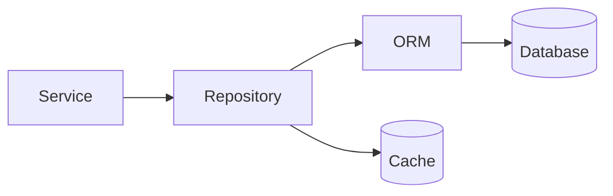

# Database Layer

> Backend Development 101 시리즈 (5/10)

<!-- a-grade-intro:begin -->

**핵심 질문**: Service에서 SQL을 *직접* 쓰면 안 되는 이유는?

> 데이터베이스가 바뀔 수도 있고, 같은 쿼리가 여러 곳에 흩어져 *유지보수 지옥* 이 되기 때문입니다. Repository가 그 사이를 막아 줍니다.

<!-- a-grade-intro:end -->

## 이 글에서 배울 것

- Repository 패턴의 역할
- ORM을 쓰는 이유와 *함정*
- 트랜잭션 / commit / rollback의 흐름
- migration이 무엇이고 왜 필요한지
- N+1 쿼리 문제와 해결법

## 왜 중요한가

DB는 *가장 자주 바뀌는 것* 이자 *가장 바뀌면 안 되는 것* 입니다. 처음부터 layer를 분리하면 새 DB로 옮기거나, 캐시를 끼워넣거나, 테스트를 인메모리로 돌리는 일이 모두 *한 군데만 고치면 끝* 입니다.

> Repository는 *DB와 service 사이의 통역사* 입니다.

## 개념 한눈에 보기



Service는 SQL을 모릅니다 — Repository만 압니다.

## 핵심 용어 정리

- **Repository**: DB 접근을 *함수* 처럼 추상화한 객체.
- **ORM**: 객체와 테이블을 매핑하는 도구.
- **Migration**: 스키마 변경을 코드로 버전 관리하는 것.
- **Transaction**: 여러 쿼리를 *한 단위* 로 묶는 범위.
- **N+1**: 1개 쿼리 + N개의 자식 쿼리 — 가장 흔한 성능 함정.

## Before/After

**Before (Service에서 직접 SQL)**

```python
def create_user(name):
    cur = db.execute("INSERT INTO users(name) VALUES(?)", (name,))
    return cur.lastrowid
```

**After (Repository로 추상화)**

```python
# repositories/user_repo.py
class UserRepository:
    def __init__(self, session):
        self.session = session

    def save(self, user):
        self.session.add(user)
        self.session.flush()
        return user
```

쿼리 변경이 *한 파일* 안에서 끝납니다.

## 실습: Database Layer 5단계

### 1단계 — SQLite + SQLAlchemy 설정

```python
# 1_setup.py
from sqlalchemy import create_engine, String
from sqlalchemy.orm import DeclarativeBase, Mapped, mapped_column

class Base(DeclarativeBase): pass

class User(Base):
    __tablename__ = "users"
    id: Mapped[int] = mapped_column(primary_key=True)
    name: Mapped[str] = mapped_column(String(50))

engine = create_engine("sqlite:///app.db")
Base.metadata.create_all(engine)
```

### 2단계 — 세션과 Repository

```python
# 2_repo.py
from sqlalchemy.orm import Session

class UserRepository:
    def __init__(self, session: Session):
        self.session = session

    def add(self, name: str) -> User:
        u = User(name=name)
        self.session.add(u)
        self.session.flush()
        return u

    def get(self, uid: int) -> User | None:
        return self.session.get(User, uid)
```

### 3단계 — 트랜잭션

```python
# 3_tx.py
from sqlalchemy.orm import Session
with Session(engine) as s, s.begin():
    repo = UserRepository(s)
    repo.add("Alice")
    repo.add("Bob")
# 블록을 정상적으로 빠져나오면 commit, 예외면 rollback
```

### 4단계 — Migration

```bash
pip install alembic
alembic init migrations
alembic revision --autogenerate -m "add users"
alembic upgrade head
```

스키마 변경을 *코드처럼* 관리합니다.

### 5단계 — N+1 잡기

```python
# 5_eager.py
from sqlalchemy.orm import selectinload
stmt = select(Order).options(selectinload(Order.items))
orders = session.scalars(stmt).all()
```

자식 컬렉션을 *한 번* 에 가져오면 N+1이 사라집니다.

## 이 코드에서 주목할 점

- Session은 *짧게* 유지합니다 — 요청 단위가 표준.
- Repository는 *도메인 객체* 를 반환합니다 — dict가 아닙니다.
- Migration은 *직접 ALTER TABLE* 보다 항상 안전합니다.

## 자주 하는 실수 5가지

1. **Service에서 ORM 객체를 그대로 응답한다.** Pydantic으로 *DTO* 를 만들어 분리합니다.
2. **세션을 전역으로 재사용한다.** 동시성 문제를 일으킵니다.
3. **migration 없이 운영 DB를 직접 수정한다.** 환경마다 스키마가 어긋납니다.
4. **모든 관계를 lazy로 둔다.** N+1이 *조용히* 누적됩니다.
5. **테스트에서 진짜 DB를 쓴다.** 인메모리 SQLite나 mock으로 빠르게 갑니다.

## 실무에서는 이렇게 쓰입니다

대부분의 백엔드는 *PostgreSQL + ORM + Alembic + Repository* 조합으로 시작합니다. 트래픽이 늘면 Read replica, 캐시(Redis), Elasticsearch가 추가되지만 Service는 그대로입니다 — Repository 안만 바뀝니다. 이 경계가 *시스템 진화* 를 가능하게 합니다.

## 시니어 엔지니어는 이렇게 생각합니다

- 모든 쿼리는 *index가 받쳐주는지* 확인한다.
- migration은 *down* 도 작성한다.
- Repository는 *도메인 언어* 로 메서드 이름을 짓는다 (`find_active_users`).
- 트랜잭션 길이는 *짧을수록* 좋다.
- 운영에서 슬로 쿼리 로그를 *항상* 켠다.

## 체크리스트

- [ ] Repository에 SQL을 모을 수 있다.
- [ ] 트랜잭션 블록을 작성할 수 있다.
- [ ] Alembic으로 migration을 생성할 수 있다.
- [ ] N+1을 식별하고 eager load로 고칠 수 있다.
- [ ] DTO와 ORM 객체를 구분한다.

## 연습 문제

1. `OrderRepository.find_recent(limit=10)` 을 작성하고 인덱스를 검토하세요.
2. Alembic으로 `users.email` 컬럼을 추가하는 migration을 만드세요.
3. N+1이 발생하는 쿼리를 일부러 만들고 `selectinload` 로 고친 차이를 측정하세요.

## 정리 및 다음 단계

Repository는 *DB 위에 얹은 통역사* 입니다. 다음 글에서는 데이터를 *누가 볼 수 있는지* 결정하는 인증과 권한을 봅니다.

- [백엔드 개발이란 무엇인가?](./01-what-is-backend-development.md)
- [HTTP 서버 만들기](./02-building-an-http-server.md)
- [Routing과 Controller](./03-routing-and-controllers.md)
- [Service Layer](./04-service-layer.md)
- **Database Layer (현재 글)**
- 인증과 권한 (예정)
- Logging과 Error Handling (예정)
- 백엔드 테스트 (예정)
- 백엔드 배포 (예정)
- 운영 가능한 백엔드 구조 (예정)
## 참고 자료

- [SQLAlchemy ORM](https://docs.sqlalchemy.org/en/20/orm/)
- [Alembic Tutorial](https://alembic.sqlalchemy.org/en/latest/tutorial.html)
- [Repository pattern (Martin Fowler)](https://martinfowler.com/eaaCatalog/repository.html)
- [N+1 queries explained](https://www.sqlshack.com/n1-query-problem/)

Tags: Backend, Database, SQL, SQLAlchemy, Python

---

© 2026 영선북스. 이 글의 저작권은 저자에게 있습니다.
