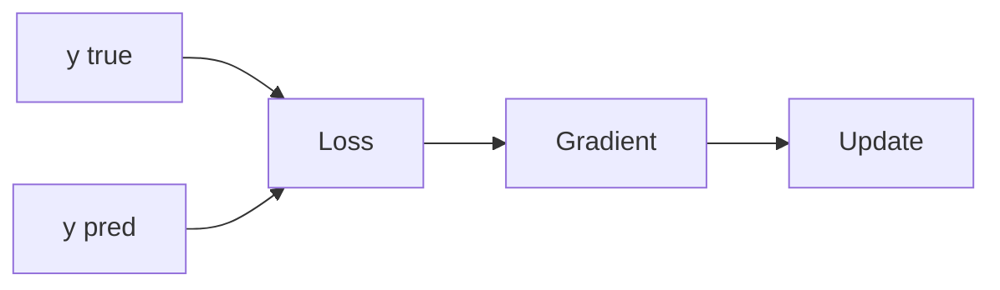

# 손실 함수

> Calculus for ML 101 시리즈 (6/10)

<!-- a-grade-intro:begin -->

**핵심 질문**: ML이 *얼마나 잘 했는가* 를 *어떤 함수* 로 *측정* 할까요?

> *손실 함수* 는 *모델 출력* 과 *정답* 의 *차이* 를 *수치* 로 만들고, 그 *기울기* 가 *학습* 을 이끕니다.

<!-- a-grade-intro:end -->

## 이 글에서 배울 것

- *손실* 의 정의
- *MSE* (회귀)
- *교차 엔트로피* (분류)
- *기울기* 의 의미
- *학습 신호* 직관

## 왜 중요한가

*잘못된 손실* 은 *잘못된 모델* 을 만듭니다. *손실 선택* 이 *문제 정의* 입니다.

## 개념 한눈에 보기



## 핵심 용어 정리

- **loss**: *오차* 의 *수치*.
- **MSE**: *평균 제곱 오차*.
- **CE**: *교차 엔트로피*.
- **signal**: *학습 신호*.
- **objective**: *최적화 대상*.

## Before/After

**Before**: *눈* 으로 *예측* 평가.

**After**: *손실* 로 *수치* 평가.

## 실습: 미니 손실 키트

### 1단계 — MSE

```python
def mse(y, p):
    return sum((yi - pi) ** 2 for yi, pi in zip(y, p)) / len(y)
```

### 2단계 — MSE 기울기

```python
def mse_grad(y, p):
    n = len(y)
    return [-2 * (yi - pi) / n for yi, pi in zip(y, p)]
```

### 3단계 — 이진 교차 엔트로피

```python
import math

def bce(y, p, eps=1e-7):
    return -sum(yi * math.log(pi + eps) + (1 - yi) * math.log(1 - pi + eps) for yi, pi in zip(y, p)) / len(y)
```

### 4단계 — 손실 비교

```python
y = [1, 0, 1]
p = [0.9, 0.2, 0.7]
loss = bce(y, p)
```

### 5단계 — 학습 신호 점검

```python
def signal(y, p):
    return sum(abs(yi - pi) for yi, pi in zip(y, p)) / len(y)
```

## 이 코드에서 주목할 점

- *MSE* 는 *회귀* 에 적합.
- *BCE* 는 *분류* 에 적합.
- *학습 신호* 는 *손실 기울기* 의 *크기*.

## 자주 하는 실수 5가지

1. ***회귀* 에 *분류 손실* 사용.**
2. ***log(0)* 처리 누락.**
3. ***평균* 과 *합* 의 *스케일* 혼동.**
4. ***이상치* 에 *MSE* 가 *민감* 함을 무시.**
5. ***라벨 인코딩* 불일치.**

## 실무에서는 이렇게 쓰입니다

*손실 곡선 모니터링*, *손실 가중치 조정*, *클래스 불균형 보정* 모두 *손실 설계* 의 일부입니다.

## 시니어 엔지니어는 이렇게 생각합니다

- *손실* 은 *문제 정의*.
- *MSE/BCE* 의 *적합성* 검토.
- *수치 안정성* 우선.
- *학습 신호* 모니터링.
- *불균형* 에 대한 *보정*.

## 체크리스트

- [ ] *문제 유형* 에 맞는 손실.
- [ ] *수치 안정성*.
- [ ] *스케일* 일치.
- [ ] *학습 곡선* 모니터링.

## 연습 문제

1. *MSE* 한 줄 정의.
2. *BCE* 한 줄 정의.
3. *학습 신호* 한 줄 의미.

## 정리 및 다음 단계

다음 글은 *경사하강법* 입니다.

- [미분이란 무엇인가](./01-what-is-derivative.md)
- [함수와 기울기](./02-functions-and-slope.md)
- [편미분](./03-partial-derivatives.md)
- [Gradient](./04-gradient.md)
- [연쇄 법칙](./05-chain-rule.md)
- **손실 함수 (현재 글)**
- 경사하강법 (예정)
- 최적화 (예정)
- 역전파 직관 (예정)
- 딥러닝에서의 미분 (예정)
## 참고 자료

- [Loss Functions - PyTorch](https://pytorch.org/docs/stable/nn.html#loss-functions)
- [Cross Entropy - CS231n](https://cs231n.github.io/linear-classify/)
- [Deep Learning Book - Loss](https://www.deeplearningbook.org/contents/mlp.html)
- [Class Imbalance - scikit-learn](https://scikit-learn.org/stable/modules/svm.html#unbalanced-problems)

Tags: Calculus, ML, LossFunction, MSE, Beginner

---

© 2026 영선북스. 이 글의 저작권은 저자에게 있습니다.
