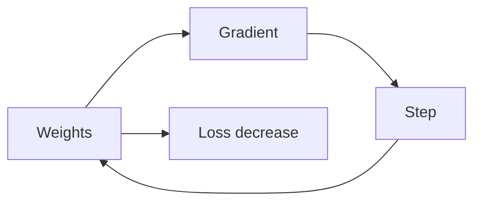

# 경사하강법

> Calculus for ML 101 시리즈 (7/10)

<!-- a-grade-intro:begin -->

**핵심 질문**: *손실의 기울기* 만으로 *최적의 가중치* 를 *어떻게* 찾을까요?

> *경사하강법* 은 *gradient 의 반대 방향* 으로 *작은 한 걸음* 을 *반복* 하는 *최적화* 입니다.

<!-- a-grade-intro:end -->

## 이 글에서 배울 것

- *경사하강법* 알고리즘
- *학습률* 의 역할
- *수렴* 과 *발산*
- *확률적* 경사하강 (SGD)
- *미니배치* 직관

## 왜 중요한가

*ML 학습* 의 *대부분* 은 *경사하강* 의 *변형* 입니다.

## 개념 한눈에 보기



## 핵심 용어 정리

- **GD**: *전체* 데이터로 *기울기*.
- **SGD**: *한 샘플* 로 *기울기*.
- **mini-batch**: *작은 묶음* 으로 *기울기*.
- **lr**: *학습률*.
- **convergence**: *수렴*.

## Before/After

**Before**: *그리드 탐색* 으로 *모든 조합* 시도.

**After**: *기울기* 따라 *효율적* 으로 이동.

## 실습: 미니 GD 키트

### 1단계 — 손실과 기울기

```python
def loss(w):
    return (w - 3) ** 2

def grad(w):
    return 2 * (w - 3)
```

### 2단계 — GD 한 스텝

```python
def step(w, lr=0.1):
    return w - lr * grad(w)
```

### 3단계 — 학습 루프

```python
def train(w0, lr=0.1, steps=100):
    w = w0
    for _ in range(steps):
        w = step(w, lr)
    return w
```

### 4단계 — SGD

```python
import random

def sgd(data, w0, lr=0.01, epochs=10):
    w = w0
    for _ in range(epochs):
        random.shuffle(data)
        for x in data:
            w -= lr * 2 * (w - x)
    return w
```

### 5단계 — 학습률 영향

```python
for lr in [0.001, 0.1, 1.5]:
    print(lr, train(0.0, lr, 50))
```

## 이 코드에서 주목할 점

- *반대 부호* 한 걸음.
- *학습률* 이 *결정적*.
- *SGD* 는 *노이즈* 동반.

## 자주 하는 실수 5가지

1. ***학습률* 을 *지나치게 크게* 설정.**
2. ***스케일* 다른 가중치 동일 학습률.**
3. ***수렴* 이전 *조기 종료*.**
4. ***SGD* 의 *노이즈* 무시.**
5. ***초기화* 를 *0* 으로만.**

## 실무에서는 이렇게 쓰입니다

*Adam*, *Momentum*, *RMSProp* 모두 *경사하강* 의 *개량형* 입니다.

## 시니어 엔지니어는 이렇게 생각합니다

- *학습률* 이 *제일 중요* 한 하이퍼파라미터.
- *발산* 이 보이면 *학습률* 부터.
- *SGD* 는 *정규화 효과* 도.
- *워밍업* 과 *스케줄링* 을 활용.
- *손실 곡선* 을 *항상* 본다.

## 체크리스트

- [ ] *학습률* 탐색.
- [ ] *수렴* 모니터링.
- [ ] *발산* 시 *조기 중단*.
- [ ] *초기화* 다양화.

## 연습 문제

1. *경사하강* 한 줄 정의.
2. *학습률* 의 역할 한 줄.
3. *SGD* 와 *GD* 의 차이 한 줄.

## 정리 및 다음 단계

다음 글은 *최적화* 입니다.

- [미분이란 무엇인가](./01-what-is-derivative.md)
- [함수와 기울기](./02-functions-and-slope.md)
- [편미분](./03-partial-derivatives.md)
- [Gradient](./04-gradient.md)
- [연쇄 법칙](./05-chain-rule.md)
- [손실 함수](./06-loss-function.md)
- **경사하강법 (현재 글)**
- 최적화 (예정)
- 역전파 직관 (예정)
- 딥러닝에서의 미분 (예정)
## 참고 자료

- [Gradient Descent - CS231n](https://cs231n.github.io/optimization-1/)
- [Adam Optimizer - Kingma and Ba](https://arxiv.org/abs/1412.6980)
- [Deep Learning Book - Optimization](https://www.deeplearningbook.org/contents/optimization.html)
- [PyTorch Optimizers](https://pytorch.org/docs/stable/optim.html)

Tags: Calculus, ML, GradientDescent, Optimization, Beginner

---

© 2026 영선북스. 이 글의 저작권은 저자에게 있습니다.
