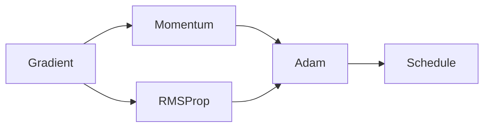

# 최적화

> Calculus for ML 101 시리즈 (8/10)

<!-- a-grade-intro:begin -->

**핵심 질문**: *기본 경사하강* 의 *약점* 을 *어떻게* 보완할까요?

> *모멘텀*, *적응 학습률*, *스케줄링* 이 *수렴 속도* 와 *안정성* 을 *함께* 끌어올립니다.

<!-- a-grade-intro:end -->

## 이 글에서 배울 것

- *모멘텀*
- *RMSProp*
- *Adam*
- *학습률 스케줄*
- *정규화* 직관

## 왜 중요한가

*Adam* 등 *현대 옵티마이저* 가 *왜* 잘 동작하는지 *직관* 으로 이해합니다.

## 개념 한눈에 보기



## 핵심 용어 정리

- **momentum**: *과거 기울기* 평균.
- **RMSProp**: *기울기 제곱* 평균.
- **Adam**: *모멘텀* + *RMSProp*.
- **schedule**: *학습률* 시간 변화.
- **regularization**: *과적합* 억제.

## Before/After

**Before**: *고정 학습률* GD.

**After**: *적응* 과 *스케줄* 의 *조합*.

## 실습: 미니 옵티마이저 키트

### 1단계 — 모멘텀

```python
def momentum_step(w, v, g, lr=0.1, beta=0.9):
    v = beta * v + g
    return w - lr * v, v
```

### 2단계 — RMSProp

```python
def rms_step(w, s, g, lr=0.01, beta=0.99, eps=1e-8):
    s = beta * s + (1 - beta) * g * g
    return w - lr * g / (s ** 0.5 + eps), s
```

### 3단계 — Adam (간이)

```python
def adam_step(w, m, v, g, t, lr=0.001, b1=0.9, b2=0.999, eps=1e-8):
    m = b1 * m + (1 - b1) * g
    v = b2 * v + (1 - b2) * g * g
    mh = m / (1 - b1 ** t)
    vh = v / (1 - b2 ** t)
    return w - lr * mh / (vh ** 0.5 + eps), m, v
```

### 4단계 — 스케줄

```python
def cosine_lr(step, total, lr0=0.01):
    import math
    return 0.5 * lr0 * (1 + math.cos(math.pi * step / total))
```

### 5단계 — L2 정규화

```python
def l2_step(w, g, lr=0.1, wd=1e-4):
    return w - lr * (g + wd * w)
```

## 이 코드에서 주목할 점

- *모멘텀* 은 *관성*.
- *RMSProp* 은 *적응 학습률*.
- *Adam* 은 *둘의 결합*.
- *스케줄* 로 *후반 미세조정*.
- *L2* 가 *일반화* 도움.

## 자주 하는 실수 5가지

1. ***Adam* 학습률 *기본값* 그대로 사용 (튜닝 필요).**
2. ***weight decay* 를 *L2* 와 혼동.**
3. ***스케줄* 없는 *고정 lr*.**
4. ***초반 발산* 시 *워밍업* 미사용.**
5. ***모멘텀* 누적 *재시작* 안 함.**

## 실무에서는 이렇게 쓰입니다

*트랜스포머 학습* 은 *Adam* + *워밍업* + *코사인 스케줄* 이 *표준* 입니다.

## 시니어 엔지니어는 이렇게 생각합니다

- *옵티마이저* 는 *문제별* 선택.
- *워밍업* 이 *발산* 을 막음.
- *적응형* 은 *스케일* 을 흡수.
- *정규화* 가 *일반화*.
- *학습률* 이 *모든 것* 을 결정.

## 체크리스트

- [ ] *옵티마이저* 적합성.
- [ ] *워밍업* 적용.
- [ ] *스케줄* 설계.
- [ ] *정규화* 강도.

## 연습 문제

1. *모멘텀* 한 줄 정의.
2. *Adam* 한 줄 정의.
3. *워밍업* 의 의미 한 줄.

## 정리 및 다음 단계

다음 글은 *역전파 직관* 입니다.

- [미분이란 무엇인가](./01-what-is-derivative.md)
- [함수와 기울기](./02-functions-and-slope.md)
- [편미분](./03-partial-derivatives.md)
- [Gradient](./04-gradient.md)
- [연쇄 법칙](./05-chain-rule.md)
- [손실 함수](./06-loss-function.md)
- [경사하강법](./07-gradient-descent.md)
- **최적화 (현재 글)**
- 역전파 직관 (예정)
- 딥러닝에서의 미분 (예정)
## 참고 자료

- [Adam - Kingma and Ba](https://arxiv.org/abs/1412.6980)
- [Optimizer Overview - Ruder](https://www.ruder.io/optimizing-gradient-descent/)
- [Cosine LR Schedule - Loshchilov and Hutter](https://arxiv.org/abs/1608.03983)
- [Decoupled Weight Decay - Loshchilov and Hutter](https://arxiv.org/abs/1711.05101)

Tags: Calculus, ML, Optimization, Adam, Beginner

---

© 2026 영선북스. 이 글의 저작권은 저자에게 있습니다.
