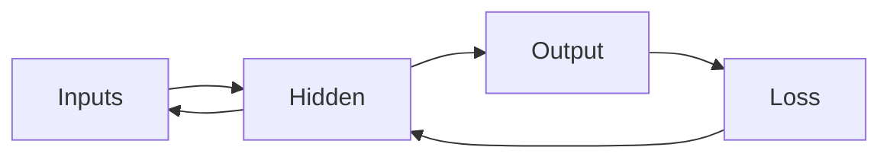

# 역전파 직관

> Calculus for ML 101 시리즈 (9/10)

<!-- a-grade-intro:begin -->

**핵심 질문**: *수많은 가중치* 의 *기울기* 를 *어떻게* 한 번에 계산할까요?

> *역전파* 는 *연쇄 법칙* 을 *역방향* 으로 *적용* 해 *모든 기울기* 를 *효율적* 으로 만듭니다.

<!-- a-grade-intro:end -->

## 이 글에서 배울 것

- *계산 그래프*
- *순전파*
- *역전파*
- *기울기 누적*
- *자동 미분* 직관

## 왜 중요한가

*프레임워크* 가 *기울기* 를 *대신* 계산해 주므로, *원리* 를 알면 *디버깅* 이 가능합니다.

## 개념 한눈에 보기



## 핵심 용어 정리

- **graph**: *계산* 의 *그래프*.
- **forward**: *입력 -> 출력*.
- **backward**: *기울기* *역방향*.
- **autograd**: *자동 미분*.
- **node**: *연산* 단위.

## Before/After

**Before**: *각 가중치* *수치 미분*.

**After**: *한 번* 의 *역방향 패스*.

## 실습: 미니 역전파 키트

### 1단계 — 노드

```python
class Node:
    def __init__(self, val, parents=()):
        self.val = val
        self.parents = parents
        self.grad = 0.0
```

### 2단계 — 덧셈

```python
def add(a, b):
    n = Node(a.val + b.val, (a, b))
    n.local = (1.0, 1.0)
    return n
```

### 3단계 — 곱셈

```python
def mul(a, b):
    n = Node(a.val * b.val, (a, b))
    n.local = (b.val, a.val)
    return n
```

### 4단계 — 역방향 패스

```python
def backward(n):
    n.grad = 1.0
    stack = [n]
    while stack:
        x = stack.pop()
        for p, lg in zip(x.parents, x.local):
            p.grad += x.grad * lg
            stack.append(p)
```

### 5단계 — 미니 예제

```python
a, b, c = Node(2.0), Node(3.0), Node(4.0)
y = mul(add(a, b), c)
backward(y)
# a.grad == 4.0, b.grad == 4.0, c.grad == 5.0
```

## 이 코드에서 주목할 점

- *순전파* 가 *값* 을 만든다.
- *역전파* 가 *기울기* 를 만든다.
- *각 노드* 가 *지역* 미분 보유.

## 자주 하는 실수 5가지

1. ***기울기* 를 *0* 으로 *초기화* 안 함 (누적).**
2. ***순전파* 와 *역전파* 의 *순서* 혼동.**
3. ***공유 노드* 에서 *중복 누적* 누락.**
4. ***메모리* 절약 위해 *값 보관* 생략.**
5. ***detach* 누락으로 *불필요한 그래프* 유지.**

## 실무에서는 이렇게 쓰입니다

*PyTorch*, *TensorFlow*, *JAX* 모두 *역전파* 를 *자동* 으로 수행합니다.

## 시니어 엔지니어는 이렇게 생각합니다

- *역전파* 는 *연쇄 법칙* 의 구현.
- *그래디언트 누적* 을 *명시*.
- *zero_grad* 를 *반복적* 으로.
- *검증* 을 위해 *수치 미분* 비교.
- *그래프* 가 *메모리*.

## 체크리스트

- [ ] *zero_grad* 호출.
- [ ] *역방향* 한 번.
- [ ] *수치 검증*.
- [ ] *detach* 정리.

## 연습 문제

1. *역전파* 한 줄 정의.
2. *zero_grad* 의 의미 한 줄.
3. *autograd* 한 줄 정의.

## 정리 및 다음 단계

다음 글은 *딥러닝에서의 미분* 종합 편입니다.

- [미분이란 무엇인가](./01-what-is-derivative.md)
- [함수와 기울기](./02-functions-and-slope.md)
- [편미분](./03-partial-derivatives.md)
- [Gradient](./04-gradient.md)
- [연쇄 법칙](./05-chain-rule.md)
- [손실 함수](./06-loss-function.md)
- [경사하강법](./07-gradient-descent.md)
- [최적화](./08-optimization.md)
- **역전파 직관 (현재 글)**
- 딥러닝에서의 미분 (예정)
## 참고 자료

- [Backpropagation - CS231n](https://cs231n.github.io/optimization-2/)
- [Calculus on Computational Graphs - Olah](https://colah.github.io/posts/2015-08-Backprop/)
- [PyTorch Autograd](https://pytorch.org/tutorials/beginner/blitz/autograd_tutorial.html)
- [JAX Autograd Cookbook](https://jax.readthedocs.io/en/latest/notebooks/autodiff_cookbook.html)

Tags: Calculus, ML, Backprop, NeuralNetwork, Beginner

---

© 2026 영선북스. 이 글의 저작권은 저자에게 있습니다.
