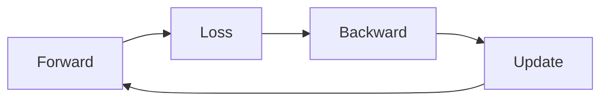

# 딥러닝에서의 미분

> Calculus for ML 101 시리즈 (10/10)

<!-- a-grade-intro:begin -->

**핵심 질문**: 시리즈에서 배운 *미분* 은 *딥러닝* 의 *학습 루프* 에서 *어떻게* 결합될까요?

> *신경망*, *손실*, *역전파*, *옵티마이저* 가 모두 *미분* 위에서 *한 사이클* 로 동작합니다.

<!-- a-grade-intro:end -->

## 이 글에서 배울 것

- *학습 루프* 의 *5 단계*
- *순전파*
- *손실 계산*
- *역전파*
- *가중치 갱신*

## 왜 중요한가

*시리즈를 종합* 해서, *모든 ML 학습* 의 *공통 골격* 을 직접 구현합니다.

## 개념 한눈에 보기



## 핵심 용어 정리

- **forward**: *예측* 생성.
- **loss**: *오차* 측정.
- **backward**: *기울기* 계산.
- **update**: *가중치* 갱신.
- **epoch**: *전체* 데이터 *1 회*.

## Before/After

**Before**: *프레임워크* 의 *블랙박스* 사용.

**After**: *학습 루프* 의 *각 단계* 가 *왜* 그런지 안다.

## 실습: 미니 학습 루프

### 1단계 — 모델

```python
import math

def model(x, w, b):
    return sigmoid(w * x + b)

def sigmoid(z):
    return 1 / (1 + math.exp(-z))
```

### 2단계 — 손실 (BCE)

```python
def bce(y, p, eps=1e-7):
    return -(y * math.log(p + eps) + (1 - y) * math.log(1 - p + eps))
```

### 3단계 — 기울기 (해석)

```python
def grads(x, y, w, b):
    p = model(x, w, b)
    err = p - y
    return err * x, err
```

### 4단계 — 한 스텝 갱신

```python
def step(x, y, w, b, lr=0.1):
    dw, db = grads(x, y, w, b)
    return w - lr * dw, b - lr * db
```

### 5단계 — 학습 루프

```python
def train(data, epochs=100, lr=0.1):
    w, b = 0.0, 0.0
    for _ in range(epochs):
        for x, y in data:
            w, b = step(x, y, w, b, lr)
    return w, b
```

## 이 코드에서 주목할 점

- *순전파* 가 *예측*.
- *손실* 이 *방향*.
- *역전파* 가 *책임 분배*.
- *옵티마이저* 가 *갱신*.
- *반복* 이 *학습*.

## 자주 하는 실수 5가지

1. ***학습률* 미조정.**
2. ***zero_grad* 누락.**
3. ***평가* 시 *gradient* 계산.**
4. ***eval/train* 모드 혼동 (Dropout, BN).**
5. ***재현성* 위한 *시드* 누락.**

## 실무에서는 이렇게 쓰입니다

*이미지 분류*, *언어 모델*, *추천*, *강화학습* 까지 *모든 학습* 이 *동일 골격* 입니다.

## 시니어 엔지니어는 이렇게 생각합니다

- *학습 루프* 는 *5 줄* 로 요약됨.
- *프레임워크* 는 *편의*, *원리* 가 *본질*.
- *모니터링* 이 *디버깅*.
- *재현성* 이 *생산성*.
- *수치 안정성* 이 *최후의 보루*.

## 체크리스트

- [ ] *순전파* 정확.
- [ ] *손실* 적절.
- [ ] *zero_grad* 호출.
- [ ] *역전파* 한 번.
- [ ] *옵티마이저* 갱신.

## 연습 문제

1. *학습 루프* *5 단계* 를 한 줄씩.
2. *zero_grad* 의 *위치* 한 줄.
3. *eval 모드* 의 *의미* 한 줄.

## 정리 및 다음 단계

이 글로 *Calculus for ML 101* 시리즈를 마무리합니다. *미분* 은 *딥러닝* 이 *학습* 한다는 말의 *수학적 본질* 입니다.

- [미분이란 무엇인가](./01-what-is-derivative.md)
- [함수와 기울기](./02-functions-and-slope.md)
- [편미분](./03-partial-derivatives.md)
- [Gradient](./04-gradient.md)
- [연쇄 법칙](./05-chain-rule.md)
- [손실 함수](./06-loss-function.md)
- [경사하강법](./07-gradient-descent.md)
- [최적화](./08-optimization.md)
- [역전파 직관](./09-backpropagation-intuition.md)
- **딥러닝에서의 미분 (현재 글)**
## 참고 자료

- [Deep Learning Book - Goodfellow et al.](https://www.deeplearningbook.org/)
- [PyTorch Tutorials](https://pytorch.org/tutorials/)
- [CS231n - Convolutional Neural Networks](https://cs231n.stanford.edu/)
- [Reproducibility - PyTorch](https://pytorch.org/docs/stable/notes/randomness.html)

Tags: Calculus, ML, DeepLearning, Capstone, Beginner

---

© 2026 영선북스. 이 글의 저작권은 저자에게 있습니다.
