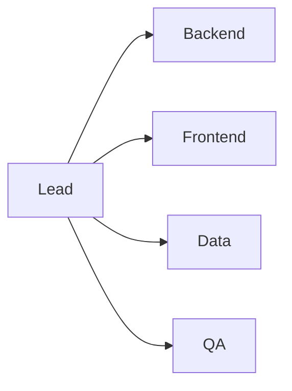

# 팀 역할 나누기

> 캡스톤 프로젝트 101 시리즈 (5/10)

<!-- a-grade-intro:begin -->

**핵심 질문**: *역할* 이 *겹치면* 왜 *속도* 가 느려질까요?

> *책임* 이 *분산* 되면 *결정* 이 *지연* 되기 때문입니다.

<!-- a-grade-intro:end -->

## 이 글에서 배울 것

- 핵심 *역할* 5가지
- *책임 매트릭스*
- *코드 오너십*
- *의사결정* 흐름
- *백업* 인력

## 왜 중요한가

*명확한 역할* 이 *책임* 과 *속도* 를 만듭니다.

## 개념 한눈에 보기



## 핵심 용어 정리

- **lead**: *전체 조율*.
- **backend**: *서버 / API*.
- **frontend**: *UI*.
- **data**: *DB / 분석*.
- **QA**: *품질 검증*.

## Before/After

**Before**: *모두가 모든 것* 을 본다.

**After**: *주 책임 + 백업* 이 정해져 있다.

## 실습: 역할 표

### 1단계 — 인원 정리

```python
members = ["A", "B", "C", "D"]
```

### 2단계 — 주 역할 매핑

```python
primary = {"A": "lead", "B": "backend", "C": "frontend", "D": "data"}
```

### 3단계 — 백업 매핑

```python
backup = {"backend": "C", "frontend": "B", "data": "A"}
```

### 4단계 — 책임 표

```python
raci = {"deploy": ("A", "B"), "test": ("D", "C")}
```

### 5단계 — 검토 주기

```python
review = "weekly"
```

## 이 코드에서 주목할 점

- *주 역할* 은 *1인*.
- *백업* 은 *반드시* 지정.
- *RACI* 는 *간결하게*.

## 자주 하는 실수 5가지

1. ***공동 책임* 으로 *모두* 표시.**
2. ***백업* 이 없다.**
3. ***리드* 가 *전부* 결정.**
4. ***QA* 를 *마지막* 에 배정.**
5. ***역할* 변경을 *기록* 하지 않는다.**

## 실무에서는 이렇게 쓰입니다

회사 팀도 *RACI* 로 의사결정 권한을 정리합니다.

## 시니어 엔지니어는 이렇게 생각합니다

- *역할* 은 *문서*.
- *백업* 은 *필수*.
- *결정권* 은 *명확히*.
- *겹침* 은 *최소*.
- *변경* 은 *공지*.

## 체크리스트

- [ ] *주 역할* 매핑.
- [ ] *백업* 지정.
- [ ] *RACI* 표.
- [ ] *주간 검토*.

## 연습 문제

1. *RACI* 가 무엇인가 한 줄.
2. *백업* 의 목적 한 줄.
3. *리드* 의 책임 한 줄.

## 정리 및 다음 단계

다음 글은 *MVP 설계* 입니다.

- [캡스톤 프로젝트란 무엇인가](./01-what-is-capstone.md)
- [주제 선정](./02-choosing-a-topic.md)
- [문제 정의](./03-defining-the-problem.md)
- [요구사항 정리](./04-organizing-requirements.md)
- **팀 역할 나누기 (현재 글)**
- MVP 설계 (예정)
- 기술 스택 선택 (예정)
- 일정 관리 (예정)
- 발표 자료 만들기 (예정)
- 프로젝트 회고 (예정)
## 참고 자료

- [RACI Matrix - PMI](https://www.pmi.org/learning/library/raci-responsibility-matrix-9410)
- [Team Topologies](https://teamtopologies.com/)
- [The Mythical Man-Month](https://en.wikipedia.org/wiki/The_Mythical_Man-Month)
- [Code Ownership - Martin Fowler](https://martinfowler.com/bliki/CodeOwnership.html)

Tags: Capstone, Team, Roles, Collaboration, Beginner

---

© 2026 영선북스. 이 글의 저작권은 저자에게 있습니다.
