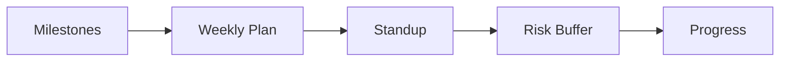

# 일정 관리

> 캡스톤 프로젝트 101 시리즈 (8/10)

<!-- a-grade-intro:begin -->

**핵심 질문**: *완벽한 계획* 이 *왜 무너질까요*?

> *현실* 은 *추정* 보다 *느리고* *불확실* 하기 때문입니다.

<!-- a-grade-intro:end -->

## 이 글에서 배울 것

- *마일스톤* 정의
- *주간 계획*
- *데일리 스탠드업*
- *위험 버퍼*
- *진척도* 측정

## 왜 중요한가

*일정* 이 *명확* 해야 *집중* 이 가능합니다.

## 개념 한눈에 보기



## 핵심 용어 정리

- **milestone**: *주요 단계*.
- **weekly plan**: *주간 계획*.
- **standup**: *짧은 동기화*.
- **buffer**: *예비 시간*.
- **progress**: *진척도*.

## Before/After

**Before**: *데드라인* 만 적는다.

**After**: *마일스톤 + 주간 + 버퍼* 가 있다.

## 실습: 일정 표

### 1단계 — 마일스톤

```python
milestones = ["MVP", "Demo", "Final"]
```

### 2단계 — 주간 계획

```python
weeks = {1: "setup", 2: "core", 3: "polish"}
```

### 3단계 — 스탠드업 양식

```python
standup = ["yesterday", "today", "blockers"]
```

### 4단계 — 위험 버퍼

```python
buffer_days = 0.2 * 21
```

### 5단계 — 진척도

```python
progress = {"done": 12, "todo": 8, "blocked": 2}
```

## 이 코드에서 주목할 점

- *마일스톤* 은 *3-5개*.
- *주간 계획* 은 *1줄*.
- *버퍼* 는 *20%*.

## 자주 하는 실수 5가지

1. ***버퍼* 가 없다.**
2. ***스탠드업* 이 *길어진다*.**
3. ***진척도* 를 *체감* 으로 본다.**
4. ***주간 계획* 이 *고정* 이다.**
5. ***블로커* 를 *숨긴다*.**

## 실무에서는 이렇게 쓰입니다

회사 팀도 *2주 스프린트* 와 *번다운* 차트를 씁니다.

## 시니어 엔지니어는 이렇게 생각합니다

- *마일스톤* 은 *결과*.
- *계획* 은 *조정 가능*.
- *버퍼* 는 *기본*.
- *블로커* 는 *공개*.
- *진척* 은 *측정*.

## 체크리스트

- [ ] *마일스톤* 표.
- [ ] *주간 계획*.
- [ ] *데일리 스탠드업*.
- [ ] *버퍼 20%*.

## 연습 문제

1. *마일스톤* 정의 한 줄.
2. *버퍼* 의 목적 한 줄.
3. *스탠드업* 3가지 한 줄.

## 정리 및 다음 단계

다음 글은 *발표 자료 만들기* 입니다.

- [캡스톤 프로젝트란 무엇인가](./01-what-is-capstone.md)
- [주제 선정](./02-choosing-a-topic.md)
- [문제 정의](./03-defining-the-problem.md)
- [요구사항 정리](./04-organizing-requirements.md)
- [팀 역할 나누기](./05-splitting-team-roles.md)
- [MVP 설계](./06-designing-the-mvp.md)
- [기술 스택 선택](./07-choosing-the-tech-stack.md)
- **일정 관리 (현재 글)**
- 발표 자료 만들기 (예정)
- 프로젝트 회고 (예정)
## 참고 자료

- [Scrum Guide](https://scrumguides.org/)
- [Critical Path Method](https://en.wikipedia.org/wiki/Critical_path_method)
- [Burndown Chart - Atlassian](https://www.atlassian.com/agile/tutorials/burndown-charts)
- [Estimation - Steve McConnell](https://stevemcconnell.com/sea/)

Tags: Capstone, Schedule, Planning, Project, Beginner

---

© 2026 영선북스. 이 글의 저작권은 저자에게 있습니다.
