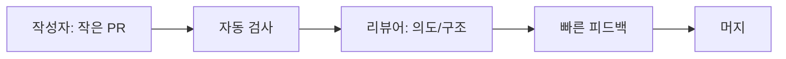

# 좋은 코드 리뷰 기준

> Clean Code 101 시리즈 (10/10)

<!-- a-grade-intro:begin -->

**핵심 질문**: 좋은 코드 리뷰는 무엇을 보아야 하나요?

> 이 시리즈가 다룬 모든 것 — 이름, 함수, 분기, 중복, 오류, 테스트, 리팩토링 — 을 한 번에 점검하는 자리입니다.

<!-- a-grade-intro:end -->

## 이 글에서 배울 것

- PR 사이즈와 리뷰 가능성
- 클린 코드 관점의 리뷰 체크리스트
- 좋은 리뷰 코멘트의 형태
- 리뷰어와 작성자의 역할
- 자동화로 옮길 수 있는 검사

## 왜 중요한가

리뷰는 코드 품질의 마지막 게이트이자 팀 학습의 가장 큰 통로입니다.

> 리뷰는 결함을 잡는 자리가 아니라 함께 더 나은 답을 찾는 자리다.

## 개념 한눈에 보기



자동화는 잡일을, 사람은 의도를.

## 핵심 용어 정리

- **PR (Pull Request)**: 변경 단위.
- **Review comment**: 변경에 대한 의견.
- **Approval**: 머지 가능 신호.
- **CI (Continuous Integration)**: 자동 빌드/테스트.
- **Style guide**: 팀 공통 규칙.

## Before/After

**Before**

```text
"이 함수 너무 길어요."
```

**After**

```text
"order_total이 60줄입니다. subtotal/with_coupon/with_member로
나누면 본문이 목차처럼 읽힙니다 (ep03, ep05 참고).
선택: (a) 이번 PR에서 분리 (b) 후속 PR 이슈로."
```

코멘트가 행동 가능합니다.

## 실습: 리뷰를 견고하게 만드는 5단계

### 1단계 — 자동화로 줄이기

```yaml
# 1_ci.yml
- run: ruff check .
- run: black --check .
- run: pytest -q
```

스타일/포맷/테스트는 사람이 보지 않습니다.

### 2단계 — PR을 작게

```text
# 2_small_pr.txt
권장: < 400 lines diff, 1 책임
```

작은 PR이 빠른 리뷰의 출발점.

### 3단계 — 의도부터 읽기

```markdown
<!-- 3_pr_template.md -->
## What
무엇이 바뀌나
## Why
왜 바꾸나 (이슈 링크)
## How
어떻게 검증했나 (테스트/스크린샷)
## Risk
무엇이 위험할 수 있나
```

설명 없는 PR은 리뷰 불가.

### 4단계 — 행동 가능한 코멘트

```text
# 4_comment.txt
NIT: 사소함 (선택)
SUGG: 제안 (이번 PR 권장)
MUST: 머지 전에 반드시
QUESTION: 이해 확인
```

라벨이 우선순위를 명확히 합니다.

### 5단계 — 회고로 학습

```text
# 5_retro.txt
- 자주 반복되는 코멘트는 lint/문서로 옮긴다.
- 큰 PR은 작게 쪼개는 가이드를 만든다.
- 리뷰 시간을 측정해서 개선 대상으로 본다.
```

리뷰 자체를 리팩토링합니다.

## 이 코드에서 주목할 점

- 자동화가 끝낸 일은 사람이 다시 보지 않습니다.
- 코멘트에 우선순위 라벨이 있습니다.
- PR 설명이 변경의 맥락을 줍니다.

## 자주 하는 실수 5가지

1. **거대 PR.** 어차피 누구도 끝까지 못 봅니다.
2. **취향 코멘트.** 가치 충돌만 남깁니다.
3. **MUST를 남발.** 신뢰가 떨어집니다.
4. **자동화로 가능한 일을 사람이 봄.** 시간 낭비.
5. **승인만 하고 학습 기록 없음.** 같은 실수 반복.

## 실무에서는 이렇게 쓰입니다

좋은 팀은 평균 PR 크기, 첫 응답 시간, 머지 리드 타임을 측정합니다. 이 지표들이 나빠지면 리뷰 프로세스 자체를 리팩토링합니다.

## 시니어 엔지니어는 이렇게 생각합니다

- 작은 PR을 강하게 옹호한다.
- 자동화로 끝낼 일은 사람이 보지 않는다.
- 의도부터 읽고 코드는 그다음.
- 코멘트는 행동 가능하게 단다.
- 리뷰 시간 자체를 지표로 본다.

## 체크리스트

- [ ] PR이 한 가지 책임만 다루는가?
- [ ] CI가 녹색인가?
- [ ] 설명(What/Why/How/Risk)이 충분한가?
- [ ] 코멘트가 우선순위 라벨을 가지나?
- [ ] 반복 코멘트를 자동화로 옮길 수 있나?

## 연습 문제

1. 본인 팀의 평균 PR 크기를 측정하고 절반으로 줄여 보세요.
2. 자주 다는 코멘트 3개를 lint 규칙으로 자동화하세요.
3. PR 템플릿을 도입하고 한 달 뒤 회고하세요.

## 정리 및 다음 단계

좋은 리뷰는 좋은 코드의 거울입니다. 이 시리즈에서 다룬 이름·함수·분기·중복·오류·주석·테스트·리팩토링·리뷰는 모두 같은 것을 향합니다 — 다음 사람이 더 쉽게 변경할 수 있는 코드. 다음 시리즈에서 이 원칙을 더 큰 단위 — 소프트웨어 설계 — 로 확장합니다.

- [Clean Code란 무엇인가?](./01-what-is-clean-code.md)
- [이름 짓기](./02-naming.md)
- [함수 작게 만들기](./03-small-functions.md)
- [조건문 줄이기](./04-simplifying-conditionals.md)
- [중복 제거](./05-removing-duplication.md)
- [오류 처리](./06-error-handling.md)
- [주석과 문서화](./07-comments-and-docs.md)
- [테스트 가능한 코드](./08-testable-code.md)
- [리팩토링 기초](./09-refactoring-basics.md)
- **좋은 코드 리뷰 기준 (현재 글)**
## 참고 자료

- [Google Engineering Practices — Code Review](https://google.github.io/eng-practices/review/)
- [Conventional Comments](https://conventionalcomments.org/)
- [Best Kept Secrets of Peer Code Review (Smart Bear)](https://smartbear.com/resources/ebooks/best-kept-secrets-of-peer-code-review/)
- [Microsoft Engineering Fundamentals — Code Review](https://microsoft.github.io/code-with-engineering-playbook/code-reviews/)

Tags: Computer Science, CleanCode, CodeReview, PullRequest, Quality, Collaboration

---

© 2026 영선북스. 이 글의 저작권은 저자에게 있습니다.
