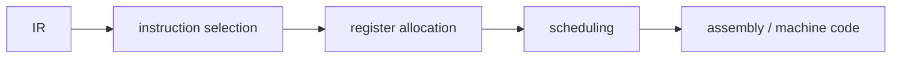

# code generation

> Compilers 101 시리즈 (8/10)

<!-- a-grade-intro:begin -->

**핵심 질문**: IR에는 `t1, t2, t3...`처럼 무한히 많은 임시 변수가 있습니다. 진짜 CPU에는 register가 16개뿐인데, 어떻게 맞춥니까?

> Code generation은 IR을 실제 명령어로 바꾸는 단계입니다. 두 핵심 작업은 instruction selection(어떤 명령어로?)과 register allocation(어디에 둘 것인가?)입니다.

<!-- a-grade-intro:end -->

## 이 글에서 배울 것

- code generation이 푸는 두 가지 핵심 문제
- instruction selection의 패턴 매칭 직관
- register allocation을 graph coloring으로 보는 시각
- spill: register가 모자랄 때 메모리를 쓰는 결정
- calling convention과 ABI의 등장 이유

## 왜 중요한가

여기까지 잘 와도 마지막에 잘못 내려가면 프로그램은 안 돕니다. 그리고 같은 IR이라도 backend 품질이 낮으면 실행 속도가 2-10배 차이가 납니다. code gen은 컴파일러의 평판을 결정합니다.

> "이론은 IR에서 끝나고, 실력은 backend에서 드러난다."

## 개념 한눈에 보기



세 단계가 거의 모든 backend의 뼈대입니다.

## 핵심 용어 정리

- **Instruction selection**: IR 노드를 어떤 CPU 명령어로 바꿀지 결정.
- **Register allocation**: 가상 register(temporary)를 실제 physical register로 매핑.
- **Spill**: register가 모자라 임시 변수를 메모리에 저장하는 동작.
- **Calling convention**: 함수 호출 시 어느 register에 어느 값을 두는가에 대한 약속.
- **ABI (application binary interface)**: 컴파일된 코드들이 서로 부르기 위한 약속.

## Before/After

**Before — 무한 가상 register IR**

```text
t1 = LOAD a
t2 = LOAD b
t3 = t1 + t2
RET t3
```

**After — 실제 명령어 (예: x86-64)**

```asm
mov rax, [a]
add rax, [b]
ret
```

가상 register가 `rax`로 줄어들고, LOAD/ADD가 한 명령어로 합쳐졌습니다.

## 실습: 작은 코드 생성기

### 1단계 — 직선적 instruction selection

```python
# 1_select.py
# 매우 단순한 1:1 매칭
def select(inst):
    op, dst, a, b = inst
    if op == "LOAD":  return [f"mov {dst}, {a}"]
    if op == "+":     return [f"mov {dst}, {a}", f"add {dst}, {b}"]
    if op == "*":     return [f"mov {dst}, {a}", f"imul {dst}, {b}"]
    if op == "RET":   return [f"mov rax, {a}", "ret"]
    return [f"; unknown {op}"]

for inst in [("LOAD","t1",2,None),("LOAD","t2",3,None),
             ("+","t3","t1","t2"),("RET",None,"t3",None)]:
    print("\n".join(select(inst)))
```

먼저 매우 단순한 1:1 매칭으로 시작합니다. 더 좋은 backend는 트리 패턴 매칭을 합니다.

### 2단계 — interference graph

```python
# 2_interference.py
# 같은 시점에 살아 있는 두 temporary는 같은 register를 못 쓴다
# → 그래프의 간선
def interferences(code):
    live = set(); edges = set()
    for op, dst, a, b in reversed(code):
        if op == "RET":
            live.add(a); continue
        if dst in live:
            live.discard(dst)
        for x in live:
            if isinstance(dst, str):
                edges.add(frozenset({dst, x}))
        if isinstance(a, str): live.add(a)
        if isinstance(b, str): live.add(b)
    return edges
```

뒤에서 앞으로 라이브니스를 추적하면, "동시에 살아 있는 변수들"의 간선이 모입니다.

### 3단계 — graph coloring 직관

```python
# 3_color.py
# 사용 가능한 색(register)이 K개일 때, 인접한 노드끼리 같은 색이 안 되게 칠한다
def greedy_color(nodes, edges, k):
    color = {}
    for n in nodes:
        used = {color[m] for m in nodes if frozenset({n,m}) in edges and m in color}
        for c in range(k):
            if c not in used:
                color[n] = c; break
        else:
            color[n] = "SPILL"
    return color
```

K개 색으로 안 칠해지는 노드는 spill 후보입니다. 실제 알고리즘은 chordal graph의 특성 등을 활용해 더 정교합니다.

### 4단계 — spill: 메모리에 임시 저장

```python
# 4_spill.py
# register가 모자라면 stack에 일시 저장 후 다시 로드
def spill(code, var):
    new = []
    for op, dst, a, b in code:
        if op != "RET" and a == var:
            new.append(("LOAD", "tmp", f"[stack:{var}]", None)); a = "tmp"
        if dst == var:
            new.append((op, "tmp", a, b))
            new.append(("STORE", None, "tmp", f"[stack:{var}]")); continue
        new.append((op, dst, a, b))
    return new
```

성능은 떨어지지만 정확성은 보장됩니다. 잘 만든 backend는 spill을 최소화합니다.

### 5단계 — calling convention

```python
# 5_call.py
# x86-64 System V: 첫 6개 정수 인자는 rdi, rsi, rdx, rcx, r8, r9
# 반환값은 rax
def emit_call(name, args):
    regs = ["rdi","rsi","rdx","rcx","r8","r9"]
    out = []
    for r, a in zip(regs, args):
        out.append(f"mov {r}, {a}")
    out.append(f"call {name}")
    return out

print("\n".join(emit_call("printf", ["fmt", "x"])))
```

내가 만든 함수와 라이브러리가 같은 약속을 따라야 호출이 동작합니다. 이게 ABI입니다.

## 이 코드에서 주목할 점

- instruction selection은 패턴 매칭의 일종입니다.
- register allocation의 본질은 graph coloring이지만, 실용은 더 정교합니다.
- spill은 "패배"가 아니라 정상적인 도구입니다.
- calling convention 위반은 무조건 segfault.

## 자주 하는 실수 5가지

1. **liveness 분석 없이 register를 배정한다.** 이미 쓰이고 있는 register를 덮어 씁니다.
2. **spill을 두려워해 코드 폭발을 만든다.** 적절한 spill은 필요합니다.
3. **calling convention을 임의로 바꾼다.** 외부 라이브러리와 영원히 못 만납니다.
4. **flag register(EFLAGS) 같은 implicit register를 잊는다.** 비교 후 점프 사이에 낀 명령어가 깨뜨립니다.
5. **instruction selection을 너무 일찍 최적화한다.** 먼저 정확한 1:1 매칭으로 동작하는 것을 먼저.

## 실무에서는 이렇게 쓰입니다

LLVM의 backend는 SelectionDAG와 GlobalISel 두 갈래가 있고, 각각 instruction selection 전략이 다릅니다. register allocator는 LinearScan(빠름)과 Greedy(품질 좋음)를 옵션으로 제공합니다. ABI는 OS와 architecture별로 달라서, 같은 함수가 Linux x86-64와 macOS ARM64에서 다르게 호출됩니다.

## 시니어 엔지니어는 이렇게 생각합니다

- "이 backend는 어떤 ABI를 따르는가?"를 먼저 확인합니다.
- 새 architecture를 보면 register 수와 calling convention부터 봅니다.
- spill을 두려워하지 않습니다 — 정확성이 먼저, 성능은 다음.
- liveness 분석을 모든 backend 작업의 시작점으로 둡니다.
- flag/예외/atomic 같은 "implicit한 것"을 항상 의심합니다.

## 체크리스트

- [ ] code generation이 푸는 두 가지 큰 문제를 답할 수 있는가?
- [ ] register allocation이 graph coloring 문제임을 이해했는가?
- [ ] spill이 무엇이고 언제 일어나는지 답할 수 있는가?
- [ ] calling convention과 ABI의 차이를 답할 수 있는가?
- [ ] liveness 분석이 왜 필요한지 한 줄로 설명할 수 있는가?

## 연습 문제

1. 위 select에 비교 연산 (`<`)와 조건 분기 (`jl`)를 추가해 보세요.
2. interference graph를 그림으로 그리고, k=2일 때 spill되는 노드를 찾아 보세요.
3. 두 함수 호출이 같은 register를 다투는 상황을 가정하고, 호출 사이에 spill이 들어가야 하는지 따져 보세요.

## 정리 및 다음 단계

Code generation은 IR과 진짜 CPU 사이의 마지막 다리입니다. 다음 글에서는 이 모든 단계를 언제(컴파일 시점) 또는 언제(실행 중) 하는지를 결정하는 — JIT vs AOT — 의 비교를 살펴봅니다.

- [컴파일러란 무엇인가?](./01-what-is-a-compiler.md)
- [lexical analysis](./02-lexical-analysis.md)
- [parsing과 AST](./03-parsing-and-ast.md)
- [semantic analysis](./04-semantic-analysis.md)
- [symbol table과 scope](./05-symbol-table-and-scope.md)
- [intermediate representation](./06-intermediate-representation.md)
- [optimization 기초](./07-optimization-basics.md)
- **code generation (현재 글)**
- JIT vs AOT (예정)
- 작은 인터프리터 만들어 보기 (예정)
## 참고 자료

- [Code generation (Wikipedia)](https://en.wikipedia.org/wiki/Code_generation_(compiler))
- [Register allocation (Wikipedia)](https://en.wikipedia.org/wiki/Register_allocation)
- [System V AMD64 ABI](https://gitlab.com/x86-psABIs/x86-64-ABI)
- [LLVM CodeGen overview](https://llvm.org/docs/CodeGenerator.html)

Tags: Computer Science, Compilers, CodeGen, RegisterAllocation, Assembly

---

© 2026 영선북스. 이 글의 저작권은 저자에게 있습니다.
