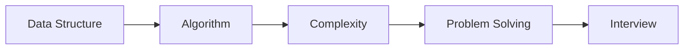

# 자료구조와 알고리즘

> 컴퓨터학과 전공 학습 가이드 101 시리즈 (3/10)

<!-- a-grade-intro:begin -->

**핵심 질문**: *자료구조* 와 *알고리즘* 은 왜 *모든 전공생* 에게 *중심* 과목일까요?

> *문제 해결 능력* 의 *공통 언어* 이기 때문입니다.

<!-- a-grade-intro:end -->

## 이 글에서 배울 것

- *자료구조* 의 의미
- *알고리즘* 의 의미
- *시간/공간 복잡도*
- 학습 *순서*
- 코딩 *인터뷰* 연결

## 왜 중요한가

*복잡도* 사고가 *코드 품질* 의 첫 *기준* 입니다.

## 개념 한눈에 보기



## 핵심 용어 정리

- **array**: *연속* 메모리.
- **list**: *연결* 구조.
- **tree**: *계층* 구조.
- **graph**: *연결* 관계.
- **complexity**: *증가율*.

## Before/After

**Before**: *for 문* 만 쓴다.

**After**: *복잡도* 를 의식한다.

## 실습: 미니 자료구조 키트

### 1단계 — 배열 합

```python
def total(xs):
    return sum(xs)
```

### 2단계 — 선형 탐색

```python
def find(xs, t):
    return any(x == t for x in xs)
```

### 3단계 — 이진 탐색

```python
def bsearch(xs, t):
    lo, hi = 0, len(xs) - 1
    while lo <= hi:
        m = (lo + hi) // 2
        if xs[m] == t:
            return m
        if xs[m] < t:
            lo = m + 1
        else:
            hi = m - 1
    return -1
```

### 4단계 — 스택

```python
stack = []
stack.append(1)
stack.pop()
```

### 5단계 — 그래프 BFS

```python
from collections import deque
def bfs(g, s):
    seen, q = {s}, deque([s])
    while q:
        u = q.popleft()
        for v in g[u]:
            if v not in seen:
                seen.add(v); q.append(v)
    return seen
```

## 이 코드에서 주목할 점

- *선형* 과 *로그* 는 다르다.
- *스택/큐* 는 *간단* 하지만 *기본*.
- *BFS* 는 *최단* 거리에 강하다.

## 자주 하는 실수 5가지

1. ***복잡도* 를 *측정* 안 한다.**
2. ***재귀* 의 *스택* 한도를 잊는다.**
3. ***해시* 를 *모든* 곳에 쓴다.**
4. ***그래프* 표현을 *섞어* 쓴다.**
5. ***입력 크기* 를 *과소평가* 한다.**

## 실무에서는 이렇게 쓰입니다

API 응답 *지연* 의 대부분은 *자료구조 선택* 에서 시작됩니다.

## 시니어 엔지니어는 이렇게 생각합니다

- *복잡도* 가 *직관*.
- *데이터 모양* 이 *알고리즘* 을 정한다.
- *최악* 도 *최선* 도 본다.
- *불변식* 을 적는다.
- *테스트* 가 *증거*.

## 체크리스트

- [ ] *복잡도* 표시.
- [ ] *입력 한계* 확인.
- [ ] *불변식* 정의.
- [ ] *테스트* 통과.

## 연습 문제

1. *해시 테이블* 한 줄 정의.
2. *그래프* 한 줄 정의.
3. *BigO* 의 의미 한 줄.

## 정리 및 다음 단계

다음 글은 *시스템 과목 이해하기* 입니다.

- [컴퓨터학과에서는 무엇을 배우는가](./01-what-cs-majors-learn.md)
- [1학년 과목 이해하기](./02-first-year-subjects.md)
- **자료구조와 알고리즘 (현재 글)**
- 시스템 과목 이해하기 (예정)
- 데이터베이스와 네트워크 (예정)
- AI와 데이터사이언스 (예정)
- 프로젝트 과목 (예정)
- 전공 공부 방법 (예정)
- 포트폴리오로 연결하기 (예정)
- 졸업 전 갖춰야 할 역량 (예정)
## 참고 자료

- [CLRS Introduction to Algorithms](https://mitpress.mit.edu/9780262046305/introduction-to-algorithms/)
- [Open Data Structures](https://opendatastructures.org/)
- [Visualgo - Algorithm Visualization](https://visualgo.net/en)
- [LeetCode Patterns](https://seanprashad.com/leetcode-patterns/)

Tags: CS, DataStructures, Algorithms, Complexity, Beginner

---

© 2026 영선북스. 이 글의 저작권은 저자에게 있습니다.
