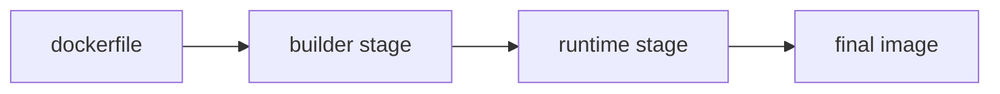

# Dockerfile

> Containers 101 시리즈 (4/10)

<!-- a-grade-intro:begin -->

**핵심 질문**: *같은 앱* 의 Dockerfile *5줄 차이* 가 *왜* *이미지 크기 10배* 와 *빌드 5배* 를 만들까요?

> *Dockerfile 은 *명령 순서*, *캐시 친화*, *multi-stage* 의 *세 원칙* 으로 결과가 *완전히* 달라집니다.*

<!-- a-grade-intro:end -->

## 이 글에서 배울 것

- *명령어* 의 *역할* 과 *순서*
- *Layer caching* 친화 작성법
- *Multi-stage build*
- *보안* 기본
- 흔한 함정 5가지

## 왜 중요한가

*Dockerfile* 은 *팀 전체* 의 *생산성* 과 *보안* 을 *직접* 결정합니다. *제대로 한 번* 쓰면 *수년* 을 갑니다.

## 개념 한눈에 보기



## 핵심 용어 정리

- **FROM**: *베이스 이미지*.
- **WORKDIR**: 작업 디렉터리.
- **COPY/ADD**: 파일 복사.
- **RUN**: 빌드 시 명령.
- **CMD/ENTRYPOINT**: 실행 시 *기본 명령*.

## Before/After

**Before**: *단일 단계* 빌드 → *900MB* 이미지.

**After**: *multi-stage* + *slim* 베이스 → *80MB*.

## 실습: Python 앱 Dockerfile (의사 텍스트)

### 1단계 — 베이스 선택

```python
def base_stage():
    return [
        "FROM python:3.12-slim AS builder",
        "WORKDIR /app",
    ]
```

### 2단계 — 의존성 먼저

```python
def deps_stage():
    return [
        "COPY requirements.txt .",
        "RUN pip install --user -r requirements.txt",
    ]
```

### 3단계 — 코드 복사

```python
def code_stage():
    return [
        "COPY . .",
    ]
```

### 4단계 — 런타임 단계

```python
def runtime_stage():
    return [
        "FROM python:3.12-slim",
        "WORKDIR /app",
        "COPY --from=builder /root/.local /root/.local",
        "COPY --from=builder /app .",
        "ENV PATH=/root/.local/bin:$PATH",
    ]
```

### 5단계 — 비루트 + 실행

```python
def finalize():
    return [
        "RUN useradd -m app && chown -R app:app /app",
        "USER app",
        "CMD [\"python\", \"main.py\"]",
    ]
```

## 이 코드에서 주목할 점

- *requirements.txt* 를 *코드보다 먼저* 복사 → *캐시*.
- *--from=builder* 로 *이전 단계* 결과 복사.
- *USER app* 으로 *root 회피*.

## 자주 하는 실수 5가지

1. ***COPY .* 를 *먼저* 해서 *캐시 무효*.**
2. ***apt update* 만 단독 실행 → *오래된 캐시*.**
3. ***루트* 로 실행.**
4. ***ENV* 에 *비밀* 저장.**
5. ***LATEST* 베이스 이미지 사용.**

## 실무에서는 이렇게 쓰입니다

*Multi-stage* 로 *빌드 도구* 분리, *.dockerignore* 로 *전송 최소화*, *digest 핀* 으로 *재현성*, *비루트* 사용자.

## 시니어 엔지니어는 이렇게 생각합니다

- *Dockerfile* 은 *코드 품질* 과 *동급*.
- *캐시 친화 순서* 가 *생산성*.
- *비밀* 은 *빌드 인자/시크릿* 으로.
- *베이스* 는 *작고 검증된 것*.
- *이미지 스캔* 은 *CI 의 일부*.

## 체크리스트

- [ ] *Multi-stage* 적용.
- [ ] *.dockerignore* 작성.
- [ ] *비루트* 사용자.
- [ ] *digest 핀* 사용.

## 연습 문제

1. *requirements 복사* 가 *코드 복사* 보다 *위* 에 와야 하는 *이유* 한 줄로.
2. *Multi-stage* 의 *대표 효과* 한 가지.
3. *Dockerfile* 에서 *비밀* 을 다루는 *권장 방법* 한 가지.

## 정리 및 다음 단계

이미지가 만들어지면 *데이터* 를 어디 둘지가 다음 문제. 다음 글은 *Volume*.

- [Container란 무엇인가?](./01-what-is-a-container.md)
- [Image와 Layer](./02-image-and-layer.md)
- [Runtime](./03-runtime.md)
- **Dockerfile (현재 글)**
- Volume (예정)
- Network (예정)
- Registry (예정)
- Container Security (예정)
- Container와 VM 차이 (예정)
- 실전 컨테이너 앱 만들기 (예정)
## 참고 자료

- [Dockerfile 레퍼런스](https://docs.docker.com/engine/reference/builder/)
- [Multi-stage builds](https://docs.docker.com/build/building/multi-stage/)
- [Dockerfile 모범 사례](https://docs.docker.com/develop/develop-images/dockerfile_best-practices/)
- [BuildKit secrets](https://docs.docker.com/build/building/secrets/)

Tags: Containers, Docker, Dockerfile, Build, DevOps

---

© 2026 영선북스. 이 글의 저작권은 저자에게 있습니다.
