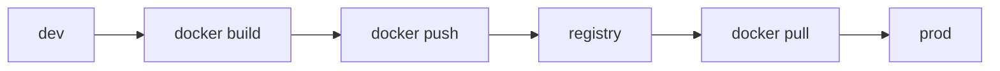

# Registry

> Containers 101 시리즈 (7/10)

<!-- a-grade-intro:begin -->

**핵심 질문**: 빌드한 *이미지* 를 *어디* 에 두고 *어떻게* 다시 받을까요?

> *Registry* 는 *이미지* 의 *원격 저장소* 이며 *push/pull* 로 배포 흐름의 *중심* 이 됩니다.

<!-- a-grade-intro:end -->

## 이 글에서 배울 것

- *Registry* 의 역할
- *push / pull* 흐름
- *태그 전략*
- *Docker Hub / ECR / GHCR*
- *서명 검증* 한 줄 개요

## 왜 중요한가

*이미지* 가 *재현 가능* 해도 *받을 곳* 이 없으면 의미가 없습니다. *배포* 는 *Registry* 에서 시작합니다.

## 개념 한눈에 보기



## 핵심 용어 정리

- **registry**: *이미지 저장소* 서버.
- **repository**: *이미지 이름* 단위.
- **tag**: *버전 라벨*.
- **digest**: *불변* SHA 식별자.
- **signed image**: *Cosign* 등으로 *서명* 된 이미지.

## Before/After

**Before**: *이미지* 를 *USB / scp* 로 옮기다 *불일치*.

**After**: *Registry* 의 *digest* 로 *동일성 보장*.

## 실습: 이미지 push 자동화

### 1단계 — 로그인

```python
import subprocess

def login(registry, user, password):
    subprocess.run(
        ["docker", "login", registry, "-u", user, "--password-stdin"],
        input=password.encode(), check=True,
    )
```

### 2단계 — 태그

```python
def tag(local, remote):
    subprocess.run(["docker", "tag", local, remote], check=True)
```

### 3단계 — push

```python
def push(remote):
    subprocess.run(["docker", "push", remote], check=True)
```

### 4단계 — digest 조회

```python
def digest(remote):
    res = subprocess.run(
        ["docker", "inspect", "--format={{index .RepoDigests 0}}", remote],
        capture_output=True, text=True, check=True,
    )
    return res.stdout.strip()
```

### 5단계 — pull 검증

```python
def verify_pull(remote_digest):
    subprocess.run(["docker", "pull", remote_digest], check=True)
```

## 이 코드에서 주목할 점

- *태그* 가 아닌 *digest* 로 *고정*.
- *password-stdin* 으로 *비밀번호 노출* 회피.
- *push* 는 *역할 분리* 후에만.

## 자주 하는 실수 5가지

1. ***latest* 태그* 를 *프로덕션* 에 사용.**
2. ***digest 고정* 없이 *재배포*.**
3. ***Public 저장소* 에 *비공개 이미지* 푸시.**
4. ***태그 덮어쓰기* 로 *과거 추적 불가*.**
5. ***서명 검증* 누락.**

## 실무에서는 이렇게 쓰입니다

*GitHub Actions* 가 *빌드 후 GHCR push*, *Argo CD* 가 *digest 변경* 을 감지해 *자동 배포*.

## 시니어 엔지니어는 이렇게 생각합니다

- *digest* 가 *진실*.
- *태그* 는 *이름표* 일 뿐.
- *Registry* 도 *백업* 대상.
- *서명* 으로 *공급망* 보호.
- *권한 분리* 가 *보안 시작*.

## 체크리스트

- [ ] *프로덕션* 은 *digest* 로 핀.
- [ ] *push* 권한은 *CI* 에만.
- [ ] *서명* 정책 적용.
- [ ] *retention* 규칙 설정.

## 연습 문제

1. *태그* 와 *digest* 의 *차이* 한 줄로.
2. *GHCR* 의 *대표 장점* 한 가지.
3. *서명 검증* 을 *왜* 하는지 한 줄로.

## 정리 및 다음 단계

이미지를 *어디서* 받는지 정했으면 *어떻게* 안전하게 *돌릴지* 가 다음. 다음 글은 *Container Security*.

- [Container란 무엇인가?](./01-what-is-a-container.md)
- [Image와 Layer](./02-image-and-layer.md)
- [Runtime](./03-runtime.md)
- [Dockerfile](./04-dockerfile.md)
- [Volume](./05-volume.md)
- [Network](./06-network.md)
- **Registry (현재 글)**
- Container Security (예정)
- Container와 VM 차이 (예정)
- 실전 컨테이너 앱 만들기 (예정)
## 참고 자료

- [Docker Hub](https://hub.docker.com/)
- [Amazon ECR](https://docs.aws.amazon.com/AmazonECR/latest/userguide/)
- [GitHub Container Registry](https://docs.github.com/en/packages/working-with-a-github-packages-registry/working-with-the-container-registry)
- [Cosign](https://docs.sigstore.dev/cosign/overview/)

Tags: Containers, Docker, Registry, ECR, DevOps

---

© 2026 영선북스. 이 글의 저작권은 저자에게 있습니다.
