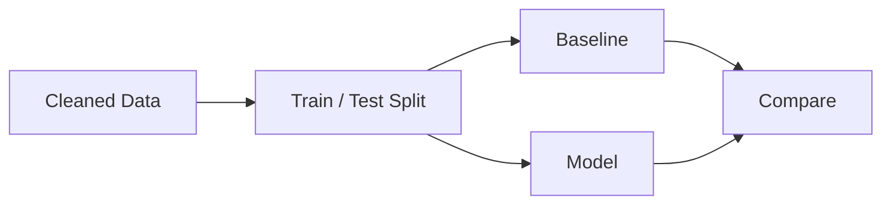

# 모델링

> Data Science 101 시리즈 (7/10)

<!-- a-grade-intro:begin -->

**핵심 질문**: *첫 모델* 은 *어떻게 만들어야* 하고, *왜 베이스라인* 부터 시작해야 할까요?

> *베이스라인 없는 모델은 *발 디딜 곳 없는 비교* 다.*

<!-- a-grade-intro:end -->

## 이 글에서 배울 것

- *지도학습* 의 *기본 흐름*
- *베이스라인* 모델의 역할
- *훈련/검증* 분리 원칙
- 5단계 모델링 실습
- 흔한 함정 5가지

## 왜 중요한가

복잡한 모델보다 *제대로 된 베이스라인* 이 *진짜 출발선* 입니다. *비교 기준* 이 *없으면* 모델의 *가치* 를 *증명할 수 없습니다*.

> *모든 모델은 *기준선* 과 *겨룬다*.*

## 개념 한눈에 보기



## 핵심 용어 정리

- **Baseline**: 가장 *단순한* 예측. *항상 다수 클래스* 처럼.
- **Train/Test Split**: 데이터를 *훈련/평가* 로 *분리*.
- **Cross-Validation**: 여러 *fold* 로 *반복 평가*.
- **Overfitting**: 훈련만 *잘 맞고* 평가에선 *나쁨*.
- **Pipeline**: 전처리 + 모델을 *하나의 객체*.

## Before/After

**Before**: 복잡한 모델을 만들고 *95%* 정확도. 베이스라인이 *96%*. *개선이 아닌 퇴행*.

**After**: 먼저 *베이스라인 96%* 를 *기록* 하고 *그 이상* 을 *목표*.

## 실습: 5단계 모델링

### 1단계 — 데이터 준비

```python
from sklearn.model_selection import train_test_split
import pandas as pd

df = pd.read_csv("churn.csv")
X = df.drop(columns=["churn"])
y = df["churn"]

X_train, X_test, y_train, y_test = train_test_split(
    X, y, test_size=0.2, random_state=42, stratify=y
)
```

### 2단계 — 베이스라인

```python
from sklearn.dummy import DummyClassifier
from sklearn.metrics import accuracy_score

base = DummyClassifier(strategy="most_frequent").fit(X_train, y_train)
print("baseline:", accuracy_score(y_test, base.predict(X_test)))
```

### 3단계 — 파이프라인

```python
from sklearn.compose import ColumnTransformer
from sklearn.pipeline import Pipeline
from sklearn.preprocessing import OneHotEncoder, StandardScaler
from sklearn.linear_model import LogisticRegression

num = X.select_dtypes("number").columns.tolist()
cat = X.select_dtypes("object").columns.tolist()

pre = ColumnTransformer([
    ("num", StandardScaler(), num),
    ("cat", OneHotEncoder(handle_unknown="ignore"), cat),
])
model = Pipeline([("pre", pre), ("clf", LogisticRegression(max_iter=1000))])
```

### 4단계 — 학습/평가

```python
model.fit(X_train, y_train)
print("model:", accuracy_score(y_test, model.predict(X_test)))
```

### 5단계 — 교차 검증

```python
from sklearn.model_selection import cross_val_score
scores = cross_val_score(model, X_train, y_train, cv=5, scoring="accuracy")
print(scores.mean(), "+/-", scores.std())
```

## 이 코드에서 주목할 점

- *베이스라인* 을 *먼저* 기록.
- *Pipeline* 으로 *데이터 누수* 를 막는다.
- *Cross-validation* 으로 *분산* 을 본다.

## 자주 하는 실수 5가지

1. ***베이스라인 없이* 모델 시작.** *개선 여부* 를 *모른다*.
2. ***test set* 에 *전처리 통계* 학습.** *데이터 누수*.
3. ***accuracy* 만 본다.** 클래스 *불균형* 에 *속는다*.
4. ***random_state* 미설정.** *재현* 이 *어려움*.
5. ***CV 없이* 한 번의 결과로 결정.** *운* 을 *실력* 으로 착각.

## 실무에서는 이렇게 쓰입니다

데이터팀은 *MLflow / W&B* 로 *실험* 을 *기록* 합니다. *베이스라인* 은 *항상 첫 실험*. *피처 변경* 은 *한 번에 하나* 만.

## 시니어 엔지니어는 이렇게 생각합니다

- *베이스라인* 이 *제일 비싼* 실험.
- *Pipeline* 을 *항상* 쓴다.
- *random_state* 를 *고정*.
- *CV 분산* 을 *함께 보고* 한다.
- *변경 한 번* 에 *지표 한 번*.

## 체크리스트

- [ ] *Baseline* 을 만들 수 있다.
- [ ] *Pipeline* 의 의미를 안다.
- [ ] *Train/Test 분리* 의 *이유* 를 안다.
- [ ] *CV* 의 *분산* 을 본다.

## 연습 문제

1. *Titanic* 으로 *베이스라인 + 로지스틱* 을 비교해 보세요.
2. *Pipeline 없이* 했을 때의 *데이터 누수* 사례를 적어 보세요.
3. *CV fold 수* 를 바꿔가며 *분산* 을 관찰해 보세요.

## 정리 및 다음 단계

모델링은 *기준선과의 대화* 입니다. 다음 글에서는 모델을 *어떻게 평가* 할지 *지표* 의 세계로 들어갑니다.

- [Data Science란 무엇인가?](./01-what-is-data-science.md)
- [문제를 데이터 문제로 바꾸기](./02-problem-to-data-problem.md)
- [데이터 수집](./03-data-collection.md)
- [데이터 정제](./04-data-cleaning.md)
- [탐색적 데이터 분석](./05-exploratory-data-analysis.md)
- [시각화](./06-visualization.md)
- **모델링 (현재 글)**
- 평가 (예정)
- 결과 해석 (예정)
- 데이터 프로젝트 전체 흐름 (예정)
## 참고 자료

- [scikit-learn — User Guide](https://scikit-learn.org/stable/user_guide.html)
- [Google — Rules of Machine Learning](https://developers.google.com/machine-learning/guides/rules-of-ml)
- [Kaggle — Intro to Machine Learning](https://www.kaggle.com/learn/intro-to-machine-learning)
- [Hands-On ML with Scikit-Learn](https://github.com/ageron/handson-ml3)

Tags: DataScience, Modeling, ScikitLearn, MachineLearning, Beginner

---

© 2026 영선북스. 이 글의 저작권은 저자에게 있습니다.
