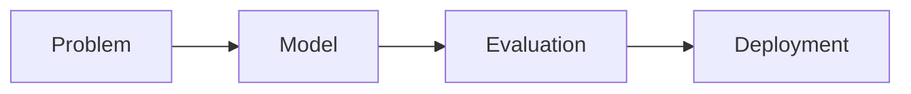

# ML 인터뷰

> Data Science Career 101 시리즈 (6/10)

<!-- a-grade-intro:begin -->

**핵심 질문**: *ML 인터뷰* 는 *어떤* *질문* 을 *던지나요*?

> *기초*, *모델 선택*, *평가*, *실무*, *시스템*.

<!-- a-grade-intro:end -->

## 이 글에서 배울 것

- *기초* *질문*
- *모델 선택* 논리
- *평가 지표*
- *실무 함정*
- *ML 시스템* 디자인

## 왜 중요한가

*모델* 만 *외우면* *왜* 가 *없습니다*.

## 개념 한눈에 보기



## 핵심 용어 정리

- **bias-variance**: *편향-분산* *균형*.
- **overfitting**: *과적합*.
- **AUC**: *면적*.
- **precision/recall**: *정밀도/재현율*.
- **drift**: *분포 변화*.

## Before/After

**Before**: "*Random Forest* 가 *항상* *좋다*."

**After**: "*문제 정의* 와 *지표* 로 *모델* 을 *고른다*."

## 실습: 5가지 답변 구조

### 1단계 — 기초

```text
편향-분산을 한 줄로 설명.
```

### 2단계 — 모델 선택

```text
- 선형 vs 트리 vs 신경망의 가정
- 데이터 크기, 해석 가능성
```

### 3단계 — 평가

```python
from sklearn.metrics import precision_score, recall_score, roc_auc_score
```

### 4단계 — 실무 함정

```text
- 데이터 누수
- 비대칭 클래스
- 시간 누수
```

### 5단계 — 시스템 디자인

```text
- 데이터 → 학습 → 서빙 → 모니터링
- 재학습 주기
- 드리프트 감지
```

## 이 코드에서 주목할 점

- *지표* 가 *답* 을 *결정* 합니다.
- *함정* 을 *말* *하면* *시니어* 처럼 *보입니다*.
- *시스템* 으로 *생각* 하기.

## 자주 하는 실수 5가지

1. ***Random Forest* 만 *답*.**
2. ***AUC* 만 *본다*.**
3. ***누수* 를 *모른다*.**
4. ***재학습* 을 *생각* *안* *한다*.**
5. ***해석 가능성* 을 *무시*.**

## 실무에서는 이렇게 쓰입니다

면접관은 *모델 정확도* 보다 *모델 운영* 을 *더* *오래* *질문* *합니다*.

## 시니어 엔지니어는 이렇게 생각합니다

- *문제* *정의* 부터.
- *지표* 가 *모델* 을 *고른다*.
- *함정* 을 *먼저* *말한다*.
- *시스템* 관점.
- *드리프트* 대비.

## 체크리스트

- [ ] *지표* 5개.
- [ ] *모델* 3개 *비교*.
- [ ] *함정* 3개 *암기*.
- [ ] *시스템 다이어그램* 1장.

## 연습 문제

1. *overfitting* 한 줄 정의.
2. *drift* *예* 한 줄.
3. *AUC* 와 *recall* *차이* 한 줄.

## 정리 및 다음 단계

다음 글은 *케이스 인터뷰* 입니다.

- [데이터 직무란 무엇인가](./01-what-is-data-career.md)
- [분석가 vs 사이언티스트 vs 엔지니어](./02-analyst-scientist-engineer.md)
- [학습 경로 설계](./03-learning-path.md)
- [데이터 포트폴리오](./04-data-portfolio.md)
- [SQL과 분석 인터뷰](./05-sql-and-analytics-interview.md)
- **ML 인터뷰 (현재 글)**
- 케이스 인터뷰 (예정)
- 첫 직장 적응 (예정)
- 도메인 전문성 쌓기 (예정)
- 시니어 데이터 직무로 가는 길 (예정)
## 참고 자료

- [Designing Machine Learning Systems](https://www.oreilly.com/library/view/designing-machine-learning/9781098107956/)
- [scikit-learn metrics](https://scikit-learn.org/stable/modules/model_evaluation.html)
- [ML Interview Book](https://huyenchip.com/ml-interviews-book/)
- [Rules of ML](https://developers.google.com/machine-learning/guides/rules-of-ml)

Tags: DataCareer, ML, Interview, Modeling, Beginner

---

© 2026 영선북스. 이 글의 저작권은 저자에게 있습니다.
