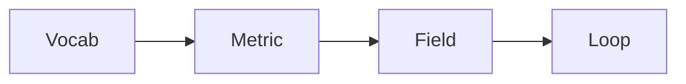

# 도메인 전문성 쌓기

> Data Science Career 101 시리즈 (9/10)

<!-- a-grade-intro:begin -->

**핵심 질문**: *도메인 전문성* 은 *어떻게* *쌓나요*?

> *질문*, *지표*, *문서*, *현장*, *어휘*.

<!-- a-grade-intro:end -->

## 이 글에서 배울 것

- *도메인* 의 *정의*
- *도메인 어휘* 학습
- *주요 지표* 이해
- *현장* 관찰
- *지속* 학습 루프

## 왜 중요한가

*기술* 은 *복제* *가능*, *도메인* 은 *복리*.

## 개념 한눈에 보기



## 핵심 용어 정리

- **domain**: *분야*.
- **glossary**: *용어집*.
- **KPI**: *핵심* *성과* *지표*.
- **playbook**: *대응* *지침*.
- **shadowing**: *동행* *관찰*.

## Before/After

**Before**: "*업종* 을 *모른* *채로* *대시보드* 만 *고친다*."

**After**: "*KPI* 와 *어휘* 로 *대화* *한다*."

## 실습: 5단계 도메인 학습

### 1단계 — 어휘집 만들기

```text
- 30개 단어
- 정의 + 예
```

### 2단계 — 핵심 지표 5개

```text
- 정의
- 계산식
- 사용 부서
```

### 3단계 — 현장 동행

```text
- 영업 또는 운영팀과 1일
- 메모와 질문
```

### 4단계 — 외부 학습

```text
- 업종 컨퍼런스 1건/분기
- 업계 뉴스 RSS
```

### 5단계 — 분기 회고

```text
- 새로운 단어 10개
- 새로운 지표 3개
```

## 이 코드에서 주목할 점

- *어휘* 가 *진입*.
- *지표* 가 *방향*.
- *현장* 이 *진실*.

## 자주 하는 실수 5가지

1. ***기술* 만 *판다*.**
2. ***어휘* 가 *없다*.**
3. ***지표 정의* 가 *모호*.**
4. ***현장* 을 *모른다*.**
5. ***외부 학습* 을 *건너* *뛴다*.**

## 실무에서는 이렇게 쓰입니다

핀테크, 헬스케어, 게임은 *도메인* 이 *답* 을 *바꿉니다*.

## 시니어 엔지니어는 이렇게 생각합니다

- *어휘* 부터.
- *지표* 정의.
- *현장* 관찰.
- *외부* 학습.
- *지속* 루프.

## 체크리스트

- [ ] *어휘* 30개.
- [ ] *KPI* 5개.
- [ ] *동행* 1회.
- [ ] *분기* 회고.

## 연습 문제

1. *KPI* 한 줄 정의.
2. *playbook* *예* 한 줄.
3. *도메인 학습* *기준* 한 줄.

## 정리 및 다음 단계

다음 글은 *시니어 데이터 직무로 가는 길* 입니다.

- [데이터 직무란 무엇인가](./01-what-is-data-career.md)
- [분석가 vs 사이언티스트 vs 엔지니어](./02-analyst-scientist-engineer.md)
- [학습 경로 설계](./03-learning-path.md)
- [데이터 포트폴리오](./04-data-portfolio.md)
- [SQL과 분석 인터뷰](./05-sql-and-analytics-interview.md)
- [ML 인터뷰](./06-ml-interview.md)
- [케이스 인터뷰](./07-case-interview.md)
- [첫 직장 적응](./08-first-job.md)
- **도메인 전문성 쌓기 (현재 글)**
- 시니어 데이터 직무로 가는 길 (예정)
## 참고 자료

- [Domain-Driven Design](https://www.domainlanguage.com/ddd/)
- [Lean Analytics](https://leananalyticsbook.com/)
- [Industry KPI catalogs](https://www.klipfolio.com/resources/kpi-examples)
- [The Personal MBA](https://personalmba.com/)

Tags: DataCareer, Domain, Expertise, BusinessSense, Beginner

---

© 2026 영선북스. 이 글의 저작권은 저자에게 있습니다.
