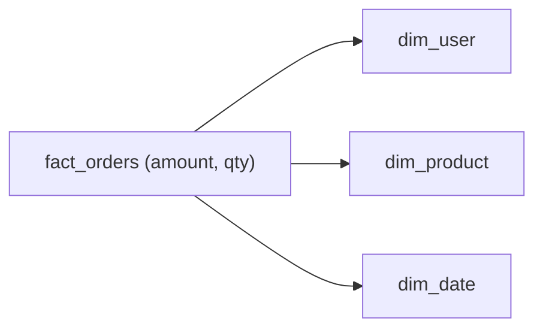

# Fact와 Dimension

> Data Warehouse 101 시리즈 (3/10)

<!-- a-grade-intro:begin -->

**핵심 질문**: *측정값* 과 *속성* 을 *왜 나눌까요*? 한 테이블에 *모두 두면* 무엇이 *무너질까요*?

> *Fact 는 *얼마* 를, Dimension 은 *무엇/누구/언제* 를 담는다.*

<!-- a-grade-intro:end -->

## 이 글에서 배울 것

- *Fact* 테이블의 정의
- *Dimension* 테이블의 정의
- 두 테이블의 *분리* 가 주는 이점
- 5단계 모델링 실습
- 흔한 함정 5가지

## 왜 중요한가

분석 질문은 거의 항상 *얼마(measure)* 를 *어떤 단면(dimension)* 별로 보고 싶어합니다. *둘을 분리* 해 두면 *집계는 빠르게*, *속성 변경은 유연하게* 다룰 수 있습니다.

> *측정과 속성을 나눠라. 함께 두면 둘 다 느려진다.*

## 개념 한눈에 보기



## 핵심 용어 정리

- **Fact**: *측정 가능한 사실*. 금액, 수량, 시간 같은 *수치*.
- **Dimension**: *사실의 맥락*. 사용자, 상품, 날짜 같은 *속성*.
- **Grain**: 한 행이 *무엇 한 건* 을 의미하는지 — 분석의 *최소 단위*.
- **Surrogate key**: Dimension 에 부여하는 *내부 식별자*.
- **Conformed dimension**: 여러 fact 가 *공유하는* dimension.

## Before/After

**Before**: *주문 한 행* 안에 *사용자 이름, 상품 이름* 까지 다 들어 있다. *이름이 바뀌면* 모든 행을 *고쳐야 한다*.

**After**: 사용자 이름은 *dim_user* 한 곳에서만 관리한다. *fact 는 그대로*.

## 실습: 모델링 5단계

### 1단계 — Dimension 만들기

```sql
CREATE TABLE dim_user (
    user_key BIGINT PRIMARY KEY,
    user_id BIGINT,
    name TEXT,
    country TEXT
);
```

### 2단계 — Date dimension

```sql
CREATE TABLE dim_date (
    date_key INT PRIMARY KEY,
    full_date DATE,
    year INT,
    month INT,
    day_of_week INT
);
```

### 3단계 — Fact 만들기

```sql
CREATE TABLE fact_orders (
    order_id BIGINT,
    user_key BIGINT,
    date_key INT,
    amount NUMERIC(12, 2),
    qty INT
);
```

### 4단계 — 조인 분석

```sql
SELECT u.country, SUM(f.amount) AS revenue
FROM fact_orders f
JOIN dim_user u ON u.user_key = f.user_key
GROUP BY u.country;
```

### 5단계 — 시간축 분석

```sql
SELECT d.year, d.month, SUM(f.amount) AS revenue
FROM fact_orders f
JOIN dim_date d ON d.date_key = f.date_key
GROUP BY d.year, d.month
ORDER BY 1, 2;
```

## 이 코드에서 주목할 점

- *fact 는 가벼운 수치* 만 갖는다.
- *dimension 은 의미를 갖는 속성* 을 갖는다.
- 같은 dimension 을 *여러 fact* 가 *공유* 한다.

## 자주 하는 실수 5가지

1. **fact 안에 *문자열 속성* 을 직접 넣는다.** 행 수가 *수억* 이면 *저장 비용 폭발*.
2. **Grain 을 *섞는다*.** *주문 단위* 와 *상품 단위* 를 한 fact 에 두면 *집계가 거짓말*.
3. **Surrogate key 없이 *natural key* 만 쓴다.** 키가 *바뀌면* 모든 fact 가 *흔들린다*.
4. **Date dimension 을 *만들지 않는다*.** *주말 / 공휴일* 분석이 *어렵다*.
5. **Dimension 에 *측정값* 을 둔다.** 의미가 흐려져 *팀이 헷갈린다*.

## 실무에서는 이렇게 쓰입니다

전자상거래는 *fact_orders, fact_payments, fact_refunds* 를 두고 *dim_user, dim_product, dim_date* 를 *공유* 합니다. 사용자 *국가가 바뀔 때* 도 dim_user 한 곳만 갱신합니다.

## 시니어 엔지니어는 이렇게 생각합니다

- *Grain 을 *문장 한 줄* 로 적을 수 있어야 한다.*
- *Conformed dimension* 을 *팀 자산* 으로 다룬다.
- *Surrogate key* 로 *변화에 대비* 한다.
- *Date dimension* 은 *모든 분석의 척추*.
- *fact 는 좁고 길게, dimension 은 넓고 짧게*.

## 체크리스트

- [ ] *Fact* 와 *Dimension* 의 차이를 안다.
- [ ] *Grain* 을 한 줄로 적을 수 있다.
- [ ] *Surrogate key* 의 필요성을 안다.
- [ ] *Date dimension* 의 가치를 안다.

## 연습 문제

1. *fact_payments* 의 grain 을 한 줄로 적어 보세요.
2. *dim_product* 에 들어갈 컬럼을 *5개* 적어 보세요.
3. *Surrogate key 없는* 설계의 단점을 *3가지* 적어 보세요.

## 정리 및 다음 단계

Fact 와 Dimension 의 분리가 *분석 모델의 출발점* 입니다. 다음 글에서는 가장 흔한 모델인 *Star Schema* 를 봅니다.

- [Data Warehouse란 무엇인가?](./01-what-is-data-warehouse.md)
- [OLTP와 OLAP](./02-oltp-and-olap.md)
- **Fact와 Dimension (현재 글)**
- Star Schema (예정)
- Partition과 Clustering (예정)
- ETL과 ELT (예정)
- BI와 Dashboard (예정)
- Data Mart (예정)
- 성능 최적화 (예정)
- Warehouse 설계 예제 (예정)
## 참고 자료

- [Kimball — Fact Table Design](https://www.kimballgroup.com/data-warehouse-business-intelligence-resources/kimball-techniques/dimensional-modeling-techniques/)
- [dbt — Dimensional Modeling](https://docs.getdbt.com/best-practices/how-we-structure/1-guide-overview)
- [Snowflake — Star Schema](https://docs.snowflake.com/en/user-guide/intro-key-concepts)
- [BigQuery — Schema Design](https://cloud.google.com/bigquery/docs/schemas)

Tags: DataWarehouse, Fact, Dimension, Modeling, Analytics

---

© 2026 영선북스. 이 글의 저작권은 저자에게 있습니다.
