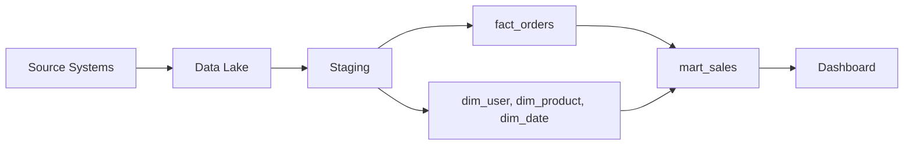

# Warehouse 설계 예제

> Data Warehouse 101 시리즈 (10/10)

<!-- a-grade-intro:begin -->

**핵심 질문**: *지금까지 배운* 것을 *모아* *하나의 warehouse* 를 *어떻게 설계* 할까요?

> *설계는 *grain 한 줄* 에서 시작한다.*

<!-- a-grade-intro:end -->

## 이 글에서 배울 것

- *전자상거래* 예제로 *처음부터 끝까지* 설계
- *grain → dimension → schema → partition → ETL → mart* 순서
- *대시보드* 까지 *연결* 하는 흐름
- 5단계 설계 실습
- 흔한 함정 5가지

## 왜 중요한가

부분만 배우면 *조합* 이 어렵습니다. *하나의 도메인* 으로 *전 과정* 을 보면 *각 조각이 왜 그 자리에 있는지* 가 분명해집니다. *마지막 글* 은 *조립* 의 글입니다.

> *모든 좋은 설계는 *한 줄의 grain* 에서 시작한다.*

## 개념 한눈에 보기



## 핵심 용어 정리

- **Grain**: fact 한 행이 *나타내는 단위*. 설계의 *출발점*.
- **Conformed Dimension**: 여러 fact 가 *공유* 하는 dimension.
- **Surrogate Key**: warehouse 가 *발급* 하는 *대체 키*.
- **Slowly Changing Dimension (SCD)**: dimension 의 *변화* 를 *기록* 하는 방식.
- **Mart**: 특정 팀/주제 전용으로 *제공* 되는 *최종 모델*.

## Before/After

**Before**: source DB 에 *직접 쿼리* 하여 *분석마다 SQL 을 새로* 짠다. *느리고 비싸고 깨지기 쉽다*.

**After**: warehouse 에 *star schema* 가 있고, 분석가는 *짧은 SQL* 한 줄로 *대시보드* 를 만든다.

## 실습: 5단계 설계

### 1단계 — Grain 정의

> *fact_orders 의 grain*: *주문 1건* 당 1행.

### 2단계 — Dimension 식별

```text
dim_user      : 사용자 정보
dim_product   : 상품 정보
dim_date      : 날짜 속성 (year, month, weekday)
dim_channel   : 유입 채널
```

### 3단계 — Star schema 작성

```sql
CREATE TABLE fact_orders (
    order_id      STRING,
    order_date    DATE,
    user_key      INT64,
    product_key   INT64,
    channel_key   INT64,
    quantity      INT64,
    amount        NUMERIC
)
PARTITION BY order_date
CLUSTER BY user_key, product_key;
```

### 4단계 — ETL/ELT 흐름

```text
source.orders  --(append)-->  staging.orders
                              |
                              v
              transform: surrogate keys, SCD type 2
                              |
                              v
                       fact_orders / dim_*
```

### 5단계 — Mart + 대시보드

```sql
CREATE OR REPLACE VIEW mart_sales AS
SELECT
    d.year,
    d.month,
    p.category,
    SUM(f.amount) AS revenue
FROM fact_orders f
JOIN dim_date d    ON d.date_key   = f.order_date
JOIN dim_product p ON p.product_key = f.product_key
GROUP BY d.year, d.month, p.category;
```

## 이 코드에서 주목할 점

- *Grain 한 줄* 이 *모든 설계의 뿌리*.
- *Surrogate key* 는 *source 가 바뀌어도* 안전.
- *Mart* 는 *대시보드의 입력* 으로 *준비된 답*.

## 자주 하는 실수 5가지

1. **Grain 을 *말로만* 정한다.** *문서* 에 *한 줄* 로 적자.
2. **모든 컬럼을 fact 에 *몰아넣는다*.** Dimension 으로 *분리* 한다.
3. **Source key 를 *그대로* 쓴다.** *Source 변경 시* 깨진다.
4. **SCD 를 *고려하지 않는다*.** *과거 분석* 이 깨진다.
5. **Mart 없이 *raw fact* 를 *대시보드* 에 연결.** 변경에 *취약*.

## 실무에서는 이렇게 쓰입니다

데이터팀은 *한 페이지짜리 design doc* 으로 *grain, dimension, partition, owner* 를 적습니다. *리뷰* 후 PR 로 *DDL* 을 올리고, *ETL DAG* 를 추가합니다. *대시보드* 는 *mart 만* 봅니다.

## 시니어 엔지니어는 이렇게 생각합니다

- *Grain* 을 *제일 먼저* 정한다.
- *Conformed dimension* 을 *팀 전체* 에서 *공유* 한다.
- *Mart* 와 *fact/dim* 의 *경계* 를 분명히 둔다.
- *Owner* 가 *없는 테이블* 은 만들지 않는다.
- *문서* 가 *없는 설계* 는 *없는 설계* 와 같다.

## 체크리스트

- [ ] Grain 을 *한 줄* 로 적을 수 있다.
- [ ] *Conformed dimension* 의 의미를 안다.
- [ ] *Star schema* DDL 을 작성할 수 있다.
- [ ] *Mart* 와 *fact* 의 차이를 설명할 수 있다.

## 연습 문제

1. *블로그 댓글 시스템* 의 grain 과 dimension 을 적어 보세요.
2. *광고 클릭 로그* 를 *fact_clicks* 로 설계해 보세요.
3. *월간 매출 대시보드* 용 *mart 뷰* 한 개를 SQL 로 작성해 보세요.

## 정리 및 다음 단계

이제 여러분은 *grain 부터 대시보드* 까지 *한 흐름* 으로 보는 눈을 가졌습니다. 다음 시리즈에서는 *Data Science* 와 *MLOps* 로 한 걸음 더 나아갑니다.

- [Data Warehouse란 무엇인가?](./01-what-is-data-warehouse.md)
- [OLTP와 OLAP](./02-oltp-and-olap.md)
- [Fact와 Dimension](./03-fact-and-dimension.md)
- [Star Schema](./04-star-schema.md)
- [Partition과 Clustering](./05-partition-and-clustering.md)
- [ETL과 ELT](./06-etl-and-elt.md)
- [BI와 Dashboard](./07-bi-and-dashboard.md)
- [Data Mart](./08-data-mart.md)
- [성능 최적화](./09-performance-optimization.md)
- **Warehouse 설계 예제 (현재 글)**
## 참고 자료

- [Kimball Group — Dimensional Modeling Techniques](https://www.kimballgroup.com/data-warehouse-business-intelligence-resources/kimball-techniques/dimensional-modeling-techniques/)
- [BigQuery — Schema Design Best Practices](https://cloud.google.com/bigquery/docs/best-practices-schema-design)
- [dbt — How We Structure Our Projects](https://docs.getdbt.com/best-practices/how-we-structure/1-guide-overview)
- [Snowflake — Data Modeling](https://docs.snowflake.com/en/user-guide/table-considerations)

Tags: DataWarehouse, Design, Example, EndToEnd, Analytics

---

© 2026 영선북스. 이 글의 저작권은 저자에게 있습니다.
