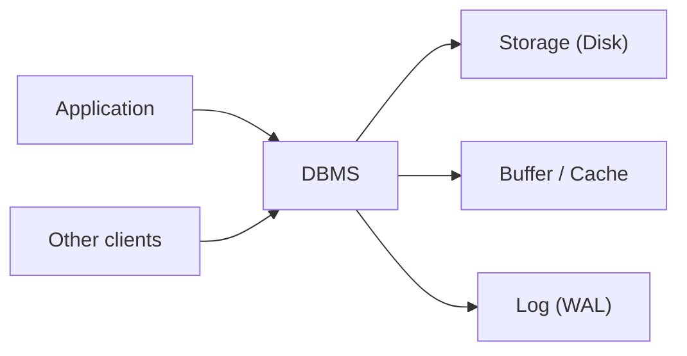

# 데이터베이스 시스템이란 무엇인가?

> Database Systems 101 시리즈 (1/10)

<!-- a-grade-intro:begin -->

**핵심 질문**: 데이터를 그냥 파일에 저장해도 되는데, 왜 우리는 굳이 데이터베이스라는 큰 소프트웨어를 따로 두는 걸까요?

> 데이터베이스 시스템(DBMS)은 단순한 저장소가 아니라 **동시 접근, 장애 복구, 일관성, 질의**라는 네 가지 어려운 문제를 한꺼번에 풀어 주는 소프트웨어입니다. 파일 한두 개로도 데이터를 보관할 수는 있지만, 여러 사용자와 장애와 복잡한 질문이 끼어드는 순간 파일은 무너집니다. 이 글에서 그 경계가 어디인지 살펴봅니다.

<!-- a-grade-intro:end -->

## 이 글에서 배울 것

- 파일과 DBMS의 결정적 차이
- DBMS가 보장하려고 애쓰는 네 가지 속성
- 관계형, 문서형, 키-값 저장소가 다루는 문제 영역
- "그냥 파일이면 된다"고 말할 수 있는 경계

## 왜 중요한가

데이터베이스를 단순히 "데이터 저장하는 곳"으로만 생각하면, 왜 자꾸 락이 걸리는지, 왜 트랜잭션이 필요한지, 왜 정전 후에도 데이터가 살아 있는지 설명할 수 없습니다. DBMS의 존재 이유를 이해하면 다음 9편 — SQL, 인덱스, 트랜잭션, 격리 수준 — 이 왜 그렇게 설계됐는지 자연스럽게 풀립니다.

> "데이터베이스를 쓴다"는 말은 사실 "동시성과 장애와 일관성을 직접 짜지 않는다"는 말입니다.

## 개념 한눈에 보기



DBMS는 응용과 디스크 사이에 끼어 들어가, 여러 클라이언트의 요청을 받아 캐시·로그·디스크를 일관되게 다루는 프로세스입니다. 응용은 "무엇을 원하는지"만 SQL로 말하고, 어떻게 잠그고 어떻게 디스크에 쓸지는 DBMS의 책임입니다.

## 핵심 용어 정리

- **DBMS**: 데이터베이스 관리 시스템. PostgreSQL, MySQL, SQLite 같은 소프트웨어 자체를 말합니다.
- **Schema**: 테이블·컬럼·타입처럼 데이터의 구조를 정의한 명세.
- **Transaction**: 모두 성공하거나 모두 실패해야 하는 SQL 작업의 묶음.
- **Durability**: 한 번 커밋된 변경은 정전이 나도 사라지지 않는 속성.
- **Concurrency control**: 여러 사용자가 동시에 같은 데이터에 접근할 때 결과가 망가지지 않도록 조정하는 메커니즘.

## Before/After

**Before — 파일에 직접 쓰기**

```python
# accounts.py — 파일을 직접 갱신
import json

def deposit(user_id: str, amount: int) -> None:
    with open("accounts.json", "r") as f:
        data = json.load(f)
    data[user_id] = data.get(user_id, 0) + amount
    with open("accounts.json", "w") as f:
        json.dump(data, f)
```

한 명만 쓸 때는 멀쩡합니다. 두 프로세스가 동시에 돌리면 한쪽 입금이 통째로 사라집니다. 정전이 `json.dump` 중간에 나면 파일이 깨집니다.

**After — SQLite로**

```python
# accounts.py — DBMS가 동시성과 내구성을 책임짐
import sqlite3

def deposit(db: sqlite3.Connection, user_id: str, amount: int) -> None:
    with db:  # 트랜잭션
        db.execute(
            "UPDATE accounts SET balance = balance + ? WHERE user_id = ?",
            (amount, user_id),
        )
```

DBMS가 락을 걸어 동시성 문제를 막고, WAL(Write-Ahead Log)로 정전 후에도 데이터가 살아 있게 합니다. 응용은 의도만 적습니다.

## 실습: SQLite로 작은 DBMS 체험하기

### 1단계 — 데이터베이스 만들기

```bash
python3 -c "import sqlite3; sqlite3.connect('shop.db').close()"
ls -l shop.db
```

`shop.db`라는 파일 하나가 데이터베이스 전체입니다. SQLite는 별도 서버 없이 라이브러리 형태로 동작합니다.

### 2단계 — 스키마 정의

```python
# init.py
import sqlite3

DDL = """
CREATE TABLE IF NOT EXISTS products (
    id    INTEGER PRIMARY KEY,
    name  TEXT NOT NULL,
    price INTEGER NOT NULL CHECK (price >= 0)
);
"""

with sqlite3.connect("shop.db") as db:
    db.executescript(DDL)
```

타입과 제약(`NOT NULL`, `CHECK`)을 적어 두면 잘못된 데이터가 들어오는 것을 DBMS가 막아 줍니다.

### 3단계 — 데이터 넣기와 읽기

```python
# use.py
import sqlite3

with sqlite3.connect("shop.db") as db:
    db.execute("INSERT INTO products (name, price) VALUES (?, ?)", ("apple", 1500))
    db.execute("INSERT INTO products (name, price) VALUES (?, ?)", ("milk", 3200))

with sqlite3.connect("shop.db") as db:
    rows = db.execute("SELECT name, price FROM products ORDER BY price").fetchall()
    for name, price in rows:
        print(name, price)
```

`?` 바인딩이 중요합니다. 문자열 포매팅으로 SQL을 짜면 SQL injection 길을 열어 줍니다.

### 4단계 — 트랜잭션 체험

```python
# tx.py
import sqlite3

db = sqlite3.connect("shop.db")
try:
    with db:  # 자동 BEGIN/COMMIT, 예외 시 ROLLBACK
        db.execute("UPDATE products SET price = price + 100 WHERE name = ?", ("apple",))
        raise RuntimeError("뭔가 잘못됐다")
except RuntimeError:
    pass

print(db.execute("SELECT price FROM products WHERE name='apple'").fetchone())
# 가격은 그대로다 — 롤백됐다
```

이 한 단계가 파일 기반과의 결정적 차이입니다.

### 5단계 — 두 프로세스로 동시 접근

```python
# writer.py — 두 터미널에서 동시에 실행
import sqlite3, time
db = sqlite3.connect("shop.db", timeout=5.0)
with db:
    db.execute("UPDATE products SET price = price + 1 WHERE name='apple'")
    time.sleep(2)
print("done")
```

한쪽이 트랜잭션 안에 있는 동안 다른 쪽은 기다립니다. 직접 파일을 갱신했다면 둘 중 하나가 통째로 덮어쓰기로 사라졌을 겁니다.

## 이 코드에서 주목할 점

- 응용은 "원하는 결과"만 적습니다. 잠금·로그·디스크 동기화는 DBMS의 일입니다.
- 스키마와 제약은 데이터 품질의 1차 방어선입니다. 응용 코드보다 빠르게, 더 일관되게 막습니다.
- 트랜잭션은 모든 SQL을 묶을 수 있는 단위입니다. "모두 성공"인지 "모두 실패"인지의 경계를 응용이 정의합니다.
- 같은 파일을 두 프로세스가 동시에 만져도 망가지지 않는 이유는 SQLite가 락을 걸기 때문입니다.

## 자주 하는 실수 5가지

1. **DBMS를 "파일이 좀 좋아진 것"으로 본다.** 동시성과 장애 복구가 빠진 비교는 처음부터 비교가 아닙니다.
2. **스키마 없이 시작한다.** 처음에는 자유롭지만, 6개월 뒤 데이터를 정리할 때 두 배의 시간을 씁니다.
3. **모든 SQL을 자동 커밋으로 돌린다.** 두 줄짜리 갱신이라도 트랜잭션으로 묶지 않으면 중간에 실패할 때 데이터가 어긋납니다.
4. **`?` 바인딩 대신 문자열 포매팅으로 SQL을 만든다.** SQL injection의 가장 흔한 입구입니다.
5. **장애 복구를 한 번도 시험해 보지 않는다.** 백업과 복구는 "있다"가 아니라 "최근에 해봤다"가 의미 있습니다.

## 실무에서는 이렇게 쓰입니다

대부분의 백엔드는 PostgreSQL이나 MySQL 같은 관계형 DBMS를 1차 데이터 저장소로 쓰고, 그 위에 Redis 같은 캐시와 검색용 인덱스(예: Elasticsearch)를 얹습니다. "관계형이 느려서 NoSQL"로 가는 경우는 생각보다 적고, 보통은 인덱스나 쿼리 설계가 부족한 경우입니다.

NoSQL은 데이터 모델이 강하게 트리/문서/시계열일 때 유리합니다. 키-값 캐시, 로그, 그래프, 시계열은 관계형으로도 가능하지만 전용 시스템이 더 단순한 경우가 많습니다. 선택의 기준은 "유행"이 아니라 **데이터 모양**과 **읽기/쓰기 패턴**입니다.

운영에서는 평소에 잘 도는 것보다 **장애 시에 데이터가 살아 있는가**가 더 중요합니다. WAL, 백업, 복제, point-in-time recovery — 이 단어들이 시리즈 후반에 자주 나옵니다.

## 시니어 엔지니어는 이렇게 생각합니다

- "데이터베이스를 안 쓰면 어떤 일을 직접 짜야 하는가?"를 먼저 떠올립니다. 락, WAL, 인덱스, 쿼리 옵티마이저 — 전부 손으로 못 짭니다.
- 스키마를 코드처럼 다룹니다. 마이그레이션은 리뷰와 롤백 계획이 있는 1급 시민입니다.
- 트랜잭션 경계를 명시적으로 그립니다. "어디서 시작해 어디서 끝나는가"가 모호하면 버그가 숨습니다.
- 데이터 모델을 응용에 맞춥니다. "정규화는 무조건 옳다"가 아니라, 읽기 패턴에 따라 의도적으로 어깁니다.
- 장애 복구는 정기적으로 연습합니다. "백업이 있다"는 말은 "최근에 복구해 본 적 있다"와 같지 않습니다.

## 체크리스트

- [ ] 왜 파일이 아니라 DBMS인가에 한 줄로 답할 수 있는가?
- [ ] 스키마와 제약을 정의했는가?
- [ ] 모든 갱신이 트랜잭션 안에 있는가?
- [ ] 사용자 입력은 `?` 바인딩으로 들어가는가?
- [ ] 백업과 복구를 최근 90일 안에 시험했는가?

## 연습 문제

1. 파일 기반 저장과 DBMS의 결정적 차이를 동시성·내구성·일관성·질의 네 측면에서 한 줄씩 비교해 보세요.
2. 실습 5단계의 두 프로세스 동시 갱신을 직접 돌리고, 어느 쪽이 먼저 끝나는지 관찰해 보세요. timeout을 0으로 줄이면 어떤 메시지가 나는지도 적어 보세요.
3. "이 데이터는 그냥 JSON 파일이면 된다"고 말할 수 있는 경우를 두 개 적어 보세요. 각각의 경우 어떤 조건이 깨지면 DBMS가 필요해지는지도 함께 적으세요.

## 정리 및 다음 단계

DBMS는 "데이터를 저장하는 곳"이 아니라 **동시성·내구성·일관성·질의를 한꺼번에 해결해 주는 소프트웨어**입니다. 그 덕분에 응용은 "원하는 결과"만 SQL로 말할 수 있습니다. 다음 글에서는 그 SQL이 기반으로 삼는 모델 — 관계형 모델 — 을 살펴봅니다.

- **데이터베이스 시스템이란 무엇인가? (현재 글)**
- 관계형 모델 (예정)
- SQL과 쿼리 처리 (예정)
- 인덱스 (예정)
- 트랜잭션과 ACID (예정)
- isolation level (예정)
- 정규화와 모델링 (예정)
- 쿼리 최적화 (예정)
- 복제와 백업 (예정)
- OLTP와 OLAP (예정)
## 참고 자료

- [PostgreSQL Documentation — Concepts](https://www.postgresql.org/docs/current/intro-whatis.html)
- [SQLite — When to Use SQLite](https://www.sqlite.org/whentouse.html)
- [Database System Concepts (Silberschatz)](https://www.db-book.com/)
- [Designing Data-Intensive Applications](https://dataintensive.net/)

Tags: Computer Science, Database, DBMS, 데이터모델, 영속성, 트랜잭션

---

© 2026 영선북스. 이 글의 저작권은 저자에게 있습니다.
