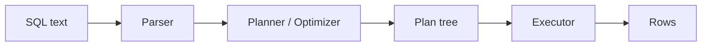

# SQL과 쿼리 처리

> Database Systems 101 시리즈 (3/10)

<!-- a-grade-intro:begin -->

**핵심 질문**: `SELECT * FROM orders WHERE user_id = 7`라는 한 줄이 결과가 되기까지, DBMS 안에서 무슨 일이 벌어지나요?

> SQL은 "무엇을 원하는지"만 적습니다. DBMS는 그것을 **파싱 → 의미 검사 → 계획 → 실행** 네 단계로 풀어 답을 만듭니다. 그 사이에 옵티마이저가 같은 결과를 더 싸게 만들 수 있는 자유를 휘두릅니다. 이 글에서는 그 단계와, 사용자에게 보여 주는 출력인 `EXPLAIN`을 함께 봅니다.

<!-- a-grade-intro:end -->

## 이 글에서 배울 것

- SQL의 선언적 성격과 그 결과
- 한 쿼리가 처리되는 네 단계
- `EXPLAIN`을 읽는 가장 기초적인 방법
- 같은 결과를 다르게 계산할 수 있는 이유

## 왜 중요한가

성능 문제 대부분은 SQL을 다시 쓰기보다 **무엇이 실행되고 있는지를 모르는 것**에서 옵니다. 쿼리 처리 단계를 알면 "이 줄은 왜 느리지?"라는 질문에 EXPLAIN으로 한 발자국 답을 할 수 있게 됩니다.

> 같은 결과를 만드는 SQL은 여러 개일 수 있고, 같은 SQL을 실행하는 방법도 여러 개입니다. 그래서 옵티마이저가 필요합니다.

## 개념 한눈에 보기



SQL은 텍스트에서 시작해 트리(plan)가 됩니다. 실행기는 그 트리를 따라가며 한 행씩 만들어 냅니다.

## 핵심 용어 정리

- **DDL/DML**: 스키마를 정의하는 SQL(CREATE, ALTER)이 DDL, 데이터를 다루는 SQL(SELECT, INSERT, UPDATE, DELETE)이 DML.
- **Plan(실행 계획)**: SQL을 어떻게 실행할지 옵티마이저가 정한 단계의 트리.
- **Cost**: 옵티마이저가 계획끼리 비교할 때 쓰는 추정값. I/O와 CPU의 단순 모델입니다.
- **Seq Scan / Index Scan**: 테이블 전체를 훑는가, 인덱스를 따라가는가의 차이.
- **Estimate vs Actual**: 옵티마이저의 추정과 실제 실행 시 본 행 수. 둘이 크게 다르면 통계가 낡았다는 신호입니다.

## Before/After

**Before — "왜 느리지?"를 추측만**

```sql
SELECT * FROM orders WHERE user_id = 7;
-- 느림. 인덱스를 더 만들어 본다. 여전히 느림. 캐시를 의심한다…
```

증거 없이 손이 가는 대로 만집니다.

**After — EXPLAIN으로 본다**

```sql
EXPLAIN QUERY PLAN
SELECT * FROM orders WHERE user_id = 7;
-- SCAN orders         ← 테이블 전체 훑음
-- 또는
-- SEARCH orders USING INDEX idx_orders_user_id (user_id=?)
```

처음에는 "전부 훑었다"가 보이고, 인덱스를 만든 뒤에는 인덱스를 탔다는 한 줄이 나옵니다. 가설이 한 번 죽거나 살아납니다.

## 실습: 한 SELECT의 처리 과정을 따라가기

### 1단계 — 데이터 준비

```python
# seed.py
import sqlite3, random

with sqlite3.connect("shop.db") as db:
    db.executescript("""
        DROP TABLE IF EXISTS orders;
        CREATE TABLE orders (
            id      INTEGER PRIMARY KEY,
            user_id INTEGER NOT NULL,
            product TEXT    NOT NULL,
            price   INTEGER NOT NULL
        );
    """)
    rows = [(i, random.randint(1, 1000), "p", random.randint(1, 1000)) for i in range(1, 100001)]
    db.executemany("INSERT INTO orders VALUES (?, ?, ?, ?)", rows)
```

10만 행 있으면 풀스캔과 인덱스 스캔의 차이가 눈으로 보입니다.

### 2단계 — 인덱스 없이 조회

```python
import sqlite3, time

with sqlite3.connect("shop.db") as db:
    plan = db.execute("EXPLAIN QUERY PLAN SELECT * FROM orders WHERE user_id = 7").fetchall()
    print(plan)

    t = time.time()
    rows = db.execute("SELECT * FROM orders WHERE user_id = 7").fetchall()
    print(len(rows), "rows in", round((time.time()-t)*1000, 1), "ms")
```

계획에 `SCAN orders`가 보일 겁니다. 옵티마이저가 "인덱스가 없으니 다 훑는다"고 정한 결과입니다.

### 3단계 — 인덱스 만들고 다시 보기

```python
with sqlite3.connect("shop.db") as db:
    db.execute("CREATE INDEX IF NOT EXISTS idx_orders_user_id ON orders(user_id)")
    db.execute("ANALYZE")  # 통계 갱신

    plan = db.execute("EXPLAIN QUERY PLAN SELECT * FROM orders WHERE user_id = 7").fetchall()
    print(plan)
```

이번에는 `SEARCH orders USING INDEX ...`가 나옵니다. 같은 SQL인데 옵티마이저의 선택이 바뀌었습니다. SQL은 그대로 "무엇"만 적었고, "어떻게"는 옵티마이저가 정합니다.

### 4단계 — JOIN의 계획 보기

```python
with sqlite3.connect("shop.db") as db:
    db.executescript("""
        CREATE TABLE IF NOT EXISTS users (id INTEGER PRIMARY KEY, name TEXT);
        INSERT OR IGNORE INTO users (id, name) SELECT 7, 'Alice';
    """)
    plan = db.execute("""
        EXPLAIN QUERY PLAN
        SELECT u.name, o.product
        FROM orders o JOIN users u ON u.id = o.user_id
        WHERE u.id = 7
    """).fetchall()
    for row in plan:
        print(row)
```

조인의 어느 쪽을 먼저 훑고, 다른 쪽을 어떻게 찾는지가 보입니다.

### 5단계 — 같은 결과, 다른 SQL

```sql
-- A
SELECT * FROM orders WHERE user_id IN (SELECT id FROM users WHERE name = 'Alice');

-- B
SELECT o.* FROM orders o JOIN users u ON u.id = o.user_id WHERE u.name = 'Alice';
```

두 쿼리는 보통 같은 결과를 줍니다. 옵티마이저가 둘을 비슷한 계획으로 변환할 수도, 아닐 수도 있습니다. EXPLAIN으로 비교해 봅니다. SQL의 자유도와 옵티마이저의 한계를 함께 느끼는 단계입니다.

## 이 코드에서 주목할 점

- 같은 SQL이 **데이터 양과 통계**에 따라 다른 계획으로 실행됩니다.
- 인덱스를 만들어도 옵티마이저가 안 쓸 수 있습니다(작은 테이블, 낡은 통계). `ANALYZE`로 통계를 갱신해야 할 때가 있습니다.
- `EXPLAIN`은 **추정**입니다. 실제 시간을 보려면 PostgreSQL의 `EXPLAIN ANALYZE` 같은 측정형 도구가 필요합니다.
- "같은 결과를 다르게 계산"하는 자유가 옵티마이저의 가치입니다.

## 자주 하는 실수 5가지

1. **EXPLAIN 없이 "느리다"고 결론 낸다.** 어디가 느린지 모르고 손을 대면 운에 맡기는 디버깅입니다.
2. **인덱스를 만들고 만족한다.** 옵티마이저가 안 쓰면 의미가 없습니다. 통계와 선택성을 함께 봐야 합니다.
3. **한 쿼리에 컬럼 100개를 다 부른다(`SELECT *`).** 네트워크와 메모리 비용이 보이지 않게 쌓입니다. 실무 SELECT는 컬럼을 명시합니다.
4. **N+1 쿼리를 만든다.** 응용 루프 안에서 SQL을 부르면 한 화면을 위해 수백 번 왕복합니다. JOIN이나 IN으로 묶어야 합니다.
5. **DDL과 DML을 같은 트랜잭션에 섞는다.** DBMS에 따라 결과가 묘하게 달라집니다. 마이그레이션은 분리해서 다룹니다.

## 실무에서는 이렇게 쓰입니다

성능 분석의 첫 도구는 거의 항상 `EXPLAIN`입니다. PostgreSQL이라면 `EXPLAIN (ANALYZE, BUFFERS)`로 추정과 실제, 메모리 접근량까지 함께 봅니다. 흔한 패턴은 다음과 같습니다.

- "Seq Scan + 큰 행 수" → 적절한 인덱스 부재 또는 통계 부정확
- "estimate 1, actual 1,000,000" → 통계가 낡음(`ANALYZE`)
- "Nested Loop이 큰 양쪽에 걸림" → 조인 순서/방법이 잘못 선택됨

EXPLAIN을 읽는 사람이 한 명이라도 있으면 팀의 평균 SQL 품질이 한 단계 올라갑니다.

## 시니어 엔지니어는 이렇게 생각합니다

- 의심이 있으면 EXPLAIN을 먼저 봅니다. 가설은 그 다음입니다.
- 인덱스를 "만들면 좋은 것"이 아니라 "선택성이 높을 때 좋은 것"으로 봅니다.
- N+1을 코드 리뷰에서 잡습니다. 응용 루프에서 SQL이 보이면 멈춥니다.
- 큰 결과는 페이지네이션과 LIMIT로 다룹니다. "전체"를 한 번에 가져오지 않습니다.
- 옵티마이저를 신뢰하되 검증합니다. 통계는 살아 있어야 합니다.

## 체크리스트

- [ ] 느린 쿼리에 대해 EXPLAIN을 본 적 있는가?
- [ ] `SELECT *` 대신 필요한 컬럼만 적는가?
- [ ] 응용 루프 안에서 SQL을 호출하지 않는가?
- [ ] 큰 변경 후 `ANALYZE`(또는 자동 통계) 실행을 확인했는가?
- [ ] 페이지네이션과 LIMIT를 쓰는가?

## 연습 문제

1. 실습 2단계의 `EXPLAIN QUERY PLAN` 출력을 보고, 인덱스가 없을 때 옵티마이저가 왜 풀스캔을 선택했는지 한 줄로 설명하세요.
2. 같은 데이터에 인덱스를 두 개 만들 수 있을 때, 옵티마이저가 어떻게 둘 중 하나를 고를지 그 기준을 두 가지 적어 보세요.
3. `SELECT *`를 쓰면 안 되는 이유 세 가지를 적어 보세요.

## 정리 및 다음 단계

SQL은 "무엇"을 적고, DBMS가 "어떻게"를 정합니다. 그 사이에 파서, 옵티마이저, 실행기가 있고, 그 결정의 결과가 EXPLAIN에 보입니다. 다음 글에서는 옵티마이저가 가장 자주 결정을 바꾸게 만드는 도구 — 인덱스 — 를 다룹니다.

- [데이터베이스 시스템이란 무엇인가?](./01-what-is-a-database.md)
- [관계형 모델](./02-relational-model.md)
- **SQL과 쿼리 처리 (현재 글)**
- 인덱스 (예정)
- 트랜잭션과 ACID (예정)
- isolation level (예정)
- 정규화와 모델링 (예정)
- 쿼리 최적화 (예정)
- 복제와 백업 (예정)
- OLTP와 OLAP (예정)
## 참고 자료

- [SQLite — EXPLAIN QUERY PLAN](https://www.sqlite.org/eqp.html)
- [PostgreSQL — Using EXPLAIN](https://www.postgresql.org/docs/current/using-explain.html)
- [Use The Index, Luke!](https://use-the-index-luke.com/)
- [Database System Concepts (Silberschatz)](https://www.db-book.com/)

Tags: Computer Science, Database, SQL, Optimizer, 실행계획, 쿼리

---

© 2026 영선북스. 이 글의 저작권은 저자에게 있습니다.
