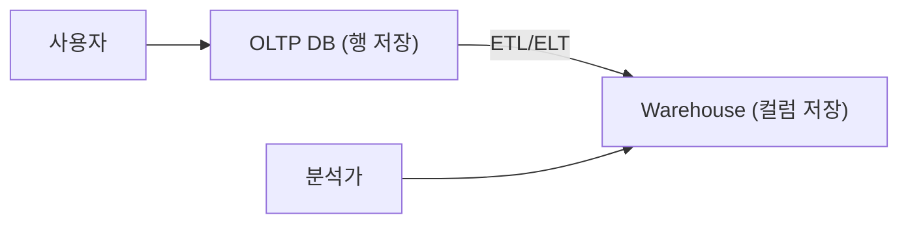

# OLTP와 OLAP

> Database Systems 101 시리즈 (10/10)

<!-- a-grade-intro:begin -->

**핵심 질문**: 같은 데이터인데 왜 운영 DB와 분석 DB는 모양이 그렇게 다를까요?

> 짧고 좁은 트랜잭션은 OLTP, 길고 넓은 집계는 OLAP입니다. 두 워크로드는 데이터 모델, 저장 형식, 인덱스 전략이 모두 다릅니다. 이 차이를 이해하면 "왜 분석을 별도 시스템에 두는가"가 자연스럽게 보입니다.

<!-- a-grade-intro:end -->

## 이 글에서 배울 것

- OLTP와 OLAP 워크로드의 본질적 차이
- 행 저장과 컬럼 저장의 트레이드오프
- 데이터 웨어하우스의 역할과 ETL/ELT
- 운영과 분석을 같은 DB에서 하면 생기는 문제

## 왜 중요한가

운영 DB가 분석 쿼리에 깔리는 일은 흔합니다. 한 번의 큰 집계 쿼리가 락을 잡고, 캐시를 휘젓고, 다른 사용자에게 영향을 줍니다. OLTP/OLAP의 차이를 알면 "이 쿼리는 어디로 가야 하는가"를 즉시 결정할 수 있습니다.

> 운영과 분석을 같은 시스템에 두는 것은 단기적으로는 편하지만, 거의 항상 두 워크로드가 서로의 발목을 잡습니다.

## 개념 한눈에 보기



OLTP는 짧은 단일 행 쿼리를 빠르게, OLAP는 수백만 행을 한꺼번에 집계하는 일을 빠르게 합니다. 둘은 다른 시스템에 두는 게 자연스럽습니다.

## 핵심 용어 정리

- **OLTP(Online Transaction Processing)**: 짧고 자주 일어나는 읽기·쓰기. 주문 생성, 결제 등.
- **OLAP(Online Analytical Processing)**: 큰 범위의 집계·필터. 일별 매출, 코호트 분석 등.
- **Row-store vs Column-store**: 행 단위로 저장 vs 컬럼 단위로 저장. OLAP에서 컬럼 저장이 압도적으로 빠릅니다.
- **Star Schema**: 사실(fact) 테이블과 차원(dimension) 테이블로 구성한 분석용 모델.
- **ETL/ELT**: 운영 DB → 분석 DB로 옮기며 변환하는 파이프라인.

## Before/After

**Before — 운영 DB에서 직접 분석**

```sql
SELECT date_trunc('day', created_at), sum(total)
FROM orders
GROUP BY 1
ORDER BY 1;
-- 60초, 락 발생, 운영에 영향
```

**After — 컬럼 저장 웨어하우스**

```sql
-- BigQuery / Snowflake / Redshift 등
SELECT date_trunc('day', created_at), sum(total)
FROM warehouse.orders
GROUP BY 1
ORDER BY 1;
-- 2초, 운영 DB에 영향 없음
```

같은 쿼리라도 저장 형식과 시스템이 다르면 30배 차이가 납니다.

## 실습: 행과 컬럼의 차이를 직접 보기

### 1단계 — 데이터 준비

```python
# seed.py
import sqlite3, random, time

with sqlite3.connect("oltp.db") as db:
    db.executescript("""
        DROP TABLE IF EXISTS orders;
        CREATE TABLE orders (
            id INTEGER PRIMARY KEY,
            user_id INTEGER, status TEXT,
            total INTEGER, country TEXT, created_at TEXT
        );
    """)
    rows = [
        (i, random.randint(1, 1000),
         random.choice(["paid","pending","cancelled"]),
         random.randint(1, 1000),
         random.choice(["KR","US","JP"]),
         f"2026-05-{random.randint(1,28):02d}")
        for i in range(1, 1_000_001)
    ]
    db.executemany("INSERT INTO orders VALUES (?,?,?,?,?,?)", rows)
```

100만 건의 주문 데이터를 SQLite(행 저장)에 넣습니다.

### 2단계 — OLTP 스타일 단일 행 조회

```python
import sqlite3, time
with sqlite3.connect("oltp.db") as db:
    db.execute("CREATE INDEX IF NOT EXISTS idx_user ON orders(user_id)")
    t = time.time()
    print(db.execute("SELECT * FROM orders WHERE user_id=7").fetchall()[:3])
    print("OLTP query:", round((time.time()-t)*1000, 2), "ms")
```

인덱스 한 번 점프로 즉시 결과가 나옵니다. 행 저장의 강점입니다.

### 3단계 — OLAP 스타일 집계 쿼리

```python
import sqlite3, time
with sqlite3.connect("oltp.db") as db:
    t = time.time()
    rows = db.execute("""
        SELECT country, sum(total)
        FROM orders
        WHERE status='paid'
        GROUP BY country
    """).fetchall()
    print(rows)
    print("OLAP query:", round((time.time()-t)*1000, 2), "ms")
```

100만 행을 모두 읽어야 합니다. 행 저장에서는 필요 없는 컬럼까지 통째로 가져옵니다. 컬럼 저장이라면 `country`와 `total`, `status` 세 컬럼만 읽으면 됩니다.

### 4단계 — Parquet로 컬럼 저장 흉내내기

```python
import pandas as pd
df = pd.read_sql("SELECT * FROM orders", "sqlite:///oltp.db")
df.to_parquet("orders.parquet")

import duckdb, time
con = duckdb.connect()
t = time.time()
print(con.execute("""
    SELECT country, sum(total)
    FROM 'orders.parquet'
    WHERE status='paid'
    GROUP BY country
""").fetchall())
print("Parquet/DuckDB:", round((time.time()-t)*1000, 2), "ms")
```

같은 집계가 여러 배 빨라지는 것을 확인할 수 있습니다. DuckDB는 컬럼 저장 + 벡터화 실행을 사용합니다.

### 5단계 — 별 모양 모델(Star Schema) 흉내

```sql
-- fact_orders + dim_user + dim_product + dim_date
SELECT d.country, sum(f.total)
FROM fact_orders f
JOIN dim_user d ON d.user_id = f.user_id
WHERE f.status='paid'
GROUP BY d.country;
```

분석에서는 의도적으로 비정규화된 별 모양 모델이 자주 쓰입니다. 조인을 줄이고 집계를 빠르게 합니다.

## 이 코드에서 주목할 점

- OLTP는 **인덱스 한 번 점프**, OLAP는 **대규모 스캔**이 본질입니다.
- 컬럼 저장은 필요한 컬럼만 디스크에서 읽기 때문에 집계에서 압도적으로 빠릅니다.
- 별 모양 모델은 정규화의 반대편 극단이지만, 분석에서는 합리적인 선택입니다.
- 운영과 분석을 분리하면 두 시스템 모두 단순해집니다.

## 자주 하는 실수 5가지

1. **운영 DB에 분석 쿼리를 그대로 돌린다.** 캐시·락·리소스가 무너집니다.
2. **OLTP 모델을 그대로 OLAP에 옮긴다.** 조인이 폭증하고 집계가 느려집니다.
3. **컬럼 저장이 만능이라고 믿는다.** 단일 행 갱신은 행 저장이 훨씬 낫습니다.
4. **ETL을 야간 한 번만 돌린다.** 분석가가 항상 어제 데이터를 보면 의사 결정이 늦어집니다.
5. **분석 DB의 비용을 측정하지 않는다.** 컬럼 웨어하우스는 스캔량 기반으로 과금되는 경우가 많습니다.

## 실무에서는 이렇게 쓰입니다

OLTP 시스템은 PostgreSQL, MySQL 같은 행 저장 RDBMS가 표준입니다. 분석은 BigQuery, Snowflake, Redshift, ClickHouse 같은 컬럼 저장 시스템이 표준입니다. 둘 사이는 ETL/ELT 파이프라인이 잇습니다.

최근에는 "데이터 레이크하우스"라는 흐름도 있습니다. Parquet 같은 컬럼 파일을 객체 스토리지에 두고, DuckDB·Trino·Spark·Snowflake 등 다양한 엔진이 그 위에서 쿼리합니다. 운영과 분석 사이의 경계는 여전히 분명하지만, 도구 선택지는 넓어졌습니다.

## 시니어 엔지니어는 이렇게 생각합니다

- "이 쿼리는 OLTP인가 OLAP인가?"를 라우팅의 첫 질문으로 삼습니다.
- 분석 쿼리는 분석 시스템에서, 운영 쿼리는 운영 DB에서.
- ETL/ELT 신뢰성을 모니터링합니다. 데이터의 신선도와 정확도가 핵심 지표입니다.
- 컬럼 저장 비용은 스캔 컬럼·파티션 설계로 통제합니다.
- 두 세계의 스키마 변경을 동시에 계획합니다. 운영 스키마 변경은 분석 파이프라인까지 영향을 줍니다.

## 체크리스트

- [ ] 분석 쿼리가 운영 DB로 가지 않는가?
- [ ] 분석용 모델(별 모양 등)이 따로 정의돼 있는가?
- [ ] ETL/ELT의 신선도와 실패율을 모니터링하는가?
- [ ] 컬럼 저장 시스템에서 스캔량을 의식하는가?
- [ ] 스키마 변경 시 분석 파이프라인 영향을 검토하는가?

## 연습 문제

1. 같은 SELECT가 OLTP DB에서는 빠르고 OLAP DB에서는 느릴 수 있는 시나리오를 한 가지 적어 보세요.
2. 컬럼 저장이 단일 행 UPDATE에 약한 이유를 한 줄로 설명하세요.
3. 별 모양 모델이 정규화 원칙과 충돌하는 점, 그럼에도 분석에서 정당화되는 이유를 적어 보세요.

## 정리 및 다음 단계

OLTP와 OLAP는 같은 데이터를 다른 시간 단위·다른 모양으로 다루는 두 세계입니다. 행 저장은 단일 행 점프에, 컬럼 저장은 대규모 집계에 강합니다. 두 세계를 분리하고 그 사이를 ETL/ELT로 잇는 것이 표준 구조입니다. 이로써 Database Systems 101 시리즈를 마칩니다. 데이터베이스라는 단어 뒤에 숨어 있던 모델·트랜잭션·인덱스·복제·분석의 큰 지도가 이제 익숙한 풍경이 되었기를 바랍니다.

- [데이터베이스 시스템이란 무엇인가?](./01-what-is-a-database.md)
- [관계형 모델](./02-relational-model.md)
- [SQL과 쿼리 처리](./03-sql-and-query-processing.md)
- [인덱스](./04-indexes.md)
- [트랜잭션과 ACID](./05-transactions-and-acid.md)
- [isolation level](./06-isolation-levels.md)
- [정규화와 모델링](./07-normalization-and-modeling.md)
- [쿼리 최적화](./08-query-optimization.md)
- [복제와 백업](./09-replication-and-backup.md)
- **OLTP와 OLAP (현재 글)**
## 참고 자료

- [Designing Data-Intensive Applications — Chapter 3](https://dataintensive.net/)
- [Snowflake — What Is a Data Warehouse?](https://www.snowflake.com/guides/what-data-warehouse/)
- [DuckDB — Why DuckDB?](https://duckdb.org/why_duckdb)
- [Wikipedia — Online Analytical Processing](https://en.wikipedia.org/wiki/Online_analytical_processing)

Tags: Computer Science, Database, OLTP, OLAP, 컬럼지향, 분석

---

© 2026 영선북스. 이 글의 저작권은 저자에게 있습니다.
